```mermaid
flowchart TD
    Start([User Lands on jabur]) --> Discovery{How did they<br/>find us?}

    Discovery -->|SEO Search| SEO[Read Landing Page<br/>'Get 1 format FREE']
    Discovery -->|Referral| Referral[Friend told them<br/>about quality]
    Discovery -->|Paid Ad| Ad[Clicked ad promise<br/>'Human curation in 6hrs']

    SEO --> Upload
    Referral --> Upload
    Ad --> Upload

    Upload[Click 'Upload Episode'] --> CheckState{Returning<br/>with saved state?}

    CheckState -->|Yes - previous upload| ResumeUpload[Resume: 'Welcome back!<br/>Your file is ready<br/>Choose format']
    CheckState -->|No - new upload| UploadUI[Upload Interface<br/>Drag/drop audio file]

    ResumeUpload --> FormatSelect

    UploadUI --> Uploading{Upload<br/>successful?}

    Uploading -->|File too large| Error1[Error: Max 500MB<br/>Compress or split file?]
    Uploading -->|Wrong format| Error2[Error: MP3/MP4/WAV only<br/>Convert file?]
    Uploading -->|Success| SaveState1[Save state: File uploaded]

    Error1 --> UploadUI
    Error2 --> UploadUI

    SaveState1 --> Validate[AI Validates File<br/>Duration, quality, language]

    Validate --> ValidationResult{Quality<br/>check}

    ValidationResult -->|Poor audio| Warning[Warning: Background noise<br/>Transcription may have errors<br/>Proceed or upload better?]
    ValidationResult -->|Too short| Error3[Error: Min 10 minutes<br/>Upload longer episode]
    ValidationResult -->|Good quality| Transcribe

    Warning -->|Proceed anyway| Transcribe
    Warning -->|Upload better| UploadUI
    Error3 --> UploadUI

    Transcribe[Transcription Processing<br/>AssemblyAI API<br/>Est. 5-15 minutes]

    Transcribe --> TranscribeComplete[Transcription Complete]

    TranscribeComplete --> Notif0[Email: 'Transcription complete<br/>Choose your FREE format']

    Notif0 --> FormatSelect[Format Selection Screen]

    FormatSelect --> NeedHelp{User needs help<br/>choosing format?}

    NeedHelp -->|Yes - clicks help| Selector[Interactive Selector<br/>2 questions]
    NeedHelp -->|No - knows what they want| ShowFormats

    Selector --> Q1[Q1: Primary channel?<br/>Email/LinkedIn/Twitter/Blog]
    Q1 --> Q2[Q2: Goal?<br/>Grow/Engage/Traffic]
    Q2 --> Recommend[Recommended: Newsletter<br/>Can override]
    Recommend --> ShowFormats

    ShowFormats[Show ALL 8 formats<br/>Categorized:<br/>TEXT: Newsletter, Blog<br/>SOCIAL: LinkedIn, Twitter, IG<br/>UTILITY: Show notes, Insights]

    ShowFormats --> DirectPick[Pick 1 FREE format]

    DirectPick --> Decision{Which option?}

    Decision -->|Free format| PickFormat[Select format:<br/>Newsletter/LinkedIn/<br/>Twitter/Blog/etc]
    Decision -->|Skip to paid| FullSuite[Buy Full Suite<br/>$47 upfront]
    Decision -->|Wrong file uploaded| CancelUpload[Request: Cancel upload<br/>Upload different file]

    CancelUpload --> UploadUI

    PickFormat --> Confirm[Confirm selection<br/>'Get My Free Format']

    Confirm --> SaveState2[Save state: Format selected]

    SaveState2 --> CheckCreators{Creators<br/>available?}

    CheckCreators -->|Yes - normal capacity| Promise6hrs[Promise: 6 hours delivery]
    CheckCreators -->|No - backlogged| Promise12hrs[Promise: 12 hours delivery<br/>'High demand right now']

    Promise6hrs --> RouteTask
    Promise12hrs --> RouteTask

    RouteTask[Route to creator queue<br/>Wait for claim]

    FullSuite --> Payment[Payment: $47]
    Payment --> PaySuccess{Payment<br/>successful?}
    PaySuccess -->|Failed| PaymentError[Error: Try again<br/>Or try different card]
    PaySuccess -->|Success| RouteTask
    PaymentError --> PaymentRetry{Retry?}
    PaymentRetry -->|Try again| Payment
    PaymentRetry -->|Give up| Abandon1[Abandon - payment failed]

    RouteTask --> CreatorClaims[Creator claims task]

    CreatorClaims --> Notif1[Email: Upload Confirmed<br/>'Sarah is curating...']

    Notif1 --> Wait1[Wait: 3 hours]

    Wait1 --> Notif2[Email: Mid-Creation Check<br/>'Sarah is halfway through']

    Notif2 --> Wait2[Wait: 3 more hours]

    Wait2 --> QAApproval[Content QA approved]

    QAApproval --> Notif3[Email: Format Delivered<br/>'Your FREE newsletter ready<br/>Use it today!']

    Notif3 --> DownloadCheck{User downloads<br/>within 48hrs?}

    DownloadCheck -->|No| NudgeEmail[Email: 'You haven't<br/>downloaded your content yet']
    DownloadCheck -->|Yes| Downloaded[Free format downloaded]

    NudgeEmail --> DownloadCheck

    Downloaded --> UseFormat[ASSUME: User is using it<br/>Publishing newsletter]

    UseFormat --> Wait3[Wait: 48 hours<br/>post-download]

    Wait3 --> Notif4[Email: Usage Check-In<br/>'How did it work?<br/>Want more formats?']

    Notif4 --> UserReply{User<br/>response}

    UserReply -->|Replies 'worked great'| HotLead[HOT LEAD<br/>Immediate upsell]
    UserReply -->|No reply| Wait4[Wait: 24 hours]
    UserReply -->|Unhappy - quality bad| RevisionRequest[Request revision<br/>Creator revises]

    RevisionRequest --> CreatorRevises[Creator revises format]
    CreatorRevises --> QAApproval

    HotLead --> ImmediateUpsell[Email: 'Get 7 more formats<br/>$39 - ready now']
    Wait4 --> Notif5[Email: Standard Upsell<br/>'Get 7 more formats - $39']

    ImmediateUpsell --> ConversionDecision
    Notif5 --> ConversionDecision{User<br/>decision}

    ConversionDecision -->|Buy $39 suite| ConversionPayment[Payment: $39]
    ConversionDecision -->|Not interested| NoConversion1[No purchase]
    ConversionDecision -->|Only want 2-3| ReplyForCart[Reply: 'Too expensive<br/>Only need LinkedIn + Twitter']

    ConversionPayment --> ConvSuccess{Payment<br/>successful?}
    ConvSuccess -->|Success| InstantDownload[Instant download<br/>7 formats ready]
    ConvSuccess -->|Failed| PayError2[Error: Try different card]

    PayError2 --> ConvRetry{Retry?}
    ConvRetry -->|Yes| ConversionPayment
    ConvRetry -->|No| NoConversion1

    ReplyForCart --> AlaCarteOffer[Support reply:<br/>'$8 per format<br/>Which ones do you want?']
    AlaCarteOffer --> PickFormats[User picks 2-3 formats]
    PickFormats --> AlaCartePayment[Payment: $16-24]

    AlaCartePayment --> ConvSuccess

    InstantDownload --> Happy[Satisfied customer<br/>Conversion complete!]

    NoConversion1 --> Wait5[Wait: 4 days]
    Wait5 --> Notif6[Email: Final Reminder<br/>'Archiving in 3 days']

    Notif6 --> FinalDecision{Last chance<br/>decision}

    FinalDecision -->|Convert| ConversionPayment
    FinalDecision -->|Pass| NoConversion2[No conversion<br/>Keep as free user]

    NoConversion2 --> RetargetLater[Add to retargeting<br/>Win-back campaign]

    Happy --> End1([Journey Complete:<br/>Paying Customer])
    RetargetLater --> End2([Journey Complete:<br/>Free User])
    Abandon1 --> End3([Abandoned:<br/>Payment Issue])
```

# UX Design Specification jabur

**Author:** Omen
**Date:** 2025-12-26

---

<!-- UX design content will be appended sequentially through collaborative workflow steps -->

## Executive Summary

### Project Vision

jabur is an AI Podcast to Human-Curated Content Platform that transforms raw AI-generated podcast audio into polished, actionable content through a curated marketplace of skilled human experts. The platform operates as a two-sided marketplace connecting content uploaders (podcast creators, educators, entrepreneurs) with vetted content creators who transform audio into 9 valuable derivative formats: summaries, insights, reflection questions, blog posts, social media content, fact-check reports, show notes, and newsletter segments.

The platform's core differentiator is its role isolation design philosophy - creators experience a task-based system rather than a gig marketplace, never seeing client names, pricing, or platform margins. This reduces marketplace anxiety and focuses creators on quality work while maintaining trust and quality assurance for uploaders.

### Target Users

**Primary User Personas:**

1. **Content Uploader (Alex)** - Time-poor entrepreneur/educator (28-45 years) who creates AI podcasts but needs professional curation to extract maximum value. Success moment: Receiving publication-ready content within 24-48 hours that requires zero additional editing.

2. **Content Creator (Maria)** - Skilled writer/editor (25-55 years) seeking steady, fairly-compensated work with clear advancement. Success moment: First approved submission with positive feedback, visible tier progress (Probationary → Junior → Mid-Level → Senior → Expert), and reliable weekly payouts.

3. **QA Editor (James)** - Senior editor (30-50 years) maintaining platform quality through rubric-based review, inline feedback, and account flagging. Success moment: Processing 200+ reviews weekly with efficient tools while maintaining quality standards.

4. **Platform Administrator (Sarah)** - Operations manager (28-45 years) ensuring platform health through creator management, fraud detection, dispute resolution, and strategic oversight. Success moment: Data-driven decision making with comprehensive dashboards and audit trails.

### Key Design Challenges

1. **Dual Experience Isolation** - Creating completely separate, role-isolated experiences for uploaders versus creators while maintaining platform cohesion and preventing data crossover. Creators must never see client information; uploaders interact with "jabur the entity" rather than individual creators.

2. **Audio-First Specialized Workflow** - Designing a creator workspace with synchronized audio player (waveform visualization, variable speed 0.5x-2x, transcript sync, keyboard shortcuts) that makes audio content curation feel effortless and professional.

3. **Transparent Progression Without Gaming** - Making the 5-tier creator advancement system feel earned, transparent, and motivating (with real-time progress tracking like "12/30 approvals to Mid-Level") while preventing platform gaming through role separation enforcement.

4. **Quality Assurance at Scale** - Enabling QA editors to maintain consistent quality across 200+ weekly reviews through rubric-based scoring (6 dimensions with weighted criteria), side-by-side review interfaces, and automated pattern detection.

5. **Multi-Role Complexity Management** - Supporting four distinct user roles (Client, Creator, Editor, Admin) with different permission levels, workflows, and data access while maintaining security and preventing role overlap.

### Design Opportunities

1. **Creator Workspace Excellence as Competitive Moat** - The specialized audio player + rich text editor with auto-save could become so superior to generic freelance platforms that creators actively prefer jabur for the tools alone, creating retention through workflow superiority.

2. **Gamified Advancement Without Manipulation** - Tier progression visibility with achievement recognition, rate multiplier feedback (0.8x → 1.5x), and unlocked task access creates genuine motivation while maintaining fairness through performance-based advancement.

3. **Trust Through Quality Transparency** - Showing uploaders the QA rubric scores, review process, and human curation layer builds trust in the platform's value proposition over pure-AI solutions, justifying the premium pricing.

4. **Frictionless Magic Moments** - The upload → transcription (15min) → assignment → creation → QA → delivery pipeline should feel automated and reliable, with real-time status updates creating confidence rather than anxiety about turnaround times.

5. **Network Effects Through Experience Design** - More creators improve task availability and turnaround speed (attracting uploaders), while more uploads provide steady work (attracting creators), reinforced by UX that makes both sides reluctant to switch platforms.

## Core User Experience

### Defining Experience

**jabur** is built around four distinct core experiences, each optimized for a specific persona:

**For Content Uploaders (Alex):** The core experience is **"Upload and Forget"** - drag-and-drop audio files, select desired output formats with transparent pricing, and receive publication-ready content within the promised timeframe. The uploader never thinks about the complexity behind the scenes (transcription, routing, creator assignment, QA review). They simply upload AI podcast audio and receive polished, human-curated deliverables.

**For Content Creators (Maria):** The core experience is **"Claim, Create, Advance"** - browse available tasks filtered to their qualification level, claim work instantly, use professional-grade audio tools to curate content efficiently, submit with confidence, and watch their tier progression and earnings grow. The workspace is a task-based sanctuary free from marketplace anxiety, client information, and competitive bidding dynamics.

**For QA Editors (James):** The core experience is **"Review at Scale Without Sacrifice"** - process 200+ submissions weekly using side-by-side review interfaces that present audio, transcript, and creator submissions simultaneously. Rubric-based scoring maintains consistency, inline commenting provides actionable feedback, and pattern detection surfaces quality issues automatically.

**For Platform Administrators (Sarah):** The core experience is **"Proactive Oversight"** - alerts and dashboards surface problems before they escalate. One-click investigations provide full context (creator history, evidence, audit trails), enabling data-driven decisions on creator management, fraud detection, and dispute resolution.

### Platform Strategy

**Primary Platform:** Web application (browser-based, responsive design)

**Platform-Specific Optimizations:**

1. **Creator Workspace (Desktop-First):**
   - Optimized for 1280px+ viewport width with multi-panel layout
   - Mouse and keyboard interaction focus (keyboard shortcuts for audio navigation, text formatting)
   - Audio player requires desktop/laptop for professional waveform visualization and synchronized transcript
   - Mobile view available for task browsing and earnings tracking, but content creation happens on desktop

2. **Uploader Portal (Mobile-Responsive):**
   - Fully functional across phone, tablet, and desktop devices
   - Drag-and-drop upload on desktop, file picker on mobile
   - Real-time upload progress and status tracking works across devices
   - Mobile-friendly content review and approval workflow

3. **QA Editor Dashboard (Desktop-Optimized):**
   - Multi-panel side-by-side layout requires desktop viewport
   - Support for multi-monitor setups (audio/transcript on one screen, submission review on another)
   - Data-heavy interfaces with sortable queues and batch operations

4. **Admin Dashboard (Desktop-Optimized):**
   - Complex data visualization and analytics require desktop viewport
   - Multi-tab workflow for investigating alerts while monitoring platform health

**No offline functionality needed** - all work occurs online with auto-save providing data persistence safety net.

### Effortless Interactions

**Content Uploader Effortless Moments:**

- **Upload Simplicity:** Drag-and-drop file interface with progress indicator, automatic format validation (MP3, WAV, M4A up to 500MB), and resume capability for failed uploads
- **Automatic Status Updates:** Real-time progress during upload, notification when transcription completes (within 15 minutes), alert when curated content is ready for review
- **No Mental Overhead on Pricing:** Transparent pricing calculator shows exact cost upfront with rush/express options clearly explained (48h standard, 24h +50%, 12h +100%)
- **One-Click Content Approval:** Review delivered content, approve/request revision with single interaction, download in preferred format (MD, PDF, DOCX)

**Content Creator Effortless Moments:**

- **Instant Task Discovery:** Opens workspace, sees task list filtered automatically to qualification level, one-click claim locks task with deadline commitment
- **Effortless Audio Navigation:** Click transcript text to jump to exact timestamp in audio, keyboard shortcuts (spacebar = play/pause, arrow keys = skip forward/back), variable speed control (0.5x-2x) without audio quality degradation
- **Never Lose Work:** Auto-save every 30 seconds with "last saved X seconds ago" indicator, draft persistence across sessions, version history for recovery
- **Omnipresent Progress Visibility:** Tier advancement tracker always visible ("15/30 approvals to Mid-Level"), rate multiplier displayed with task values, earnings dashboard updated in real-time

**QA Editor Effortless Moments:**

- **Everything in One View:** Side-by-side layout with audio player, synchronized transcript, creator submission, and rubric scoring form all visible simultaneously (zero tab switching)
- **Efficient Review Flow:** Keyboard shortcuts for rubric scoring, inline commenting with highlighted text references, approve/reject actions automatically advance to next queue item
- **Pattern Detection:** Automated flagging for plagiarism, AI-generated content, and quality drops surfaces issues without manual investigation

**Platform Administrator Effortless Moments:**

- **Alerts Come to Her:** Fraud flags, quality anomalies, dispute escalations appear as notifications with severity indicators (she doesn't hunt for problems)
- **One-Click Investigations:** Click alert to see full context aggregated in single view (creator performance history, evidence, related transactions, audit trail)
- **Batch Operations:** Promote/demote multiple creators, resolve similar disputes with templates, create comped tasks for partnerships with bulk import

### Critical Success Moments

**Content Uploader Make-or-Break Moments:**

1. **First Upload Completion:** Upload must succeed reliably with clear progress feedback. If upload fails or feels confusing, user abandons platform.
2. **First Delivery Quality Check:** Curated content must be publication-ready without additional editing. If quality is poor or doesn't match expectations, user doesn't return.
3. **Consistent Turnaround Reliability:** Promised delivery times (48h, 24h, 12h) must be met consistently. One late delivery breaks trust and undermines premium pricing value proposition.

**Content Creator Make-or-Break Moments:**

1. **First Task Claim:** Must be able to find and claim a task matching skill level immediately. If task list is empty or claiming is complicated, platform feels broken.
2. **First QA Approval with Feedback:** Feedback must be specific, actionable, and respectful (not vague criticism). Approval with positive reinforcement builds confidence and loyalty.
3. **First Payout Execution:** Payment must arrive exactly when promised (weekly Friday payout) with transparent breakdown. Delayed or confusing payments destroy trust immediately.
4. **Tier Advancement Recognition:** When creator hits advancement criteria (e.g., 20 approvals at 4.5+ average), promotion must happen automatically with achievement recognition. Manual delays or unclear criteria feel arbitrary and unfair.

**QA Editor Make-or-Break Moments:**

1. **Review Queue Manageability:** Must be able to process volume (200+ weekly) without falling behind. If queue becomes overwhelming, quality suffers and editor burns out.
2. **Complete Context Availability:** Must have access to original audio, transcript, creator history, and submission guidelines in single view. Missing context makes fair review impossible.

**Platform Administrator Make-or-Break Moments:**

1. **Fraud Detection Before Damage:** Platform must surface suspicious patterns (multi-account creation, plagiarism spikes, collusion indicators) before significant damage occurs. Reactive firefighting is unsustainable.
2. **Dispute Resolution Evidence:** Must have complete context (audio, submissions, messages, QA scores, creator history) aggregated in single investigation view. Incomplete evidence makes fair resolution impossible.

### Experience Principles

These five principles guide every UX decision for **jabur**:

**1. Invisible Complexity**
The platform orchestrates complex workflows (audio transcription, level-based task routing, dual-layer QA review, weekly batch payouts, fraud detection) but users only see their simple role-specific interface. Alex uploads and receives. Maria creates and gets paid. James reviews and scores. Sarah monitors and resolves. Multi-step orchestration happens automatically behind the scenes.

**2. Role-Specific Optimization**
Each persona receives a workspace designed exclusively for their needs without compromise. Creators get specialized audio curation tools. Editors get side-by-side review interfaces. Admins get oversight dashboards. Uploaders get simple upload/download flows. No "one-size-fits-all" generic interface.

**3. Automatic Progress, Manual Control**
The system auto-saves work, auto-updates status, auto-routes tasks, auto-flags quality issues, but users maintain intentional control over critical actions. Creators deliberately claim tasks. Editors consciously approve submissions. Admins explicitly resolve disputes. Automation serves human decision-making.

**4. Trust Through Transparency**
No black boxes. Maria sees exact tier progression ("15/30 approvals to Mid-Level") and rate multipliers (0.8x → 1.5x). Alex sees QA rubric scores proving human quality review. James sees creator performance history informing fair evaluation. Sarah sees complete audit trails enabling accountability. Transparency builds trust and prevents gaming.

**5. Effortless Navigation, Powerful Tools**
Common actions (play/pause audio, claim task, approve submission, upload file) are one-click simple with keyboard shortcuts. Advanced features (rubric customization, creator tier management, comped task creation, fraud investigation) are available but don't clutter primary workflows. Progressive disclosure reveals complexity only when needed.

## Desired Emotional Response

### Primary Emotional Goals

**jabur** creates distinct emotional experiences for each persona, aligned with their needs and the platform's value proposition:

**Content Uploader (Alex): Relief and Confidence**

The primary emotional goal is to transform anxiety about content production into confidence about quality and delivery. Alex should feel: *"Finally, I can transform my AI experiments into real content without spending 4 hours per episode. This platform actually delivers what it promises."*

The **relief** comes from offloading a time-consuming task to trusted human experts. The **confidence** comes from:
- Consistent quality delivery (publication-ready, brand voice-matched content)
- Reliable turnaround times (48h, 24h, or 12h as promised)
- Transparent pricing with no hidden costs
- Brand voice consistency ensuring every output sounds authentically "him"

**Content Creator (Maria): Respected and Progressing**

The primary emotional goal is to counter marketplace exploitation with professional respect and visible growth. Maria should feel: *"This isn't another soul-crushing gig platform. They treat me like a professional, pay me fairly, and I can see myself growing here."*

The **respect** comes from:
- Fair, transparent compensation with rate multipliers (0.8x → 1.5x)
- Professional-grade tools (specialized audio workspace, not generic text boxes)
- Actionable feedback (specific praise and improvement guidance, not vague criticism)
- Task-based system (no bidding wars or client haggling)

The **progression** comes from:
- Visible tier advancement ("15/30 approvals to Mid-Level" always displayed)
- Automatic promotion when criteria met (no arbitrary delays)
- Unlocked task types and higher rates at each level
- Achievement recognition celebrating milestones

**QA Editor (James): Efficient and Effective**

The primary emotional goal is to enable quality maintenance at scale without burnout. James should feel: *"I can maintain quality standards even at this volume. The tools actually help me do my job better."*

The **efficiency** comes from streamlined review interfaces (side-by-side layout, keyboard shortcuts, auto-advance to next item). The **effectiveness** comes from having all necessary context in one view (audio, transcript, creator history, submission guidelines) enabling fair, informed evaluation without constant tab switching or information hunting.

**Platform Administrator (Sarah): In Control and Informed**

The primary emotional goal is to shift from reactive firefighting to proactive oversight. Sarah should feel: *"I can see what's happening across the platform and make data-driven decisions before problems escalate."*

The **control** comes from comprehensive dashboards surfacing platform health metrics at a glance. The **informed** state comes from aggregated investigation views providing complete context (creator history, fraud evidence, audit trails, dispute details) enabling confident, defensible decision-making without blind spots.

### Emotional Journey Mapping

**Content Uploader Emotional Journey:**

**1. Discovery (Skepticism → Curiosity → Hope)**

Alex discovers jabur through AI podcast creator forums or content marketing communities. Initial skepticism ("another service promising the world?") shifts to curiosity when he sees the human-curation value proposition and brand voice matching emphasized. Hope emerges when he notices transparent pricing and the trial offer ("First output free").

**2. Trial Experience (Anticipation → Relief)**

**Upload Phase:** Drag-and-drop feels surprisingly simple. Clear pricing calculator shows exact cost. Style guide template makes brand voice setup easy ("Select your brand voice: Conversational, Professional, Educational"). Relief that it's not complicated.

**Waiting Phase:** Real-time transcription notification (within 15 minutes) builds trust. Status updates prevent obsessive checking. Promised 24-48 hour window creates anticipation rather than anxiety because the timeline is explicit and he's tracking progress.

**3. First Delivery (Delight → Validation → Trust)**

Opening the curated Social Media Pack and seeing three platform-specific posts that **sound exactly like his brand voice** creates delight. The "this is exactly what I needed" moment validates both the expense and the decision to try jabur.

Side-by-side comparison shows: original 30-minute audio snippet → perfectly on-brand Twitter thread + LinkedIn post + Instagram caption. This is the **"aha moment"** where Alex realizes he's found a solution that actually works.

**4. Conversion Decision (Evaluation → Commitment)**

Clear CTA: "Love it? Unlock all 9 formats." Alex evaluates: "This saved me 3+ hours and the quality is publication-ready." Business case is obvious. Converts to paid account (Pay-As-You-Go or Pro subscription).

**5. Return Usage (Trust → Loyalty → Advocacy)**

Each successful delivery reinforces trust. Consistent quality + reliable turnaround + brand voice matching transform Alex from skeptical tester to loyal customer. By upload #5, he's recommending jabur in content creator communities. By month 3, he's upgraded to Business tier for volume discounts.

**Content Creator Emotional Journey:**

**1. Discovery (Skepticism → Interest)**

Maria finds jabur through freelance job boards or creator community recommendations. Initial skepticism about "yet another marketplace" shifts to interest when she sees role isolation and tier advancement described. "No bidding, no client haggling" catches her attention.

**2. Application (Hope → Nervousness → Patience)**

Submitting portfolio and sample task creates hope for steady work but nervousness about vetting standards. The waiting period (24-72 hours) tests patience but the clear timeline prevents anxiety.

**3. Approval & Onboarding (Validation → Excitement)**

Receiving approval email: "Congratulations! You've been approved at Probationary level with access to Social Media Pack and Reflection Questions tasks." Validation that her skills meet platform standards.

Logging into creator workspace for first time: excitement builds seeing the specialized audio tools (waveform visualization, synced transcript, variable speed control). "This is way better than Upwork's generic interface."

**4. First Task Claim (Confidence → Focus)**

Seeing available task list filtered to her level. One-click claim feels empowering (no competitive bidding stress). Workspace layout with style guide panel visible shifts her to focused productivity mode.

**5. First Submission (Nervousness → Pride)**

Hitting submit after 45 minutes of work. Nervousness: "Will they like it?" Auto-save prevented data loss. Clear submission confirmation reduces uncertainty.

**6. First Approval (Pride → Motivation)**

Email notification: "Your submission has been approved - 4.6/5." Opens dashboard to see specific positive feedback: "Great attention to platform-specific formatting and brand voice consistency - keep it up!"

Pride in quality work validated. Tier progress tracker shows "5/20 approvals to Junior level" - motivation to continue. Earnings counter updates: "+$19.20 (pending Sunday payout)."

**7. First Payout (Security → Commitment)**

Sunday morning: payout notification. Bank account shows deposit with transparent breakdown. Financial security validated - this is real income, not gig work uncertainty.

Commitment builds: "I can see a path to $400-600/week with steady work here."

**8. Tier Advancement (Achievement → Aspiration)**

After 20 tasks at >4.3 average: automatic promotion notification with achievement badge. "Congratulations! You've advanced to Junior level (1.0x rate multiplier). Unlocked: Action Items and Executive Summary tasks."

Rate increase feels earned through demonstrated skill. Seeing next tier (Mid-Level at 1.1x with Key Insights access) creates aspiration to continue growing.

**QA Editor Emotional Journey:**

**1. Monday Morning Queue (Determination → Control)**

Opening review queue: 50+ pending submissions could create overwhelm. Sortable/filterable interface (by deadline, creator tier, output type) creates sense of control. Determination shifts to methodical execution: "I can handle this volume with these tools."

**2. Review Process (Focus → Satisfaction)**

Side-by-side layout with audio player, transcript, submission, and rubric form all visible enables focused evaluation without context switching. Completing a fair review with actionable feedback creates satisfaction in doing the job well.

**3. Pattern Detection (Alertness → Confidence)**

Noticing a creator's quality drop across 3 consecutive submissions. Using account flagging system with evidence notes creates confidence in maintaining platform standards through systematic quality control.

**4. End of Week (Accomplishment → Pride)**

Friday afternoon: processed 200+ reviews while maintaining fairness and consistency. Platform quality metrics show average rubric score holding at 4.2/5. Pride in impact: "My work directly affects both creator growth and client satisfaction."

**Platform Administrator Emotional Journey:**

**1. Dashboard Check (Vigilance → Assurance)**

Morning dashboard review: platform health metrics visible at glance. Instead of anxiety about unknown problems, comprehensive visibility creates assurance that issues will surface proactively.

**2. Alert Response (Concern → Control)**

Fraud alert notification: "Potential multi-account creation detected - 2 creator accounts from same device." Concern about platform integrity, but one-click investigation aggregates full context (registration timestamps, IP addresses, submission patterns, payment methods). Control restored through complete information enabling confident action.

**3. Decision Making (Responsibility → Confidence)**

Resolving creator tier promotion decision: reviewing performance data (task completion rate, average quality scores, customer satisfaction ratings, time on platform). Data-driven evidence creates confidence in making fair, defensible promotion from Mid-Level to Senior.

**4. Strategic Oversight (Purpose → Impact)**

Weekly metrics review: quality scores trending up (+0.3 over 30 days), fraud rate down (from 2.1% to 0.8%), creator retention strong (85% of Junior+ creators active), uploader NPS at 62. Sense of purpose and measurable impact on platform health.

### Micro-Emotions

**Critical Micro-Emotional States:**

**Confidence vs. Confusion:**
- **Alex:** Upload interface must create instant confidence (drag-and-drop simplicity, pricing calculator, style guide templates). Confusion about output types, brand voice setup, or turnaround would trigger abandonment.
- **Maria:** Workspace must create confidence in claiming tasks and navigating audio tools. Confusion about tier advancement criteria, payout schedule, or quality expectations would create distrust and hesitation.

**Trust vs. Skepticism:**
- **Alex:** QA rubric scores, brand voice matching demonstration, and transparent delivery timeline build trust. Hidden processes, vague quality promises, or opaque pricing would trigger skepticism and churn.
- **Maria:** Transparent earnings breakdown, automatic tier advancement, and actionable feedback build trust. Manual/arbitrary promotions, unclear payout timing, or vague rejection reasons would trigger skepticism about platform fairness.

**Accomplishment vs. Frustration:**
- **Maria:** Seeing "Approved 4.6/5" with specific positive feedback and tier progress increment creates accomplishment. Vague rejection ("doesn't meet standards") without explanation would create frustration and demoralization.
- **James:** Completing 50 reviews efficiently using streamlined tools creates accomplishment. Missing context, slow interface response, or inability to provide nuanced feedback would create frustration and quality compromise.

**Empowerment vs. Helplessness:**
- **Maria:** Control over task claiming, visible progress tracking, and earnings transparency create empowerment. Empty task queues with no explanation, opaque routing, or arbitrary assignment would create helplessness.
- **Sarah:** Data-driven decision tools and proactive alerts create empowerment. Missing evidence, incomplete context, or reactive firefighting would create helplessness and decision paralysis.

**Delight vs. Satisfaction:**
- **Alex:** First trial delivery exceeding expectations (perfect brand voice match, immediately publication-ready) creates delight and word-of-mouth advocacy. Subsequent deliveries meeting consistent standards create satisfaction and habitual usage.
- **Maria:** Tier advancement notification with achievement badge and rate increase creates delight milestone. Weekly payouts arriving on schedule create satisfaction and financial security.

**Belonging vs. Isolation:**
- **Maria:** Role isolation paradox - creators should NOT feel part of a competitive marketplace (isolation from clients is intentional to reduce anxiety), but SHOULD feel part of a professional creator community (belonging through fair treatment, advancement opportunities, respectful feedback, shared professional standards).

**Educational Authority vs. Transactional Service:**
- **Alex:** jabur positioning itself as content strategy authority (teaching podcast structure, brand voice importance, repurposing best practices) creates perception of valuable partnership. Pure transactional "upload and pay" framing creates commodity service perception with no loyalty.

### Design Implications

**Emotional Goal → UX Design Connections:**

**1. Relief and Confidence (Alex) → Simplicity, Transparency, and Brand Voice Trust**

- **Upload Interface:** Drag-and-drop with visual progress bar and format validation reduces anxiety about technical complexity
- **Pricing Calculator:** Upfront cost display with rush/express options (48h standard, 24h +50%, 12h +100%) prevents surprise charges and budget anxiety
- **Status Updates:** Real-time notifications (transcription complete, task assigned, content ready) create confidence about progress without requiring obsessive checking
- **Quality Preview:** Showing QA rubric scores (6 dimensions with weighted breakdown) proves human review happened, justifying premium pricing and building trust
- **Style Guide System:** Profile-level brand voice settings with template library ("Conversational, Professional, Educational, Storytelling") + optional per-upload instructions ensure creators understand tone/perspective/complexity requirements, reducing brand voice mismatch anxiety
- **Educational Positioning:** "Why Your Brand Voice Matters" explainer during onboarding positions jabur as authority rather than commodity service
- **Trial Experience:** "First output free" with Social Media Pack recommendation provides low-risk proof of value before payment commitment

**2. Respected and Progressing (Maria) → Professional Tools, Visibility, and Fair Treatment**

- **Task-Based Interface:** Clean task list (NOT gig marketplace dynamics with bidding wars) creates professional respect and reduces exploitation anxiety
- **Specialized Workspace:** Audio player with waveform visualization, variable speed control (0.5x-2x), synchronized transcript, keyboard shortcuts signals investment in creator success rather than generic freelance platform
- **Tier Progress Tracker:** Always-visible "15/30 approvals to Mid-Level" with rate multiplier display (0.8x → 1.5x) creates motivation through transparency and prevents "black box" frustration
- **Actionable Feedback:** Specific QA comments ("Great attention to platform-specific formatting and brand voice consistency") with rubric scores demonstrate respect for creator's skill development, not vague rejection
- **Style Guide Access:** Collapsible panel in workspace with profile-level guide + per-upload instructions visible while working enables brand voice adherence without guessing
- **Automatic Advancement:** Tier promotion triggers automatically when criteria met (no manual delays or arbitrary decisions) builds trust in system fairness

**3. Efficient and Effective (James) → Streamlined Workflow and Complete Context**

- **Side-by-Side Layout:** Audio player, synchronized transcript, creator submission, and rubric scoring form all visible simultaneously eliminates tab switching frustration and enables focused evaluation
- **Keyboard Shortcuts:** Rubric scoring hotkeys, audio navigation shortcuts (spacebar = play/pause, arrows = skip), approve/reject actions enable high-volume processing without sacrificing quality or burning out
- **Automated Pattern Detection:** Plagiarism flags, AI-generated content detection, quality drop alerts surface issues without manual investigation, enabling proactive quality maintenance
- **Brand Voice Rubric Dimension:** New 20%-weighted "Brand Voice Adherence" dimension with objective criteria ("Uses first-person perspective as specified: Yes/No") provides clear evaluation framework

**4. In Control and Informed (Sarah) → Proactive Alerts and Aggregated Context**

- **Alert Notifications:** Fraud flags (multi-account creation, plagiarism spikes), quality anomalies, dispute escalations appear as notifications with severity indicators - she doesn't hunt for problems
- **One-Click Investigations:** Full context view aggregates creator performance history, fraud evidence, related transactions, audit trails in single interface enabling confident, defensible decisions
- **Comprehensive Dashboards:** Platform health metrics (quality scores, fraud rate, creator retention, uploader NPS) visible at glance enable proactive decision-making rather than reactive firefighting
- **Batch Operations:** Promote/demote multiple creators, resolve similar disputes with templates, create comped tasks for partnerships reduces administrative burden

**Avoiding Negative Emotions:**

- **Prevent Anxiety:** Clear timelines, transparent pricing, auto-save functionality (every 30s), omnipresent status visibility, brand voice guidance
- **Prevent Frustration:** Effortless navigation, keyboard shortcuts, everything-in-one-view interfaces, complete context access
- **Prevent Exploitation Feelings:** Fair compensation visibility (task values shown, not client pricing), transparent advancement criteria, professional feedback tone, no bidding wars
- **Prevent Overwhelm:** Sortable queues, batch operations, automated flagging, progressive disclosure of complexity (advanced features available but not cluttering primary workflows)
- **Prevent Distrust:** No black boxes, complete transparency about tier criteria and earnings calculations, audit trails for accountability, automatic (not arbitrary) advancement

### Emotional Design Principles

These six principles guide every UX decision for **jabur**:

**Principle 1: Confidence Through Clarity**

Every interaction must reduce uncertainty and build trust through transparent communication. Users should never wonder "what's happening now?" or "when will this be done?" or "why was this decision made?"

Status indicators (upload progress, transcription status, task assignment, review queue position), progress tracking (tier advancement counters, earnings dashboards), explicit timelines (48h/24h/12h turnaround promises), and clear feedback (rubric scores with specific comments) create confidence by eliminating ambiguity.

Clarity extends to pricing (calculator showing exact costs upfront), quality standards (rubric dimensions publicly visible), and advancement criteria (objective task completion and rating thresholds). When users understand the system, they trust it.

**Principle 2: Respect Through Professional-Grade Tools**

Creators (Maria) and Editors (James) must feel valued through investment in specialized, high-quality tools that demonstrate the platform takes their work seriously.

The creator workspace isn't a generic text box borrowed from a gig marketplace - it's a professional environment with waveform visualization, synchronized transcripts, variable-speed audio playback, efficient keyboard shortcuts, and auto-save data protection. This signals: "We built this specifically for audio content curation because we respect your craft."

Similarly, the QA editor interface provides side-by-side layout, rubric scoring frameworks, inline commenting tools, and pattern detection automation - professional tools that enable quality work at scale without burnout.

**Principle 3: Motivation Through Visible Progress**

Achievement systems (tier advancement, earnings tracking, quality scores) must be transparent and automatic, not opaque or arbitrary.

Maria sees "15/30 approvals to Mid-Level" at all times, knowing exactly what's required for advancement. When she hits 20 approvals at >4.3 average rating, promotion happens automatically with achievement badge notification - no waiting for manual approval or wondering if criteria changed.

Alex sees consistent delivery quality through QA rubric scores on every output. James sees platform quality metrics trending over time. Sarah sees fraud rate improvements and creator retention strengthening. Visible progress creates motivation; opaque systems create frustration and disengagement.

**Principle 4: Control Through Proactive Information**

Users should feel in control by having information come to them (push notifications, alerts, status updates) rather than hunting for it or wondering about status.

Sarah doesn't search for fraud patterns - alerts notify her of suspicious activity with aggregated evidence. Alex doesn't check upload status obsessively - real-time notifications inform him when transcription completes and content is ready. Maria doesn't wonder about payout timing - transparent schedule (weekly Sundays, $20 minimum) with countdown visibility eliminates uncertainty.

Proactive information delivery shifts users from anxious monitoring to confident execution. The system serves them; they don't serve the system.

**Principle 5: Trust Through Honest Limitations**

When things go wrong (upload fails, delivery delayed, QA rejection, fraud detected), honest communication with clear next steps maintains trust where vague explanations or blame-shifting would destroy it.

Error messages should be specific and actionable: "Upload failed: File exceeds 500MB limit. Try compressing audio or splitting into segments" (not "Error 500"). QA rejection feedback should be specific: "Brand voice mismatch: Content uses formal academic tone, but style guide specifies conversational approach. See examples in style guide panel" (not "Doesn't meet standards").

Recovery paths should be obvious: revision requests with clear deadlines, re-upload options with format guidance, appeal processes with evidence requirements. Trust grows when the platform admits limitations honestly and provides clear solutions.

**Principle 6: Trust Through Brand Voice Consistency**

Alex must feel confident that his carefully crafted brand voice (whether conversational, authoritative, playful, academic, storytelling-focused) will be maintained across all curated outputs. Brand voice matching is the primary driver of confidence that transforms one-time testers into loyal customers.

The dual-level style guide system (profile-level defaults + per-upload overrides) creates this confidence by:
- Giving creators explicit guidance through template-based voice profiles
- Making brand voice adherence a weighted QA rubric dimension (20% - highest weight)
- Providing before/after examples during onboarding showing generic vs. brand-matched content
- Positioning jabur as content strategy authority through educational content explaining why brand voice matters

If Maria delivers a blog post with perfect accuracy but wrong tone ("too formal" when Alex's brand is "conversational and playful"), trust is shattered. Brand voice consistency is what separates jabur from generic curation services and pure-AI solutions that can't maintain tonal nuance across diverse content formats.

## UX Pattern Analysis & Inspiration

### Inspiring Products Analysis

**1. Descript (Audio/Content Creation Tool)**

**Excellence in UX:**
- Transcript-synced audio player: Click any transcript word to jump to that exact timestamp
- Waveform visualization with seekable scrubbing
- Variable speed control (0.5x-2x) without audio quality degradation
- Omnipresent auto-save with version history
- Keyboard-first design (spacebar = play/pause, arrows = navigate)

**Emotional Impact:** Creates confidence through professional-grade tools. Users feel the platform was built specifically for audio work.

**Transferable to jabur:** The creator workspace should mirror Descript's audio-first philosophy - transcript-synced player, waveform visualization, keyboard shortcuts, auto-save visibility.

**Technical Feasibility Notes (Winston):**
- Waveform visualization requires audio processing libraries (WaveSurfer.js or Peaks.js)
- Lazy-load waveform generation for large files (>100MB) to maintain performance
- Web Audio API dependency - minimum browser versions: Chrome 34+, Firefox 25+, Safari 14.1+
- Significant engineering investment but critical competitive moat

**2. Notion (Collaborative Workspace)**

**Excellence in UX:**
- Block-based composable editing
- Visible auto-save indicator ("last saved 3 seconds ago")
- Progressive disclosure (simple by default, powerful when needed)
- Comprehensive keyboard shortcuts (/ for commands, @ for mentions)
- Clean, minimalist interface focusing on content
- Template library reducing decision fatigue

**Emotional Impact:** Creates effortless productivity. Users feel in control without overwhelm.

**Transferable to jabur:** Clean UI principles, auto-save visibility, keyboard shortcuts for common actions, template-based style guides (brand voice templates like "Conversational," "Professional," "Educational").

**3. Canva (Design Platform)**

**Excellence in UX:**
- Drag-and-drop upload simplicity
- Template library eliminating blank-canvas paralysis
- Brand Kit feature (save colors, fonts, logos once - reuse everywhere)
- Transparent pricing tiers (Free, Pro, Teams)
- Real-time collaboration support

**Emotional Impact:** Creates confidence for non-designers. Makes professional output accessible.

**Transferable to jabur:** Brand voice "kit" concept (save tone/perspective/vocabulary once, apply across all tasks). Template-based style guides. Simple drag-and-drop upload UX for audio files.

**4. Fiverr (Gig Marketplace)**

**Excellence in UX:**
- Gig-based model (fixed pricing, NOT bidding)
- Tiered seller system (Level 1, Level 2, Top Rated) with clear progression
- Transparent pricing (no hidden fees, exact cost upfront)
- Clear delivery expectations (24h, 3 days, 7 days turnaround)
- Quality badges creating aspiration ("Top Rated Seller")

**Weaknesses:**
- Race-to-the-bottom pricing competition
- Transactional marketplace feel lacking professional respect
- Client-creator power imbalance

**Transferable to jabur:** Tier system (Probationary → Junior → Mid-Level → Senior → Expert), transparent pricing calculator, explicit delivery timelines (48h/24h/12h). **Avoid**: Bidding mechanics, low-price positioning, transactional language.

**5. Toptal (Premium Freelance Network)**

**Excellence in UX:**
- Rigorous vetting process (top 3% accepted) creating exclusivity and quality
- Premium positioning justifying higher rates
- Client shielding (no competitive bidding or haggling)
- Performance-based tier advancement
- Respectful treatment ("talent" not "gig workers")

**Emotional Impact:** Creates professional respect and pride in belonging to exclusive network.

**Transferable to jabur:** Premium positioning (human-curated content vs. AI-only solutions), vetting process for creator approval, role isolation (creators never see client information), respectful language ("content creator" not "gig worker").

**6. Upwork (Freelance Marketplace - Anti-Pattern Study)**

**UX Failures:**
- Bidding wars creating race-to-bottom pricing
- Proposal fatigue (hours writing proposals that go nowhere)
- Marketplace anxiety ("Am I pricing right? Will they choose me?")
- Generic tools (text boxes and file uploads, no specialized workspace)
- Opaque algorithms (unclear visibility and routing rules)

**Emotional Impact:** Creates exploitation feelings, anxiety, and platform distrust.

**Critical anti-patterns for jabur to avoid:** NO bidding, NO client information exposure to creators, NO generic tools, NO opaque task routing/assignment.

**7. DoorDash (Two-Sided Marketplace - Dasher Experience)**

**Excellence in UX:**
- Earnings transparency before accepting orders (distance, expected time, payout visible upfront)
- Real-time delivery tracking with step-by-step progress
- Clear acceptance criteria (pickup location, delivery location, item count shown before claiming)
- Heat map showing demand zones (empowers strategic decisions)
- Weekly earnings summary with breakdown by time/zone

**Emotional Impact:** Empowerment through information. Dashers see full context before accepting work, reducing uncertainty and regret.

**Transferable to jabur:** Task preview before claiming - show audio duration, output type, style guide complexity, estimated effort, task value. Creators claim with full context, not blind acceptance. Weekly earnings forecast dashboard.

**8. Airbnb (Host Experience)**

**Excellence in UX:**
- Quality scoring with specific improvement feedback ("Guests loved your quick responses - keep it up!")
- Tier system (Superhost status) with clear benefits (visibility boost, badge display)
- Calendar management showing earnings potential ("This weekend could earn $450")
- Performance dashboard with trend analysis (response time, acceptance rate, ratings over time)

**Weaknesses:**
- Overly complex cancellation policies create host anxiety
- Algorithm changes affecting visibility feel opaque and unpredictable

**Transferable to jabur:** Host-style creator dashboard showing weekly earnings forecast, quality score breakdown with specific praise/improvement areas, tier advancement timeline. **Avoid**: Opaque algorithm changes that feel arbitrary.

**9. Uber (Marketplace Transparency)**

**Excellence in UX:**
- Upfront ride details before acceptance (pickup, dropoff, estimated time, fare)
- Quest system gamifying earnings goals ("Complete 20 rides this weekend, earn $100 bonus")
- Real-time demand surge indicators
- Rating system with rider feedback visible to driver

**Weaknesses:**
- Acceptance rate pressure (implicit punishment for declining rides)
- Deactivation policies feel arbitrary without clear appeals process

**Transferable to jabur:** Transparent task details before claiming. Achievement system for milestones ("Complete 50 tasks this month, unlock Mid-Level tier"). **Avoid**: Punishing creators for task selectivity - claiming should feel empowering, not pressured.

### Marketplace-Specific Patterns (John's Insight)

jabur is fundamentally a **two-sided marketplace**, not just a creation tool. Maria's experience is closer to a DoorDash driver or Airbnb host than a Notion user. She's participating in a marketplace economy, not just using productivity software.

**Key Marketplace UX Patterns:**

**1. Pre-Acceptance Information Transparency**
- **Pattern:** Show full task context before claiming (audio duration, output type, style guide complexity, estimated effort, task value)
- **Inspiration:** DoorDash shows distance, time, payout before acceptance
- **Why it works:** Empowers informed decisions, reduces claim-and-regret, respects creator time
- **Application to jabur:** Task card preview with expandable details, "Claim" button only appears after viewing full context

**2. Earnings Visibility and Forecasting**
- **Pattern:** Dashboard showing current week earnings, projected earnings, payout timeline
- **Inspiration:** Airbnb's calendar earnings potential, DoorDash's weekly summary
- **Why it works:** Financial transparency creates security, motivates strategic task selection
- **Application to jabur:** Creator dashboard showing "This week: $127.50 earned, $52.50 pending review, payout in 3 days"

**3. Performance Feedback with Specificity**
- **Pattern:** Quality scores with specific praise and improvement areas
- **Inspiration:** Airbnb's "Guests loved your quick responses" messaging
- **Why it works:** Specific feedback feels respectful and actionable (not vague criticism)
- **Application to jabur:** QA feedback like "Excellent brand voice matching in Twitter thread - keep this conversational energy. Suggestion: LinkedIn post could use more professional framing per style guide."

**4. Tier Systems with Clear Benefits**
- **Pattern:** Visible progression with unlocked benefits at each tier
- **Inspiration:** Airbnb Superhost (visibility boost, badge), Fiverr Level 2 (higher placement)
- **Why it works:** Transparent advancement creates aspiration, progress feels earned
- **Application to jabur:** Tier advancement unlocks new output types, higher rate multipliers, priority assignment

**5. Marketplace Participant Protection**
- **Pattern:** Platform shields participants from exploitation dynamics
- **Inspiration:** Toptal's no-bidding model, Uber's upfront fare visibility
- **Why it works:** Removes anxiety-inducing competitive pressure, creates respect
- **Application to jabur:** Fixed task values (no bidding), role isolation (creators never see client pricing or identity), one-click claiming (no proposals)

### Transferable UX Patterns

**Navigation Patterns:**

1. **Side-by-Side Panel Layout** (Descript, Notion)
   - **Application to jabur Creator Workspace:** Audio player + synchronized transcript (left panel), rich text editor (center panel), style guide reference (right collapsible panel)
   - **Why it works:** Everything visible simultaneously, eliminates tab-switching friction, maintains context
   - **Supports emotional goal:** Efficiency (James), Confidence (Maria) through complete information access

2. **Contextual Navigation with Breadcrumbs** (Notion)
   - **Application to jabur:** "Tasks → Social Media Pack → Task #1234 → In Progress"
   - **Why it works:** Reduces cognitive load, creates sense of place in system hierarchy
   - **Supports emotional goal:** Control (Sarah), Orientation (Maria)

**Interaction Patterns:**

1. **Transcript-Synced Playback** (Descript)
   - **Application to jabur:** Click transcript text to jump to timestamp, current word highlights during playback, seekable waveform scrubbing
   - **Why it works:** Makes audio tangible and navigable (not opaque or mysterious)
   - **Supports emotional goal:** Effortless audio navigation, Professional tool confidence (Maria)
   - **Technical requirement:** WaveSurfer.js for waveform rendering, Web Audio API for synchronization

2. **Keyboard-First Design** (Notion, Descript)
   - **Application to jabur:** Spacebar = play/pause, arrow keys = skip forward/back, / = command menu, Cmd+S = save (even with auto-save), Cmd+Enter = submit
   - **Why it works:** Efficiency for power users, professional tooling signal, reduces mouse dependency
   - **Supports emotional goal:** Respect (Maria) through professional-grade tools, Efficiency (James)

3. **Progressive Disclosure** (Notion)
   - **Application to jabur:** Simple task list by default, advanced filters/search/sorting hidden behind "Advanced" toggle
   - **Why it works:** Doesn't overwhelm beginners, empowers advanced users when needed
   - **Supports emotional goal:** Effortless navigation for common tasks, Powerful tools available when needed

4. **Auto-Save with Visible Indicator** (Notion, Descript)
   - **Application to jabur:** "Last saved 3 seconds ago" indicator always visible, draft persistence across sessions
   - **Why it works:** Prevents data loss anxiety, creates confidence in system reliability
   - **Supports emotional goal:** Confidence (Alex, Maria), Trust through transparency

**Progress & Feedback Patterns:**

1. **Visible Tier Progression** (Fiverr, Airbnb Superhost, LinkedIn)
   - **Application to jabur:** "15/30 approvals to Mid-Level" always displayed with progress bar, rate multiplier shown (0.8x → 1.0x → 1.1x → 1.3x → 1.5x)
   - **Why it works:** Transparent advancement creates motivation, prevents "black box" frustration
   - **Supports emotional goal:** Progressing (Maria), Achievement through visible advancement

2. **Specific, Actionable Feedback** (GitHub code reviews, Airbnb host feedback)
   - **Application to jabur QA:** Inline comments on specific text selections, rubric scoring with dimension-specific examples ("Brand Voice Adherence: 4/5 - Great conversational tone in intro, but paragraph 3 shifts to passive voice. See style guide example 2 for active voice approach.")
   - **Why it works:** Creators know exactly what to improve, not vague criticism
   - **Supports emotional goal:** Respected (Maria) through constructive, specific guidance

3. **Achievement Recognition** (Duolingo, LinkedIn, Airbnb Superhost)
   - **Application to jabur:** Badge notification on tier advancement, celebration modal with unlocked benefits (new task types, rate multiplier increase)
   - **Why it works:** Creates pride and milestone recognition, reinforces progress
   - **Supports emotional goal:** Achievement (Maria), Belonging through recognition

4. **Pre-Task Information Transparency** (DoorDash, Uber)
   - **Application to jabur:** Task card shows audio duration, output type, style guide complexity level, estimated effort, task value BEFORE claiming
   - **Why it works:** Informed decisions reduce regret, respect for creator's time and choice
   - **Supports emotional goal:** Empowerment (Maria), Control through information

**Visual Patterns:**

1. **Waveform Visualization** (Descript, Audacity)
   - **Application to jabur:** Visual audio representation with timestamps, seekable scrubbing, visual cues for silence/speech
   - **Why it works:** Makes invisible audio visible and navigable, professional tooling signal
   - **Supports emotional goal:** Control (Maria, James), Efficiency through visual audio navigation
   - **Technical requirement:** WaveSurfer.js or Peaks.js, lazy-loading for large files

2. **Omnipresent Status Indicators** (Notion, Linear, DoorDash)
   - **Application to jabur:** Upload progress bar, transcription status ("Transcribing... 47%"), task assignment status ("Assigned to creator, due in 22 hours"), review queue position ("3rd in QA queue")
   - **Why it works:** Reduces uncertainty, creates confidence about system state
   - **Supports emotional goal:** Confidence (Alex), Control (Sarah) through clarity and transparency

3. **Brand Consistency System** (Canva Brand Kit)
   - **Application to jabur:** Style guide templates at profile level (Conversational, Professional, Educational, Storytelling) with optional per-upload overrides
   - **Why it works:** Consistency without repetitive setup, reduces decision fatigue
   - **Supports emotional goal:** Confidence in brand voice matching (Alex), Clarity in expectations (Maria)

4. **Earnings Dashboard** (Airbnb, DoorDash, Uber)
   - **Application to jabur:** Creator dashboard showing current week earnings, pending review amounts, next payout date with countdown, weekly earnings trend graph
   - **Why it works:** Financial transparency creates security and motivation
   - **Supports emotional goal:** Security (Maria), Progressing through visible financial growth

### Emotional Goal Mapping Matrix (Maya's Insight)

Each UX pattern should explicitly serve one or more emotional goals from Step 4. This matrix connects patterns to outcomes, making the strategy actionable for developers.

| UX Pattern | Alex (Relief/Confidence) | Maria (Respected/Progressing) | James (Efficient/Effective) | Sarah (Control/Informed) |
|------------|--------------------------|-------------------------------|----------------------------|--------------------------|
| **Transcript-synced audio** | - | ✅ Professional tools = Respect | ✅ Faster review = Efficient | - |
| **Tier progression display** | - | ✅ Visible growth = Progressing | - | ✅ Creator quality visibility = Informed |
| **Auto-save indicator** | ✅ No data loss = Confidence | ✅ Platform reliability = Trust | - | - |
| **Pricing calculator** | ✅ No surprises = Relief | - | - | - |
| **Rubric-based QA** | ✅ Quality proof = Confidence | ✅ Specific feedback = Respect | ✅ Consistent scoring = Effective | ✅ Quality metrics = Informed |
| **Waveform visualization** | - | ✅ Pro tooling = Respect | ✅ Visual navigation = Efficient | - |
| **Keyboard shortcuts** | - | ✅ Pro tooling = Respect | ✅ Speed = Efficient | ✅ Power user tools = Efficient |
| **Pre-task transparency** | - | ✅ Informed claiming = Empowerment | - | - |
| **Earnings dashboard** | - | ✅ Financial visibility = Security/Progressing | - | ✅ Platform health = Informed |
| **Status indicators** | ✅ System state clarity = Confidence | - | - | ✅ Proactive monitoring = Control |
| **Achievement badges** | - | ✅ Milestone recognition = Achievement | - | - |
| **Side-by-side review** | - | - | ✅ All context visible = Effective | ✅ Complete evidence = Informed |
| **Brand voice templates** | ✅ Consistency guarantee = Confidence | ✅ Clear guidance = Respect | - | - |
| **Actionable feedback** | - | ✅ Growth path = Progressing/Respect | ✅ Fair evaluation = Effective | - |

**Key Insights from Matrix:**

- **Maria (Creator) benefits most** from 10/14 patterns - creator experience is central to platform success
- **Professional tooling patterns** (transcript-sync, waveform, keyboards) all serve "Respect" emotional goal
- **Transparency patterns** (pricing, tier progress, earnings, pre-task info) serve both "Confidence" and "Empowerment"
- **James (QA Editor)** needs efficiency patterns - side-by-side layout, keyboard shortcuts, rubric structure
- **Alex (Uploader)** needs confidence builders - pricing clarity, status visibility, quality proof

### Anti-Patterns to Avoid

**From Upwork (Marketplace Exploitation):**

❌ **Bidding wars and proposal fatigue**
- **Why avoid:** Creates race-to-bottom pricing, exploitation feelings, marketplace anxiety
- **Conflicts with:** "Respected and Progressing" emotional goal for creators
- **jabur alternative:** Fixed task values based on output type and tier, one-click task claiming (no proposals)

❌ **Generic text-box tools**
- **Why avoid:** Signals lack of investment in creator success, reduces retention, feels like commodity gig work
- **Conflicts with:** "Respect Through Professional-Grade Tools" design principle
- **jabur alternative:** Specialized audio workspace with waveform player, synchronized transcript, rich text editor

❌ **Client information exposure to creators**
- **Why avoid:** Creates marketplace anxiety, competitive pressure, potential for gaming or collusion
- **Conflicts with:** "Role Isolation" architectural principle and "Invisible Complexity" UX principle
- **jabur alternative:** Task-based system where creators see only audio, style guide, and output requirements (never client identity or pricing)

**From Overcomplex Tools (Adobe Creative Suite, Pro Tools):**

❌ **Feature overload in primary interface**
- **Why avoid:** Overwhelms users, creates decision paralysis, slows adoption, increases support burden
- **Conflicts with:** "Effortless Navigation" design principle
- **jabur alternative:** Progressive disclosure - simple by default with advanced features behind optional toggles

❌ **Steep learning curve without onboarding**
- **Why avoid:** Abandonment during first session, frustration, poor creator retention
- **Conflicts with:** "Effortless Interactions" and creator "Make-or-Break Moments"
- **jabur alternative:** Interactive onboarding highlighting audio player controls, keyboard shortcuts, style guide panel, first task walkthrough

**From Low-Quality Platforms:**

❌ **Opaque algorithms and routing**
- **Why avoid:** Creates distrust, feelings of powerlessness, attempts to game system
- **Conflicts with:** "Trust Through Transparency" emotional design principle
- **jabur alternative:** Transparent task routing (level-based filtering clearly explained), visible queue position

❌ **Vague feedback** ("doesn't meet standards")
- **Why avoid:** No path to improvement, demoralization, creator churn
- **Conflicts with:** "Respected and Progressing" emotional goal
- **jabur alternative:** Rubric-based scoring with dimension-specific comments and examples

❌ **Hidden fees or confusing pricing**
- **Why avoid:** Distrust, abandonment at payment, poor word-of-mouth
- **Conflicts with:** "Relief and Confidence" emotional goal for uploaders
- **jabur alternative:** Pricing calculator showing exact cost upfront with transparent rush pricing (+50% for 24h, +100% for 12h)

**From Poor Audio Tools:**

❌ **Audio player without waveform visualization**
- **Why avoid:** Makes audio opaque and hard to navigate, increases time-to-completion
- **Conflicts with:** "Effortless Audio Navigation" critical success moment
- **jabur alternative:** Waveform visualization with seekable scrubbing, visual silence/speech indicators

❌ **No transcript synchronization**
- **Why avoid:** Forces manual timestamp hunting (tedious), slows creator workflow, reduces quality
- **Conflicts with:** "Efficient and Effective" emotional goal for creators and editors
- **jabur alternative:** Fully synchronized transcript with click-to-jump and playback highlighting

❌ **Missing keyboard shortcuts**
- **Why avoid:** Inefficient mouse-driven workflow, unprofessional feel, slower task completion
- **Conflicts with:** "Professional-Grade Tools" respect signal
- **jabur alternative:** Comprehensive keyboard shortcuts (spacebar, arrows, /, Cmd+S, Cmd+Enter) with visible shortcut hints

**From Marketplace Anti-Patterns (Uber, Airbnb):**

❌ **Acceptance rate pressure**
- **Why avoid:** Makes creators feel punished for selectivity, creates resentment
- **Conflicts with:** "Empowerment" and "Respect" emotional goals
- **jabur alternative:** No penalties for declining tasks - claiming is empowering choice, not obligation

❌ **Arbitrary deactivation without appeals**
- **Why avoid:** Destroys trust, creates fear-based compliance
- **Conflicts with:** "Trust Through Transparency" principle
- **jabur alternative:** Clear quality thresholds, warning system before tier demotion, appeals process with evidence review

❌ **Algorithm changes affecting visibility/earnings without notice**
- **Why avoid:** Feels like bait-and-switch, destroys long-term planning confidence
- **Conflicts with:** "Control" and "Informed" emotional goals
- **jabur alternative:** Documented, transparent task routing rules; any changes communicated with advance notice

### Design Inspiration Strategy

**What to ADOPT (Use as-is):**

1. **Descript's transcript-synced audio player** → Core foundation of creator workspace
   - Waveform visualization with seekable scrubbing
   - Click-to-jump transcript interaction
   - Variable speed control (0.5x-2x) without audio quality degradation
   - Keyboard shortcuts (spacebar = play/pause, arrows = skip)
   - **Rationale:** Table-stakes for professional audio curation. Without it, creators find workspace frustrating and inefficient.
   - **Technical foundation (Winston):** WaveSurfer.js or Peaks.js for rendering, Web Audio API for sync, lazy-loading for files >100MB

2. **Notion's auto-save visibility** → "Last saved X seconds ago" indicator
   - Reduces data loss anxiety during long editing sessions
   - Creates confidence in system reliability
   - **Rationale:** Creators invest 30-60 minutes per task. Data loss would be catastrophic for trust and retention.

3. **Fiverr's tier progression transparency** → "15/30 approvals to Mid-Level"
   - Progress bars showing exact advancement criteria
   - Automatic advancement when thresholds met (no manual delays)
   - **Rationale:** Transparent progression prevents "black box" frustration and creates motivation through visible growth.

4. **Canva's Brand Kit concept** → Style guide templates at profile level
   - Save brand voice settings once (Conversational, Professional, Educational)
   - Reuse across all tasks with optional per-upload overrides
   - Template library with before/after examples
   - **Rationale:** Brand voice consistency is jabur's primary differentiator. Profile-level style guides reduce setup friction while ensuring consistency.

5. **DoorDash's pre-acceptance transparency** → Full task context before claiming
   - Show audio duration, output type, style guide complexity, estimated effort, task value
   - Expandable task card with all details visible before "Claim" button appears
   - **Rationale:** Informed decisions reduce claim-and-regret, respect creator time, create empowerment through information.

**What to ADAPT (Modify for jabur's unique context):**

1. **Toptal's vetting and exclusivity model** → Adapt for jabur's 5-tier progression system
   - **Toptal approach:** Binary acceptance (top 3% accepted, rest rejected)
   - **jabur adaptation:** 5-tier progression (Probationary → Junior → Mid-Level → Senior → Expert) with entry at Probationary level and advancement through demonstrated performance
   - **Why adapt:** Allows broader creator access while maintaining quality through advancement gates and level-appropriate task assignment. More inclusive than Toptal while preserving quality through tier filtering.
   - **Implementation:** All approved creators start at Probationary (0.8x rate), advance automatically when hitting objective criteria (20 tasks at 4.3+ average for Junior, 30 tasks at 4.5+ for Mid-Level, etc.)

2. **Notion's progressive disclosure philosophy** → Adapt for creator workspace complexity
   - **Notion approach:** Feature-rich but clean interface by default, advanced features revealed through discovery
   - **jabur adaptation:** Simple task list and workspace by default, advanced filters/search/batch actions hidden behind "Advanced" toggle
   - **Why adapt:** Beginners see simplicity and can start working immediately. Power users (Senior/Expert creators) access advanced features when needed without cluttering the primary interface.
   - **Implementation:** Default view shows available tasks filtered to creator's level with one-click claim. "Advanced" toggle reveals filters (output type, deadline urgency, topic categories), search, and keyboard shortcut reference.

3. **Descript's collaboration features** → Adapt for QA editor review workflow
   - **Descript approach:** Real-time multi-user collaborative editing with comments and version control
   - **jabur adaptation:** Side-by-side review interface (audio + transcript + creator submission visible simultaneously) with inline commenting and rubric scoring
   - **Why adapt:** QA editors need comparison view (original audio context vs. creator output) rather than collaborative editing. Sequential review (creator → editor → client) not simultaneous editing.
   - **Implementation:** Three-panel layout - left (audio player + transcript), center (creator submission), right (rubric scoring form + inline comment tools). Keyboard shortcuts for efficient review flow.

4. **Airbnb's earnings forecasting** → Adapt for creator dashboard
   - **Airbnb approach:** Calendar showing potential earnings per night based on demand
   - **jabur adaptation:** Creator dashboard showing current week earnings, pending review amounts, next payout countdown, weekly trend graph
   - **Why adapt:** Audio curation isn't calendar-based like hosting. Creators need current status + short-term forecast (this week/next payout), not long-term calendar projections.
   - **Implementation:** Dashboard widget: "This week: $127.50 earned, $52.50 pending review, payout in 3 days (Friday 9am)" with sparkline showing last 4 weeks trend.

**What to AVOID (Anti-patterns conflicting with jabur's goals):**

1. ❌ **Upwork's bidding system and marketplace dynamics**
   - **Conflicts with:** "Respected and Progressing" emotional goal for creators
   - **Creates:** Race-to-bottom pricing, marketplace anxiety, exploitation feelings
   - **jabur alternative:** Task-based claiming with fixed values (no bidding, no proposals, no client haggling). Creators see task value based on their tier multiplier.

2. ❌ **Generic marketplace tools** (text boxes, basic file uploads)
   - **Conflicts with:** "Respect Through Professional-Grade Tools" design principle
   - **Creates:** Perception of low investment in creator success, reduced retention
   - **jabur alternative:** Specialized audio workspace built specifically for audio content curation (not repurposed generic freelance platform tools).

3. ❌ **Opaque progression algorithms and routing**
   - **Conflicts with:** "Trust Through Transparency" emotional design principle
   - **Creates:** Distrust, gaming attempts, feelings of powerlessness
   - **jabur alternative:** Objective, publicly documented tier criteria. Task routing explained (level-based filtering with clear rules). Progress always visible.

4. ❌ **Feature overload in primary UI**
   - **Conflicts with:** "Effortless Navigation, Powerful Tools" design principle
   - **Creates:** Overwhelm, decision paralysis, slow adoption, high support burden
   - **jabur alternative:** Progressive disclosure - simple default interface with advanced features behind optional toggles. Common actions (claim task, play audio, submit) are one-click simple.

5. ❌ **Acceptance rate pressure and arbitrary penalties** (Uber model)
   - **Conflicts with:** "Empowerment" and "Respect" emotional goals
   - **Creates:** Fear-based compliance, resentment, feeling of exploitation
   - **jabur alternative:** No penalties for declining tasks. Claiming is empowering choice, not obligation. Quality standards based on work completed, not acceptance rates.

This design inspiration strategy ensures jabur adopts proven patterns from best-in-class tools (both creation tools AND marketplaces) while avoiding the anti-patterns that plague existing gig platforms. The result is a platform that feels professional, respectful, and purpose-built for audio content curation while treating creators as valued marketplace participants, not exploited gig workers.

## Design System Foundation

### Design System Choice

**Primary Design System: shadcn/ui (Tailwind CSS + Radix UI Primitives)**

shadcn/ui is a collection of re-usable components built using Radix UI primitives and styled with Tailwind CSS. Unlike traditional component libraries, shadcn/ui uses a unique "copy-paste" approach where components live directly in your codebase, providing complete ownership and customization freedom.

**Component Architecture:**
- **Foundation:** Tailwind CSS 4.x (already in Jabur's stack)
- **Primitives:** Radix UI (unstyled, accessible React components)
- **Components:** shadcn/ui pre-built components (button, dialog, dropdown, command, etc.)
- **Custom Components:** Purpose-built for Jabur's unique needs (waveform player, transcript viewer, rubric scorer)

**Key Components for Jabur:**

**Standard shadcn/ui Components:**
- **Form controls:** Button, Input, Textarea, Select, Checkbox, RadioGroup
- **Navigation:** Tabs, Breadcrumb, Command (⌘K search)
- **Feedback:** Dialog, Alert, Toast, Progress, Badge
- **Data display:** Table, Card, Avatar, Separator
- **Overlays:** Sheet (side panel), Popover, Tooltip, DropdownMenu

**Custom Jabur Components (Built on shadcn foundation):**
- **AudioPlayer:** Waveform visualization + transcript sync (WaveSurfer.js integration)
- **TranscriptViewer:** Clickable transcript with playback highlighting
- **RubricScorer:** QA editor scoring interface with inline comments
- **TaskCard:** Expandable task preview with claim interaction
- **TierProgressBar:** Visual tier advancement tracker with milestones
- **EarningsDashboard:** Creator financial visibility widget
- **StyleGuidePanel:** Collapsible brand voice reference panel

### Rationale for Selection

**Why shadcn/ui is the optimal choice for Jabur:**

**1. Accessibility-First Foundation (Critical for Creator Workspace)**

Radix UI primitives provide enterprise-grade accessibility out of the box:
- **Keyboard navigation:** Full keyboard support for all interactive components (essential for Maria's keyboard-heavy workflow)
- **Screen reader optimization:** Proper ARIA attributes, semantic HTML, focus management
- **Keyboard shortcuts:** Command palette (⌘K) pattern for power users
- **Focus management:** Automatic focus trapping in modals, predictable tab order

**Jabur benefit:** Creator workspace keyboard shortcuts (spacebar = play/pause, arrows = skip, / = command menu) integrate seamlessly with Radix primitives. QA editor side-by-side review interface maintains accessibility at scale.

**2. Complete Customization Freedom (Essential for Unique Components)**

Components live in your codebase (`/components/ui/`), not locked in node_modules:
- **Audio workspace customization:** Full control to build waveform player, transcript sync, progress indicators
- **Four role-specific interfaces:** Customize same base components differently for Client/Creator/Editor/Admin
- **Brand voice matching:** Custom styling for Jabur's premium, professional positioning
- **No upgrade conflicts:** Update only components you need, when you need

**Jabur benefit:** Custom AudioPlayer component can extend shadcn Button/Dialog patterns while integrating WaveSurfer.js for waveform visualization. No fighting against library constraints.

**3. Tailwind CSS Native (Leverages Existing Stack)**

Built entirely with Tailwind utility classes:
- **No new CSS paradigm:** Team already knows Tailwind 4.x
- **Consistent styling language:** Same utilities for custom components and shadcn components
- **Design token integration:** Tailwind config defines colors, spacing, typography once
- **JIT compilation:** Only ship CSS actually used

**Jabur benefit:** Waveform player, transcript viewer, and standard form controls all use same Tailwind utilities. Single source of truth for design tokens.

**4. Production-Ready Component Patterns**

Pre-built components follow React best practices:
- **Composition over configuration:** Flexible, composable component APIs
- **TypeScript-first:** Full type safety for props, events, state
- **React 19 compatible:** Uses latest React patterns (Server Components where applicable)
- **Performance optimized:** Lazy loading, code splitting, minimal bundle impact

**Jabur benefit:** Command palette (⌘K) component perfect for creator workspace quick actions. Dialog/Sheet components ideal for task claiming, submission review, tier advancement modals.

**5. Active Ecosystem and Community**

Rapidly growing community with excellent support:
- **Comprehensive documentation:** Clear examples for every component
- **Community components:** Additional patterns (data tables, charts, forms) built by community
- **Regular updates:** Active maintenance, new components added frequently
- **Framework agnostic:** Can be used with Next.js, Remix, Vite, etc.

**Jabur benefit:** Next.js 15 App Router support confirmed. Community-built data table component can be adapted for admin dashboards, QA queue management.

**6. No Vendor Lock-In**

Copy-paste architecture means zero dependency risk:
- **Own the code:** Components live in your repo, fully modifiable
- **No breaking updates:** Library updates are optional component refreshes
- **Mix and match:** Use only components you need, ignore the rest
- **Future-proof:** If shadcn/ui disappears, your components remain functional

**Jabur benefit:** Long-term maintenance confidence. Custom audio workspace components won't break due to upstream library changes.

### Implementation Approach

**Phase 1: Foundation Setup (Week 1)**

**1.1 Install shadcn/ui CLI and Dependencies**
```bash
npx shadcn-ui@latest init
```

**1.2 Configure Tailwind Design Tokens**

Define Jabur's brand colors, typography, and spacing in `tailwind.config.ts`:

```typescript
// Jabur Brand Colors (Example - to be refined in Visual Foundation step)
colors: {
  primary: {
    50: '#f0f9ff',   // Light blue backgrounds
    500: '#0ea5e9',  // Primary brand blue
    700: '#0369a1',  // Darker blue for hover states
  },
  success: '#10b981', // Tier advancement, approval states
  warning: '#f59e0b', // Pending review, approaching deadlines
  error: '#ef4444',   // Rejection, validation errors
  neutral: {
    50: '#fafafa',   // Background
    700: '#404040',  // Body text
    900: '#171717',  // Headings
  }
}
```

**1.3 Install Base Components**

Install core shadcn/ui components needed across all roles:
```bash
npx shadcn-ui@latest add button input textarea select checkbox radio-group
npx shadcn-ui@latest add dialog alert toast progress badge
npx shadcn-ui@latest add tabs breadcrumb command
npx shadcn-ui@latest add table card avatar separator
npx shadcn-ui@latest add sheet popover tooltip dropdown-menu
```

**Phase 2: Custom Component Development (Week 2-3)**

**2.1 AudioPlayer Component (Highest Priority)**

Built on shadcn Button/Slider primitives + WaveSurfer.js:

```typescript
// /components/audio-player.tsx
interface AudioPlayerProps {
  audioUrl: string;
  transcript: TranscriptSegment[];
  onTimestampClick: (time: number) => void;
}

// Features:
// - Waveform visualization (WaveSurfer.js)
// - Play/pause/skip controls (shadcn Button)
// - Speed control (shadcn Select: 0.5x, 1x, 1.5x, 2x)
// - Timestamp display and seeking (shadcn Slider)
// - Keyboard shortcuts (spacebar, arrows)
```

**2.2 TranscriptViewer Component**

Syncs with AudioPlayer:

```typescript
// /components/transcript-viewer.tsx
interface TranscriptViewerProps {
  segments: TranscriptSegment[];
  currentTime: number;
  onSegmentClick: (time: number) => void;
}

// Features:
// - Clickable transcript text (jump to timestamp)
// - Highlight current word during playback
// - Scroll-to-current behavior
// - Search/filter transcript content
```

**2.3 RubricScorer Component (QA Editor)**

```typescript
// /components/rubric-scorer.tsx
interface RubricScorerProps {
  dimensions: RubricDimension[];
  onScore: (scores: DimensionScore[]) => void;
  onComment: (dimensionId: string, comment: string) => void;
}

// Features:
// - 6 rubric dimensions with weighted scoring
// - Inline commenting with text selection
// - Keyboard shortcuts for score entry
// - Real-time total score calculation
```

**2.4 TaskCard Component (Creator Dashboard)**

```typescript
// /components/task-card.tsx
interface TaskCardProps {
  task: Task;
  onClaim: (taskId: string) => void;
  previewMode?: boolean;
}

// Features:
// - Expandable preview (audio duration, complexity, value)
// - "Claim" button appears only after full preview viewed
// - Tier-appropriate task filtering
// - Estimated effort indicator
```

**Phase 3: Role-Specific Interface Assembly (Week 4)**

**3.1 Creator Workspace Layout**

```
┌─────────────────────────────────────────────────────┐
│ Header: Breadcrumb + Tier Progress + Earnings      │
├──────────────────┬──────────────────┬──────────────┤
│ AudioPlayer      │ Rich Text Editor │ Style Guide  │
│ + Transcript     │ (Textarea +      │ Panel        │
│ (Left Panel)     │  Formatting)     │ (Collapsible)│
│                  │ (Center Panel)   │ (Right)      │
├──────────────────┴──────────────────┴──────────────┤
│ Footer: Auto-save Indicator + Submit Button        │
└─────────────────────────────────────────────────────┘
```

Uses: Sheet (panels), Button, Textarea, Badge (tier), Progress (advancement)

**3.2 QA Editor Review Interface**

```
┌─────────────────────────────────────────────────────┐
│ Header: Queue Status + Filters                      │
├──────────────────┬──────────────────┬──────────────┤
│ AudioPlayer      │ Creator          │ Rubric       │
│ + Transcript     │ Submission       │ Scorer       │
│ (Original)       │ (Review)         │ (Scores +    │
│                  │                  │  Comments)   │
├──────────────────┴──────────────────┴──────────────┤
│ Footer: Approve/Reject + Next Item Shortcut        │
└─────────────────────────────────────────────────────┘
```

Uses: Table (queue), Sheet (side-by-side), Button, Textarea (comments)

**3.3 Uploader Portal**

```
┌─────────────────────────────────────────────────────┐
│ Header: Navigation + Upload Button                  │
├─────────────────────────────────────────────────────┤
│ Upload Zone (Drag-and-drop) or File Picker         │
│ + Pricing Calculator (Select outputs, see cost)    │
├─────────────────────────────────────────────────────┤
│ Status Dashboard: Uploads in Progress + Ready      │
│ (Table: Filename, Status, Actions)                 │
└─────────────────────────────────────────────────────┘
```

Uses: Card, Table, Dialog (upload), Select (outputs), Progress (transcription)

**3.4 Admin Dashboard**

```
┌─────────────────────────────────────────────────────┐
│ Header: Alerts (Badge count) + Quick Actions       │
├──────────────────┬──────────────────────────────────┤
│ Sidebar:         │ Main Content:                    │
│ - Creators       │ Tables (Creator list, Fraud      │
│ - Tasks          │ alerts, Disputes)                │
│ - Analytics      │ + Detail Modals (Investigation)  │
│ - Settings       │                                  │
└──────────────────┴──────────────────────────────────┘
```

Uses: Tabs (sections), Table, Badge (alerts), Dialog (investigations), Command (⌘K)

### Customization Strategy

**Design Token System:**

**1. Color Palette (Defined in Tailwind Config)**

- **Primary:** Brand blue for CTAs, links, tier progression
- **Success:** Green for approvals, tier advancement, payouts
- **Warning:** Amber for pending reviews, approaching deadlines
- **Error:** Red for rejections, validation failures
- **Neutral:** Grays for text, backgrounds, borders

**2. Typography Scale**

- **Headings:** Inter or similar sans-serif, bold weights
- **Body:** Inter regular, 16px base size for readability
- **Mono:** JetBrains Mono for code, timestamps, technical data

**3. Spacing System**

- Use Tailwind's default spacing scale (4px base unit)
- Consistent padding/margin for component spacing
- Generous whitespace in creator workspace (reduce cognitive load)

**Component Theming Strategy:**

**Role-Specific Color Accents:**
- **Client Portal:** Blue primary (trust, professionalism)
- **Creator Workspace:** Green accents (growth, progress)
- **QA Editor:** Amber/Orange (review focus, attention)
- **Admin Dashboard:** Red accents (alerts, authority)

**Accessibility Customization:**
- High contrast mode toggle (WCAG AAA compliance)
- Focus visible rings on all interactive elements
- Reduced motion preference respected (animations off if prefers-reduced-motion)

**Responsive Breakpoints:**
- **Creator Workspace:** Desktop-first (min 1280px), tablet fallback for task browsing
- **Uploader Portal:** Mobile-responsive (320px+), drag-and-drop on desktop, file picker on mobile
- **QA Editor:** Desktop-optimized (min 1440px for side-by-side), no mobile view
- **Admin Dashboard:** Desktop-only (min 1280px), data-heavy interfaces

**Performance Optimization:**
- Lazy load heavy components (AudioPlayer, RubricScorer) with Suspense
- Code split role-specific routes (Creator workspace separate bundle from Admin dashboard)
- Optimize waveform rendering (canvas-based, lazy generation for large files)

**Next Steps After Design System Setup:**

1. **Visual Foundation** (Step 8): Define exact brand colors, typography, logo usage
2. **Design Directions** (Step 9): Create mood boards showing how shadcn components look with Jabur branding
3. **Component Strategy** (Step 11): Detailed specs for custom components (AudioPlayer, RubricScorer)
4. **Responsive Strategy** (Step 13): Breakpoint behavior for each role-specific interface

## 2. Core User Experience

### 2.1 Defining Experience

**Jabur's defining experience is the Creator Workspace: Transcript-Synced Audio Curation**

Every user will describe Jabur differently to their friends:
- **Alex (Uploader):** "I upload AI podcast audio and get publication-ready content back in 48 hours"
- **Maria (Creator):** "I click transcript words to navigate audio instantly while curating content - way better than Upwork"
- **James (QA Editor):** "I review 200+ submissions weekly with everything in one view"
- **Sarah (Admin):** "Alerts surface problems before they escalate"

But the **core interaction that makes Jabur special** is Maria's experience in the Creator Workspace. This is the competitive moat that creates retention, quality, and differentiation from generic gig platforms.

**The Defining Moment:**
Maria clicks a transcript word → audio jumps to that exact timestamp → she adjusts playback speed to 1.5x → she highlights key insights while listening → she formats content → auto-save indicator shows "last saved 3 seconds ago" → she submits confidently → tier progress updates "16/30 approvals to Mid-Level."

This interaction feels **magical** because:
- Audio becomes tangible and navigable (not opaque or mysterious)
- Professional tools signal respect (not generic text boxes)
- Progress is visible and motivating (not a black box)
- Work is protected automatically (confidence without anxiety)

**User Description Test:**
If Maria describes Jabur to a fellow writer: "It's the platform where I actually enjoy audio work because I can click any transcript word to jump around instantly, unlike those platforms where you're just scrubbing through waveforms blindly."

That's the defining experience - the moment that separates Jabur from competitors.

### 2.2 User Mental Model

**How creators currently solve audio content curation (existing mental models):**

**Current Solutions (Pain Points):**

1. **Generic Freelance Platforms (Upwork, Fiverr)**
   - **Mental model:** "Audio is just another file attachment, use generic text editor"
   - **Pain:** Download audio → open in separate app → manually note timestamps → write in text box → upload → hope client accepts
   - **What they hate:** Context switching, manual timestamp tracking, fear of data loss, no specialized tools
   - **What they love (seeking in Jabur):** Nothing - pure friction. Jabur must eliminate ALL of this.

2. **Descript or Audacity (Creation Tools, Not Marketplaces)**
   - **Mental model:** "Professional audio tools with timeline editing"
   - **Pain:** Great tools but no marketplace integration, have to export and switch platforms for delivery
   - **What they love:** Waveform visualization, transcript sync, keyboard shortcuts
   - **Jabur opportunity:** Bring Descript-quality tools INTO the marketplace workflow

3. **Manual Process (Google Docs + VLC Player)**
   - **Mental model:** "Listen and type simultaneously, pause/rewind constantly"
   - **Pain:** Split attention between player and document, manual timestamp notation, constant window switching
   - **What they hate:** Cognitive load of juggling two applications, error-prone timestamp references
   - **Jabur advantage:** Unified workspace eliminates split-screen chaos

**User Expectations for Jabur:**

When Maria opens a task for the first time, she expects:
- **Audio should be immediately playable** (no download/wait frustration)
- **Transcript should be there already** (transcription is pre-completed, not her job)
- **Clicking transcript text should jump to that moment** (learned from YouTube closed captions, Descript)
- **Work should auto-save** (learned from Google Docs, Notion)
- **Quality feedback should be specific** (learned from GitHub code reviews, not vague rejection)

**Where confusion/frustration is likely:**

- **First-time task claiming:** "Wait, I don't see client information anywhere - is this broken?" (Requires onboarding: role isolation is intentional)
- **Style guide interpretation:** "What does 'conversational but professional' actually mean?" (Requires examples, not just adjectives)
- **Tier advancement criteria:** "How many tasks until I advance?" (Requires visible progress tracker "15/30 approvals to Mid-Level")
- **Payout timing:** "When do I get paid?" (Requires transparent schedule display "Next payout: Friday 9am, 3 days")

**Mental Model Shifts Jabur Must Create:**

1. **From "Audio is opaque" to "Audio is navigable"**
   - Waveform visualization + transcript sync makes audio feel tangible like text editing

2. **From "Gig marketplace anxiety" to "Professional task workspace"**
   - No bidding, no client haggling, no proposal writing → Just claim task, do quality work, get paid fairly

3. **From "Black box advancement" to "Transparent progression"**
   - Visible tier criteria, automatic advancement when earned, clear rate multiplier impact

4. **From "Platform exploits me" to "Platform invests in me"**
   - Professional tools (not generic text boxes), fair rates (tier multipliers 0.8x → 1.5x), actionable feedback (not vague rejection)

### 2.3 Success Criteria

**What makes users say "this just works":**

**For Creators (Maria):**
- ✅ **First task claim completes without confusion** (found audio, played it, understood style guide, submitted successfully)
- ✅ **Audio navigation feels effortless** (clicked transcript → jumped to timestamp, used keyboard shortcuts naturally)
- ✅ **Never lost work** (auto-save indicator visible, draft persisted when closing browser, version history available if needed)
- ✅ **Quality feedback was specific and respectful** ("Great brand voice matching in intro, paragraph 3 could use more active voice - see style guide example 2")
- ✅ **Tier advancement happened automatically** (hit 20 approvals at 4.5+ average → immediate promotion notification with badge, no waiting)

**For Uploaders (Alex):**
- ✅ **Upload succeeded on first try** (drag-and-drop worked, progress bar visible, format validation clear)
- ✅ **Pricing was transparent upfront** (calculator showed exact cost, no hidden fees, rush options clear)
- ✅ **Delivery arrived on time with perfect quality** (48h promised → 46h delivered, content was publication-ready with brand voice match)
- ✅ **Never had to "manage" creators** (platform handled everything behind the scenes, no coordination burden)

**For QA Editors (James):**
- ✅ **Processed 50 reviews without falling behind** (side-by-side layout efficient, keyboard shortcuts fast, queue manageable)
- ✅ **Had all necessary context for fair evaluation** (audio, transcript, creator history, style guide visible simultaneously)
- ✅ **Pattern detection surfaced quality issues automatically** (plagiarism flagged, AI-generated content detected, quality drops alerted)

**For Admins (Sarah):**
- ✅ **Fraud was detected before significant damage** (multi-account creation alert triggered within 24h, evidence aggregated automatically)
- ✅ **Decisions were data-driven and defensible** (complete audit trails, performance metrics visible, investigation context complete)

**When users feel smart or accomplished:**

- **Maria:** After first approval notification "4.6/5 - Excellent brand voice consistency!" → Pride in quality work validated
- **Alex:** Opening first delivered Social Media Pack and seeing perfect brand voice match → "This is exactly what I needed!"
- **Maria:** Tier advancement notification → "I earned this through demonstrated skill, and the system recognized it automatically"
- **James:** Completing 200 reviews while maintaining 4.2/5 platform average → Professional impact visible

**Feedback that tells them they're doing it right:**

- **Real-time progress indicators:** Upload progress bar, transcription status, auto-save timestamp, tier advancement counter
- **Specific positive reinforcement:** QA comments highlighting what worked well (not just what needs improvement)
- **Automated confirmations:** "Task claimed successfully, due in 48 hours", "Submission approved", "Payout processed"
- **Visible impact metrics:** Platform quality scores, creator retention rates, uploader satisfaction (Sarah's dashboard)

**How fast should it feel:**

- **Upload → Transcription:** < 15 minutes (creates trust that system is working)
- **Task claim → Workspace open:** < 2 seconds (instant response prevents frustration)
- **Transcript click → Audio jump:** < 200ms (feels instantaneous, not laggy)
- **Auto-save trigger:** Every 30 seconds, indicator updates immediately
- **Submit → Confirmation:** < 1 second (prevents "did it work?" anxiety)
- **QA review → Next item:** < 500ms (keyboard shortcut for rapid processing)

**What should happen automatically (zero user action):**

- ✅ **Audio transcription** (upload → transcription starts immediately)
- ✅ **Task routing to qualified creators** (level-based filtering, never manual assignment)
- ✅ **Tier advancement when criteria met** (20 approvals at 4.5+ → automatic promotion)
- ✅ **Auto-save during content creation** (every 30s, no manual Cmd+S required - though keyboard shortcut available)
- ✅ **Payout processing** (weekly Sunday schedule, no manual withdrawal requests)
- ✅ **Quality pattern detection** (plagiarism, AI content, quality drops flagged automatically)
- ✅ **Status notifications** (task assigned, content ready, payment processed - pushed to user, not polled)

### 2.4 Novel UX Patterns

**Pattern Analysis: Does Jabur use novel or established patterns?**

**Jabur combines familiar patterns in innovative ways** (not pure invention, but unique synthesis):

**Established Patterns (Users Already Understand):**

1. **Transcript-Synced Audio Player** (Familiar from Descript, YouTube closed captions, Spotify lyrics)
   - **User expectation:** "If I click transcript text, audio should jump there"
   - **No learning curve:** Pattern is well-established in media tools
   - **Jabur innovation:** Bringing this INTO a marketplace workflow (competitors don't have it)

2. **Tier Progression Systems** (Familiar from Fiverr, Airbnb Superhost, LinkedIn)
   - **User expectation:** "Complete X tasks at Y quality → advance to next tier → unlock benefits"
   - **No learning curve:** Gamification pattern widely understood
   - **Jabur innovation:** Automatic advancement (no manual delays), transparent criteria always visible

3. **Task-Based Claiming** (Familiar from TaskRabbit, DoorDash, Uber)
   - **User expectation:** "See available work → view details → claim if interested"
   - **No learning curve:** Marketplace participants understand claiming vs. bidding
   - **Jabur innovation:** Pre-claim transparency (full context before commitment)

4. **Auto-Save with Indicator** (Familiar from Google Docs, Notion, Figma)
   - **User expectation:** "Work saves automatically, indicator shows last save time"
   - **No learning curve:** Universal pattern in modern web apps
   - **Jabur innovation:** Version history for content recovery if needed

**Novel Patterns Requiring User Education:**

1. **Role Isolation (Creators Never See Client Information)**
   - **Why novel:** Most marketplaces show client profiles, ratings, pricing
   - **Why different:** Jabur intentionally hides client identity, pricing, platform margins
   - **Teaching approach:** Onboarding explains "Task-based system focuses you on quality work, not marketplace anxiety. You see audio, style guide, and requirements - not client names or competitive bidding."
   - **Familiar metaphor:** "Like a newsroom where writers receive assignments from editors, not directly from sources"

2. **Dual-Layer Quality Review (Creator Submission → QA Editor → Client)**
   - **Why novel:** Most marketplaces have direct creator-client interaction
   - **Why different:** QA editor layer between creator and client ensures consistency
   - **Teaching approach:** "All submissions reviewed by QA editors before client delivery, ensuring quality and providing you growth feedback"
   - **Familiar metaphor:** "Like publishing: you submit to editor (QA) who reviews before publication (client delivery)"

3. **Brand Voice as First-Class System Feature**
   - **Why novel:** Most platforms treat tone/style as vague instructions
   - **Why different:** Profile-level style guide templates + 20% QA rubric weight on brand voice adherence
   - **Teaching approach:** Onboarding shows before/after examples ("Generic vs. Brand-Matched"), style guide template library
   - **Familiar metaphor:** "Like Canva's Brand Kit - set your brand voice once, apply across all content"

**Innovation Strategy:**

✅ **Use established patterns for core workflows** (audio playback, task claiming, tier progression) - zero learning curve for 80% of interactions

✅ **Introduce novel patterns for competitive differentiation** (role isolation, dual-layer QA, brand voice system) - educate through onboarding, metaphors, and visible benefits

✅ **Never innovate for innovation's sake** - every novel pattern serves a clear emotional goal:
   - Role isolation → Reduces marketplace anxiety (Respect for creators)
   - Dual-layer QA → Ensures quality and growth (Confidence for uploaders, Progression for creators)
   - Brand voice system → Guarantees consistency (Relief and Trust for uploaders)

### 2.5 Experience Mechanics

**Core Experience: Transcript-Synced Audio Curation (Creator Workspace)**

Let's design the step-by-step flow for the defining interaction that makes Jabur special.

#### 1. Initiation: How Creators Start Audio Curation

**Trigger/Invitation:**

Maria logs into creator dashboard and sees:
```
Available Tasks (3)
─────────────────────────────────────────
📝 Social Media Pack • 18 min audio • $24.00
   Style: Conversational • Due: 48h

📊 Executive Summary • 32 min audio • $36.00
   Style: Professional • Due: 48h

💡 Key Insights • 12 min audio • $18.00
   Style: Educational • Due: 24h (Rush)
```

**Initiation Sequence:**

1. **Task Preview** (Before claiming):
   - Click task card → Expandable preview shows full context
   - Audio duration, output type, style guide preview, estimated effort, task value visible
   - "Claim Task" button appears only after preview viewed (prevents blind acceptance)

2. **One-Click Claim:**
   - Click "Claim Task" → Immediate confirmation modal
   - "Task claimed successfully. Due in 48 hours. Workspace opening..."
   - Deadline countdown starts, task moves to "In Progress" queue

3. **Workspace Opens:**
   - Three-panel layout loads: Audio player + Transcript (left), Rich text editor (center), Style guide (right, collapsible)
   - Audio pre-loaded (no download wait), transcript already visible
   - Auto-save indicator shows "Draft ready" (persistent storage active)

**What invites them to begin:**
- Clean task list (not overwhelming), filtered to their qualification level (confidence they can succeed)
- Full transparency before commitment (empowerment through information)
- Professional workspace (signals platform investment in creator success)

#### 2. Interaction: What Creators Actually Do

**Primary Actions:**

**Audio Navigation:**
- **Play/Pause:** Spacebar or play button (bottom waveform controls)
- **Skip Forward/Back:** Arrow keys (15-second jumps) or waveform click (precise seeking)
- **Speed Control:** Dropdown selector (0.5x, 1x, 1.5x, 2x) - remembers preference per session
- **Transcript Jump:** Click any transcript word → audio jumps to exact timestamp (< 200ms latency)
- **Waveform Scrubbing:** Drag waveform progress indicator for visual seeking

**Content Creation:**
- **Rich Text Editor:** Formats content using toolbar (bold, italic, lists, headings) or Markdown shortcuts
- **Style Guide Reference:** Collapsible right panel shows brand voice examples, tone guidance, perspective requirements
- **Copy from Transcript:** Select transcript text → Cmd+C → Paste into editor (seamless transfer)
- **Template Scaffolding:** Output type templates pre-populate structure (e.g., Social Media Pack has Twitter/LinkedIn/Instagram sections)

**System Response (Real-Time Feedback):**

- **Waveform highlights current position** (visual indicator moves during playback)
- **Transcript highlights current word** (synced highlighting during playback, auto-scroll to keep visible)
- **Auto-save triggers every 30s** ("Last saved 3 seconds ago" indicator updates)
- **Character count updates** (for outputs with length requirements like Twitter threads)
- **Style guide tips appear contextually** (if editor detects passive voice but style guide specifies active, gentle inline suggestion appears)

**Tools/Inputs:**

- **Keyboard-first design:** Spacebar (play/pause), arrows (skip), / (command menu), Cmd+S (manual save), Cmd+Enter (submit when complete)
- **Mouse for precision:** Waveform scrubbing, transcript clicking, text selection, formatting toolbar
- **Audio controls:** Volume, speed, loop section (for difficult passages)

#### 3. Feedback: How Creators Know They're Succeeding

**Real-Time Success Indicators:**

**During Creation:**
- ✅ **Auto-save indicator:** "Last saved 3 seconds ago" (confidence work is protected)
- ✅ **Transcript sync working:** Clicking transcript jumps audio perfectly (effortless navigation confirmation)
- ✅ **Character count within range:** "487/500 characters" (for Twitter - on track)
- ✅ **Style guide adherence:** No passive voice warnings (following brand guidelines)

**Pre-Submission Validation:**

Before "Submit" button activates:
- ✅ **Required fields completed:** All output sections have content (Social Media Pack: Twitter ✓, LinkedIn ✓, Instagram ✓)
- ✅ **Length requirements met:** Minimum word counts satisfied for each format
- ✅ **Quality self-check prompt:** "Review your work against style guide - does tone match? perspective correct? vocabulary appropriate?"

**What Tells Them It's Working:**

- **Audio player responsiveness:** < 200ms latency on transcript clicks (feels instant, not laggy)
- **Auto-save reliability:** Indicator updates consistently, never "saving..." stuck state
- **Visual progress:** Waveform position indicator, transcript scroll, character counters all moving as expected
- **No error states:** If audio fails to load, clear error message with retry option (not silent failure)

**If They Make a Mistake:**

**Recoverable Errors:**
- **Exceed character limit:** Real-time warning "513/500 characters - please shorten by 13" (not blocking, just informative)
- **Passive voice detected:** Gentle inline suggestion "Consider active voice per style guide" with example (not mandatory, educational)
- **Incomplete section:** "Submit" button disabled with tooltip "Complete LinkedIn section to submit" (clear guidance)

**Critical Errors:**
- **Audio fails to load:** "Audio unavailable. Please refresh or contact support. Your draft is auto-saved." (recovery path clear)
- **Network disconnection during save:** "Connection lost - changes saved locally, will sync when reconnected" (prevents panic)

#### 4. Completion: How Creators Know They're Done

**Successful Outcome:**

1. **Submit Button Activates:**
   - All required fields complete → "Submit for Review" button changes from disabled gray to active blue
   - Tooltip: "Submitting to QA Editor - you'll receive feedback within 24-48 hours"

2. **Submission Confirmation:**
   - Click Submit → Modal appears: "Submit Task for Review?"
   - Preview shows content summary (word counts, sections completed)
   - "Confirm Submission" button (final commitment) or "Keep Editing" (return to workspace)

3. **Submission Success:**
   - "Submission successful! Task moved to QA review queue. You'll be notified when reviewed."
   - Automatic redirect to creator dashboard (or "Start Next Task" suggestion if available)
   - Email confirmation sent with submission reference number

**Post-Submission State:**

**Creator Dashboard Updates:**
- Task status changes: "In Progress" → "Under Review"
- Earnings counter updates: "+$24.00 (pending review)" shown in weekly earnings widget
- Tier progress visible: "15/30 approvals to Mid-Level" (doesn't increment yet, waiting for QA approval)

**What Happens Next (System Automation):**

1. **QA Editor Assignment** (automatic):
   - Task appears in QA review queue within minutes
   - Assigned to available QA editor based on workload balancing

2. **Review Completion** (24-48h):
   - **If Approved:** Email notification "Your submission has been approved - 4.6/5" with specific feedback
   - **If Revision Needed:** Email notification "Revision requested" with rubric scores and inline comments, task returns to "In Progress" with revision deadline

3. **Tier Progress Update:**
   - Approval increments counter: "16/30 approvals to Mid-Level"
   - Quality score updates: Running average recalculated
   - If advancement criteria met (e.g., 20 approvals at 4.5+), automatic promotion triggered immediately

4. **Payout Processing:**
   - Approved earnings move from "pending review" to "approved, pending payout"
   - Weekly payout batch runs Sunday morning
   - Bank deposit arrives with transparent breakdown

**Clear Completion Signals:**

✅ **Visual:** Submit button color change (gray → blue) signals readiness
✅ **Confirmation:** Modal prevents accidental submission while requiring deliberate choice
✅ **Status update:** Dashboard immediately reflects "Under Review" state
✅ **Notification:** Email confirmation provides paper trail and peace of mind
✅ **Next action visible:** "Start Next Task" suggestion keeps momentum going

**What Makes Completion Feel Good:**

- **No ambiguity:** Clear submission confirmation (not "did it work?" anxiety)
- **Earnings visibility:** "+$24.00 (pending review)" immediately visible in dashboard (financial progress)
- **Progress tracking:** Tier advancement counter updates in real-time (motivation)
- **Respectful wait:** 24-48h review window set expectations (not indefinite uncertainty)


## Visual Design Foundation

### Color System

**Brand Colors** (derived from jabur logo):
- Primary Blue: `#2563EB` - Main actions, links, primary CTAs
- Light Blue: `#93C5FD` - Hover states, light backgrounds
- Primary Green: `#10B981` - Success, positive actions, creator badges
- Light Green/Mint: `#6EE7B7` - Success backgrounds
- Teal/Cyan: `#14B8A6` - Accent color, highlights, special features

**Semantic Color Mapping:**

*Status Colors (aligned with project card system):*
- Success: `#10B981` (Green) - "Delivered" status, approved submissions
- Warning: `#F59E0B` (Amber) - "In Progress" status, pending actions
- Error: `#EF4444` (Red) - "Revision Requested", critical alerts
- Info: `#38BDF8` (Sky Blue) - Informational messages, helpful tips

*Neutral Palette:*
- Gray 900 `#111827` - Primary text
- Gray 700 `#374151` - Secondary text
- Gray 500 `#6B7280` - Disabled states, placeholders
- Gray 300 `#D1D5DB` - Borders, dividers
- Gray 100 `#F3F4F6` - Background surfaces
- Gray 50 `#F9FAFB` - Page background
- White `#FFFFFF` - Cards, elevated surfaces
- Black `#000000` - Logo accent, high contrast

**Color Usage Guidelines:**
- Primary Blue: Navigation, primary buttons, active states, links
- Primary Green: Success confirmations, tier badges, positive metrics
- Teal: Special highlights, connection indicators, premium features
- Status colors: Always paired with icons (never color alone for accessibility)
- Neutral grays: Text hierarchy, borders, background layers

**Accessibility:**
- All text/background combinations meet WCAG AA minimum (4.5:1 contrast ratio)
- Interactive elements target WCAG AAA where possible (7:1)
- Status never conveyed by color alone (icons + text labels required)

### Typography System

**Typeface Selection:**
- **Primary**: Inter - Modern sans-serif designed for UI and long-form readability
- **Monospace**: JetBrains Mono - Technical data, IDs, timestamps, code snippets
- **Fallback Stack**: `'Inter', -apple-system, BlinkMacSystemFont, 'Segoe UI', sans-serif`

**Type Scale (Desktop):**
- H1: 48px / 3rem - Landing hero, major page titles
- H2: 36px / 2.25rem - Section headers, dashboard titles
- H3: 28px / 1.75rem - Card titles, modal headers
- H4: 24px / 1.5rem - Subsection headers
- H5: 20px / 1.25rem - Component headers
- Body Large: 18px / 1.125rem - Lead paragraphs, emphasis
- Body: 16px / 1rem - Default body text, creator editor
- Body Small: 14px / 0.875rem - Secondary text, metadata
- Caption: 12px / 0.75rem - Labels, helper text, timestamps

**Type Scale (Mobile):**
- H1: 36px / 2.25rem
- H2: 28px / 1.75rem
- H3: 24px / 1.5rem
- Body maintains 16px for readability

**Line Heights:**
- Headings (H1-H3): 1.2 - Tight for visual impact
- Headings (H4-H5): 1.3 - Slight breathing room
- Body Large: 1.6 - Optimal for long-form reading
- Body: 1.5 - Balanced readability
- Body Small: 1.4
- Caption: 1.3
- **Creator Editor**: 1.7 - Maximum comfort for extended writing

**Font Weights:**
- Regular (400): Default body text, long-form content
- Medium (500): Button text, emphasis within body
- Semibold (600): Subheadings, card titles, active navigation
- Bold (700): Main headings, primary CTAs, critical UI elements

**Typography Context:**
- **Alex's Dashboard**: Medium weights (500-600) for scannable card titles
- **Maria's Editor**: Regular weight (400) with generous line height (1.7) for comfort
- **Admin Panels**: Semibold headers (600) with regular body for data hierarchy

### Spacing & Layout Foundation

**Base Spacing Unit: 8px**

Spacing scale: 4px, 8px, 12px, 16px, 24px, 32px, 48px, 64px, 96px

**Grid System:**
- 12-column responsive grid
- Mobile (320px+): 4 columns, 16px gutters
- Tablet (768px+): 8 columns, 24px gutters
- Desktop (1024px+): 12 columns, 24px gutters
- Max content width: 1280px (prevents excessive line length)

**Density Variations by Context:**

*Generous (Maria's Creation Workspace):*
- Purpose: Focus and breathing room for long writing sessions
- Margins: 64px+ horizontal
- Line height: 1.7
- Max text width: 65-75 characters (optimal reading)
- Component spacing: 32-48px vertical

*Balanced (Alex's Dashboard):*
- Purpose: Efficient scanning of project cards
- Card spacing: 24px gaps in grid
- Section spacing: 48px vertical
- Card padding: 24px internal
- Between elements: 16px

*Efficient (Admin Dashboard):*
- Purpose: Data-dense information scanning
- Table row height: 48px (comfortable touch target)
- Between sections: 32px
- Component padding: 16px
- Data cell padding: 12px

**Component Spacing Standards:**
- Card padding: 24px
- Modal padding: 32px (desktop), 24px (mobile)
- Section spacing: 48px (desktop), 32px (mobile)
- Form field vertical spacing: 16px
- Button padding: 12px vertical, 24px horizontal
- Icon-to-text spacing: 8px
- List item spacing: 12px

**Layout Principles:**
1. **Consistent Rhythm**: All spacing uses 8px base unit multipliers
2. **Semantic Density**: Workspace density matches task type (focus vs. scanning)
3. **Responsive Scaling**: Spacing scales down proportionally on mobile (-25% to -50%)
4. **Visual Hierarchy**: Larger spacing indicates section breaks, smaller for related elements
5. **Max Content Width**: Text never exceeds 1280px to maintain readability

### Accessibility Considerations

**Color Contrast:**
- Text on background: Minimum 4.5:1 (WCAG AA)
- Large text (24px+): Minimum 3:1
- Interactive elements: Target 7:1 where possible (WCAG AAA)
- Never rely on color alone for status (always include icons + text)

**Typography Accessibility:**
- Minimum body text: 16px (1rem) - comfortable reading for all ages
- Maximum line length: 75 characters (prevents eye strain)
- Line height: 1.5+ for body text (1.7 for editor)
- Clear hierarchy: Size + weight + color differentiate heading levels
- Resizable text: Uses rem units, scales with user preferences

**Interactive Elements:**
- Touch targets: Minimum 44px × 44px on mobile
- Focus indicators: 2px solid outline, 4px offset, never removed
- Hover states: Clear visual feedback (color + shadow changes)
- Active states: Distinct from hover (darker color, inset shadow)

**Responsive Design:**
- Flexible layouts adapt to viewport width
- Touch-friendly spacing on mobile (increased padding/margins)
- Scalable typography (rem units respect user font size settings)
- Grid system ensures content reflows gracefully

**Screen Reader Support:**
- Semantic HTML hierarchy (proper heading levels)
- ARIA labels for icon-only buttons
- Status announcements for dynamic content changes
- Keyboard navigation for all interactive elements

## Design Direction Decision

### Design Directions Explored

We explored 8 comprehensive design directions to find the optimal visual approach for jabur:

1. **Clean & Spacious** - Generous white space, subtle borders, classic dashboard layout (Familiar, Approachable)
2. **Bold & Vibrant** - Strong gradients, vibrant accents, energetic feel (Modern, Dynamic)
3. **Minimal & Elegant** - Sidebar navigation, list-focused, efficient scanning (Professional, Focused)
4. **Data-Dense Dashboard** - Table-based, information-rich, power user optimized (Efficient)
5. **Card-Heavy Grid** - Visual cards, progress indicators, scannable overview (Visual, Engaging)
6. **Glassmorphism** - Frosted glass effects, depth, premium feel (Premium, Modern)
7. **Split-Screen Workspace** - Dual-panel layout, dark/light contrast, creator-focused (Focused, Creator Tool)
8. **Brutalist** - Bold borders, hard shadows, high contrast, distinctive (Bold, Distinctive)

Through collaborative evaluation with the product, architecture, and design thinking teams, we identified that **combining Direction 1 (Clean & Spacious) with Direction 6 (Glassmorphism)** creates the optimal balance: premium aesthetics where they delight users, zero distraction where focus matters most.

### Chosen Direction

**Combined Approach: Clean & Spacious + Glassmorphism**

This hybrid direction strategically applies visual treatments based on user context and cognitive needs:

**For Alex (Content Uploader):**
- **Full glassmorphism treatment** on dashboard and project views
- Gradient glass hero sections with floating stat cards
- Glass-effect project cards with subtle depth and hover states
- **Purpose:** Signal premium quality, build confidence, justify investment
- **Psychology:** "This platform invested in design = they'll invest in my content quality"

**For Maria (Content Creator - Task Selection):**
- **Subtle glass effects** on task browsing interface
- Gentle frosted cards for available tasks with clean hover states
- Spacious layout for efficient scanning
- **Purpose:** Feel valued as a professional without overwhelming
- **Psychology:** "This platform respects my craft without distracting me"

**For Maria (Content Creator - Canvas Editor):**
- **Zero glass effects** - pure minimalism for flow state
- Clean white background with soft shadows only
- Generous margins (64px horizontal) and optimal line height (1.7)
- Maximum text width of 700px for comfortable reading/writing
- **Purpose:** Enable instant entry into deep creative flow
- **Psychology:** "Nothing here but me and my work - the platform disappears"

**For James (QA Editor):**
- Clean spacious layout for dashboard overview
- Minimal glass effects on high-information density screens (rubric tables, review interfaces)
- Data clarity prioritized over aesthetic flourishes
- **Purpose:** Efficient review workflow without visual fatigue

**For Sarah (Platform Admin):**
- Moderate glass effects for executive dashboards
- Clean data visualization with subtle depth cues
- Professional polish without distraction from metrics
- **Purpose:** Premium feel that signals platform quality to operations leadership

### Design Rationale

**Why This Combination Works:**

1. **Brand Positioning Alignment**
   - Clean & spacious = approachable, trustworthy, professional
   - Glassmorphism = modern, premium, differentiated
   - Combined = "Professional yet innovative" brand promise

2. **User Psychology Optimization**
   - Alex sees premium cues that justify pricing and build confidence
   - Maria experiences delight during task selection but pure focus during creation
   - Different cognitive modes require different visual treatments

3. **Competitive Differentiation**
   - Generic freelance platforms (Upwork, Fiverr): cluttered, bargain-basement aesthetics
   - jabur positioning: curated quality marketplace with professional tools
   - Glass effects signal "this is different, this is premium" without being pretentious

4. **Performance & Accessibility**
   - Progressive enhancement ensures graceful degradation
   - Layer 1 (core experience) works on all devices
   - Maria's canvas uses Layer 1 only - maximum performance where it matters
   - Glass effects enhance but never block functionality

5. **Emotional Goal Achievement**
   - Alex: Confidence through premium signals ✓
   - Maria (browsing): Valued professional through subtle delight ✓
   - Maria (creating): Flow state through zero distraction ✓
   - Platform credibility through consistent quality ✓

### Implementation Approach

**Technical Strategy: 3-Layer Progressive Enhancement**

**Layer 1 - Core Experience (Universal Baseline):**
- Clean spacious layouts with solid color backgrounds
- Soft shadows for depth (box-shadow with minimal blur)
- Works on all browsers and devices (100% compatibility)
- **Used exclusively for:** Maria's canvas editor, high-density data tables

**Layer 2 - Enhanced Experience (Modern Browsers):**
- Glassmorphism effects using CSS backdrop-filter
- Conditional loading based on browser support detection
- Applied to: Alex's dashboard, Maria's task selection, hero sections
- **Browser support:** 95%+ (Chrome 76+, Safari 13+, Firefox 103+)

**Layer 3 - Premium Experience (High-Performance Devices):**
- Advanced glass effects with animated transitions
- Subtle parallax depth cues
- Complex hover states with multiple transform properties
- **Applies to:** High-performance devices only

**Performance Budgets:**
- Dashboard initial load: <2 seconds on 3G connection
- Canvas editor load: <1 second (creator productivity critical)
- Glass effects degrade gracefully to solid backgrounds if performance budget exceeded

**Context-Driven Application:**

- **Alex Dashboard:** Layer 2-3 (Full glass treatment) - Premium showcase
- **Maria Task Selection:** Layer 2 (Subtle glass) - Valued professional
- **Maria Canvas Editor:** Layer 1 ONLY - Zero distraction for flow state
- **James QA Interface:** Layer 1 + minimal Layer 2 - Data clarity over aesthetics
- **Sarah Admin Dashboard:** Layer 2 (Moderate) - Professional polish
- **Landing Page:** Layer 2-3 (Full) - Premium acquisition signal

**Brand Color Application:**

- **Primary Blue (#2563EB):** Navigation, primary CTAs, active states, glass tints
- **Primary Green (#10B981):** Success states, tier badges, positive metrics, glass accents
- **Teal (#14B8A6):** Special highlights, connection indicators, glass intersection effects
- **Gradient Hero Backgrounds:** Blue-to-Green gradients for premium glass cards
- **Neutral Grays:** Text hierarchy, soft shadows, background layers

**Accessibility Compliance:**

- All glass effects paired with sufficient contrast fallbacks
- Focus indicators never rely on glass effects alone
- High contrast mode automatically disables glass, increases shadow contrast
- Respects prefers-reduced-motion for users with vestibular disorders
- Glass text always has solid background fallback for readability

**Design System Integration:**

This direction fully integrates with our established visual foundation:
- **Typography:** Inter font family with established type scale
- **Spacing:** 8px base unit maintains rhythm across glass and solid elements
- **Colors:** Brand palette applied consistently with glass transparency variations
- **Accessibility:** WCAG AA compliance maintained across all layers
# Creator Ecosystem Design Documentation
## jabur Platform - Complete Creator UX Design

**Date:** 2025-12-27
**Designer:** Sally (UX Designer)
**Status:** Design Phase Complete - Ready for Implementation Planning

---

## Executive Summary

This document captures the complete creator user experience design for jabur, an AI-powered podcast-to-content curation platform. The design covers the entire creator lifecycle from application through expert-level performance, with a focus on psychological safety, efficient workflows, and quality-driven outputs.

### Key Design Principles

1. **Project-First Architecture** - Projects are mandatory containers for all work, ensuring consistency and knowledge continuity
2. **Adaptive Support** - Creator experience level determines the type and frequency of guidance provided
3. **Anonymity with Communication** - Creators remain anonymous to clients while enabling necessary clarifications through QA intermediaries
4. **Skills-Based Matching** - Multi-signal skill profiling ensures right creator for right task
5. **Multi-Region Support** - Dual payout systems serve both East African (M-Pesa) and international (bank transfer) creators

---

## Table of Contents

1. [Critical Architecture Decisions](#critical-architecture-decisions)
2. [Creator Workspace Design](#creator-workspace-design)
3. [Project System Design](#project-system-design)
4. [Creator Psychology & Adaptive Reminders](#creator-psychology-adaptive-reminders)
5. [Discord Community Integration](#discord-community-integration)
6. [Communication Flow Design](#communication-flow-design)
7. [Payout System Architecture](#payout-system-architecture)
8. [CV Collection & Skills Tracking](#cv-collection-skills-tracking)
9. [Database Schema Specifications](#database-schema-specifications)
10. [File Storage Architecture](#file-storage-architecture)

---

## 1. Critical Architecture Decisions

### Decision 1.1: Projects Are Mandatory (Not Optional)

**Decision:** Every upload must belong to a project from the moment of creation. The `project_id` field is NOT NULL in the database.

**Rationale:**
- Eliminates retroactive project assignment complexity
- Ensures consistency from day one
- Projects serve as knowledge bases with complete output history
- Simplifies creator mental model (always work within project context)

**Impact:**
- Uploaders must create project before first upload (can use default names like "Project 1", rename later)
- All content inherently organized and searchable
- Creators access project history for consistency across series

**User Quote:**
> "no we force the user to create projects.. does this simplify it"

---

### Decision 1.2: Three-Layer Standards Hierarchy

**Decision:** Platform standards → Project standards → Task-specific brief

**Structure:**

1. **Platform Standards (Admin-Controlled)**
   - jabur quality checklist (grammar, clarity, formatting rules)
   - Universal content guidelines (tone, professionalism)
   - Format-specific templates (blog structure, social media best practices)
   - Editable by admin, applies to ALL content

2. **Project Standards (Client-Provided)**
   - Client-specific style guide (brand voice, terminology)
   - Project-level instructions (target audience, recurring themes)
   - Example outputs (previous episodes for consistency)
   - Inherited by all uploads in that project

3. **Task-Specific Brief (Per Upload)**
   - This episode's focus and unique requirements
   - Special formatting or emphasis requests
   - Overrides general project standards if specified

**Rationale:**
- Platform ensures baseline quality across all creators
- Projects maintain client brand consistency
- Tasks allow flexibility for one-off requirements

**User Quote:**
> "i think our people also will need to continously be reminded of our standards.. i suspect we will be providing a checklist .. or instructions .. and this should be editable by the admin"

---

### Decision 1.3: Upload From Inside Project

**Decision:** Primary upload interface is project-first, not upload-first.

**Flow:**
1. Uploader opens project (e.g., "Crypto Education Series")
2. Clicks "Upload New Episode" from within project
3. Upload automatically inherits project settings and standards
4. No need to re-attach style guides or instructions

**Alternative (Still Available):**
- Quick upload from dashboard with project selection dropdown
- For one-off uploads or users with single project

**Rationale:**
- Reduces friction for series creators (most common use case)
- Eliminates need to repeatedly attach same style guides
- Reinforces project-as-container mental model

**User Quote:**
> "i think then they will be able to een upload from inside a project.. so that they dont have to always add instructions"

---

### Decision 1.4: Creator Access to Project History

**Decision:** Creators can view and download all previous outputs within a project they're assigned to.

**Access Rules:**
- Creator sees: Previous episode summaries, blog posts, social media content
- Creator can: Download for reference, review client feedback patterns
- Creator cannot: Edit previous outputs, see uploader/client identity

**Rationale:**
- Maintains series consistency (tone, terminology, formatting)
- Creators learn client preferences over time
- Reduces "why was this rejected?" confusion

**User Quote:**
> "i think each project can be treated to house instructions etc .. and the history becomes available to the writer"

---

## 2. Creator Workspace Design

### 2.1 Three-Panel Workspace Layout

The creator workspace uses a three-panel layout optimized for podcast-to-content workflows:

```
┌─────────────────────────────────────────────────────────────────────┐
│  [Project Name] - [Task Type: Blog Post]          [Save] [Submit]   │
├──────────────┬──────────────────────────┬─────────────────────────┤
│              │                          │                         │
│   AUDIO &    │     EDITOR PANEL         │   CONTEXT PANEL         │
│  TRANSCRIPT  │                          │                         │
│              │   Block-based rich text  │  - Brief                │
│ ▶ Play Audio │   (Notion-style)         │  - Style guide          │
│ [Progress]   │                          │  - Platform checklist   │
│              │   [Block 1: Heading]     │  - Previous outputs     │
│ Transcript:  │   [Block 2: Paragraph]   │  - Word count tracker   │
│ [Searchable] │   [Block 3: List]        │  - Format guide         │
│ [Clickable]  │                          │                         │
│              │   Format-specific tools: │  Adaptive reminders:    │
│ Key moments: │   - Word counter (blog)  │  (Based on experience)  │
│ • 0:45 Topic │   - Char counter (social)│                         │
│ • 2:30 Quote │   - Heading validator    │                         │
│              │                          │                         │
└──────────────┴──────────────────────────┴─────────────────────────┘
```

### 2.2 Panel Details

#### Left Panel: Audio & Transcript
- **Audio player** with playback controls (play, pause, speed adjustment)
- **Synchronized transcript** (clicking timestamp jumps to that moment in audio)
- **Search within transcript** (find key terms, quotes)
- **AI-highlighted key moments** (intro, main topics, conclusions, actionable quotes)
- **Download options** (transcript .txt, audio file for offline reference)

**Purpose:** Eliminates need to switch tabs or use external audio players

#### Center Panel: Block-Based Editor
- **Notion-style block editing** (type `/` to add block types)
- **Format-aware tools** appear based on output type:
  - Blog posts: Word count, heading hierarchy checker, SEO suggestions
  - Social media: Character counter per post, hashtag validator, thread preview
  - Summaries: Bullet list templates, key points extractor
  - Newsletters: Section templates, CTA blocks, image placeholders

- **Auto-save** (IndexedDB every 30 seconds + cloud sync every 2 minutes)
- **Version history** (restore previous drafts if needed)
- **Markdown support** (write in Markdown or use visual editor)

**Purpose:** Provides the right tools for each content type without overwhelming creators

#### Right Panel: Context Panel
- **Brief section** (task-specific requirements, collapsible)
- **Style guide** (project standards, client voice, examples)
- **Platform checklist** (admin-controlled quality standards)
- **Previous outputs** (if project has history, downloadable)
- **Format guide** (structure template for this output type)
- **Adaptive reminders** (changes based on creator experience level - see section 4)

**Purpose:** All reference materials in one place, no external docs needed

---

### 2.3 Format-Specific Workspace Variations

#### Blog Post Workspace
- **Center panel tools:** Word counter (target: 800-1200 words), heading hierarchy validator, readability score
- **Right panel additions:** SEO keyword suggestions, related previous blog posts
- **Reminders:** "Check heading levels (H2 → H3, no skipping)" for new creators

#### Social Media Pack Workspace
- **Center panel tools:** Character counter per platform (Twitter 280, LinkedIn 3000), hashtag validator, emoji suggester
- **Block types:** Twitter post, LinkedIn post, Instagram caption, Thread (multi-tweet)
- **Right panel additions:** Platform best practices, optimal posting times
- **Preview mode:** See how each post looks on actual platforms

#### Summary Workspace
- **Center panel tools:** Bullet list formatter, key points extractor (AI-assisted)
- **Right panel additions:** Summary templates (3-point, 5-point, executive summary)
- **Reminders:** "Include timestamps for key moments" for new creators

#### Newsletter Workspace
- **Center panel tools:** Section templates (intro, main content, CTA), link validator
- **Block types:** Header image, section divider, call-to-action block
- **Right panel additions:** Previous newsletter examples, engagement metrics

---

### 2.4 Workspace State & Persistence

**Auto-Save Strategy:**
- **Local first:** IndexedDB saves draft every 30 seconds (works offline)
- **Cloud sync:** Background sync to database every 2 minutes
- **Conflict resolution:** If connection lost, local version preserved, sync on reconnect
- **Exit warning:** "You have unsaved changes" if user tries to close tab

**Version History:**
- Every cloud sync creates a snapshot
- Creators can restore previous versions via "Version history" button
- Versions labeled with timestamp and word count delta

**Resume Work:**
- Creators return to exact workspace state (scroll position, cursor location)
- Previously opened reference materials remain open

---

## 3. Project System Design

### 3.1 Project as Knowledge Base

**Core Concept:** Projects are not just organizational folders—they are knowledge bases that preserve context and enable consistency across series.

**What Projects Contain:**
1. **Project metadata**
   - Project name (editable by uploader)
   - Client identity (hidden from creators)
   - Creation date, last upload date
   - Total episodes, total outputs

2. **Project-level standards**
   - Style guide (brand voice, terminology, formatting preferences)
   - Example outputs (approved content showing desired quality)
   - Recurring instructions (applies to all uploads)

3. **Complete output history**
   - All blog posts, summaries, social media content created for this project
   - Chronologically organized by episode
   - Downloadable by assigned creators for reference

4. **Performance data**
   - Average QA scores for this project
   - Most common rejection reasons
   - Top-performing creators on this project

### 3.2 Project Creation Flow (Uploader Perspective)

**When Uploader Creates First Project:**

```
Step 1: Quick Project Creation
┌─────────────────────────────────────────────┐
│ Create Your First Project                   │
│                                             │
│ Project Name: [Project 1          ]        │
│ (You can rename this anytime)               │
│                                             │
│ [Create Project] [I'll Do This Later]      │
└─────────────────────────────────────────────┘
```

**Educational tooltip:** "Projects keep your podcast episodes organized. If you're creating a series, all episodes go in one project for consistency."

**After Project Created:**
- Uploader immediately directed to "Upload First Episode" within that project
- Can add style guide later via "Project Settings"

**Renaming Projects:**
- Click project name anywhere it appears → inline edit
- No limits on renaming (creators still see generic "Project ABC")

### 3.3 Project Settings (Uploader)

**Accessible via:** Project page → "Settings" icon

**Settings Include:**
1. **Project Details**
   - Project name
   - Description (optional, for uploader's own reference)
   - Tags (optional, for organizing multiple projects)

2. **Default Upload Settings**
   - Default output types (always request blog + social, or customize per upload)
   - Default format preferences (long-form blog vs short summary)

3. **Style Guide** (This is the key section)
   - Rich text editor for client brand voice guidelines
   - Upload sample outputs (PDF, DOCX, previous episodes)
   - Terminology list (brand-specific terms, how to capitalize product names)
   - Example: "Always refer to our audience as 'crypto learners' not 'investors'"

4. **Creator Instructions**
   - Recurring instructions that apply to all episodes
   - Example: "Always include 3 actionable takeaways at the end of each blog post"
   - These instructions appear in creator's right panel for every task in this project

### 3.4 Upload From Inside Project

**Primary Upload Flow:**

```
Uploader's Project Page View:
┌─────────────────────────────────────────────────────────────────┐
│ 🎙️ Crypto Education Series                    [Upload Episode] │
├─────────────────────────────────────────────────────────────────┤
│                                                                 │
│ Recent Episodes:                                                │
│ • Episode 12: Bitcoin Halving (Jan 2) - 3 outputs ✅            │
│ • Episode 11: DeFi Explained (Dec 28) - 3 outputs ✅            │
│ • Episode 10: NFT Basics (Dec 21) - 2 outputs ✅               │
│                                                                 │
│ Project Stats:                                                  │
│ 📊 12 episodes | 🎯 4.7 avg quality | ⚡ 2.3 day avg turnaround │
│                                                                 │
│ [View All Episodes] [Project Settings]                          │
└─────────────────────────────────────────────────────────────────┘
```

**When Uploader Clicks "Upload Episode":**
- Upload modal opens with project already selected
- Style guide and recurring instructions auto-attached
- Uploader only needs to:
  1. Upload audio file
  2. Add this episode's title
  3. Add episode-specific brief (what's unique about this one)
  4. Confirm or customize output types
  5. Submit

**Benefits:**
- No dropdown menu to select project (already in context)
- No re-uploading style guides every time
- Faster workflow for series creators (most common use case)

**Alternative:** Quick upload button on dashboard still available for one-off uploads

---

## 4. Creator Psychology & Adaptive Reminders

### 4.1 Research Foundation

We ran detailed creator psychology scenarios to understand how reminder needs change based on experience level and context. Five scenarios were analyzed:

1. **Maria's first task** (High anxiety, needs reassurance)
2. **Maria's 20th task, new project** (Efficiency mode, needs quick reference)
3. **Maria's 3rd task in same project** (Overconfidence risk, needs critical reminders only)
4. **Maria receives revision request** (Emotional resilience, needs constructive guidance)
5. **Carlos's first social media pack** (Format learning, needs structure guidance)

### 4.2 Experience Level Detection

**System tracks:**
- Total tasks completed (platform-wide experience)
- Tasks completed in this project (project familiarity)
- Tasks completed in this format type (format expertise)
- Recent QA scores (quality trend)
- Revision request frequency (error patterns)

**Experience levels:**
1. **Novice** (0-5 total tasks) - Needs comprehensive guidance
2. **Developing** (6-20 tasks) - Needs selective reminders
3. **Proficient** (21-50 tasks) - Needs critical reminders only
4. **Expert** (51+ tasks) - Minimal reminders, self-directed

### 4.3 Adaptive Reminder System

#### Novice Creators (Tasks 1-5)

**Characteristics:**
- High anxiety about "doing it right"
- Needs reassurance and step-by-step guidance
- Benefits from detailed checklists
- Frequent self-doubt

**Reminders in Right Panel:**

```markdown
✨ You've got this!

**Before you start:**
- [ ] Listen to full audio at least once
- [ ] Read the brief and style guide
- [ ] Review the platform checklist

**While writing:**
- Use the transcript search to find specific quotes
- Check word count frequently (aim for 800-1200 words for blog posts)
- Use heading blocks (/heading) for structure

**Before submitting:**
- [ ] Run through platform quality checklist
- [ ] Double-check client style guide requirements
- [ ] Proofread for grammar and clarity

🎯 **First Task Tip:** Take your time! Quality over speed.
```

**Trigger frequency:** Every task

#### Developing Creators (Tasks 6-20)

**Characteristics:**
- Growing confidence but still need structure
- Can work independently but appreciates guidance
- Starting to develop personal workflows
- Occasional overconfidence (rushing quality checks)

**Reminders in Right Panel:**

```markdown
**Quick Checklist:**
- [ ] Style guide requirements met?
- [ ] Platform quality standards checked?
- [ ] Proofread complete?

💡 **Pro tip:** Use Cmd+F in transcript to quickly find key quotes.
```

**Trigger frequency:** Every task, but condensed

**Special trigger:** If QA score drops below 4.0, temporarily increase reminder detail:
```markdown
⚠️ **Quality Focus Reminder:**
We noticed your last submission needed revisions. Let's nail this one!

Common issues to watch for:
- Heading hierarchy (use H2 → H3, don't skip levels)
- Client terminology (check style guide)
- Grammar and clarity

You've got the skills—just double-check before submitting!
```

#### Proficient Creators (Tasks 21-50)

**Characteristics:**
- Confident and efficient
- Has established workflow
- Rarely needs basic reminders
- Benefits from advanced tips and project-specific notes

**Reminders in Right Panel:**

```markdown
**Project notes:**
- This client prefers actionable takeaways at the end
- Previous episode: "Bitcoin Halving" (Dec 28)

💎 **Pro tip:** This project's top outputs average 4.8/5 by including specific examples from the audio.
```

**Trigger frequency:** Only when project-specific or format-specific guidance applies

**Special trigger:** New format type (e.g., first newsletter after 30 blog posts):
```markdown
🆕 **New Format: Newsletter**

This format is different from blog posts:
- Use section templates (/template)
- Include clear CTA blocks
- Aim for scannable structure (short paragraphs, bullet lists)

[View Newsletter Guide]
```

#### Expert Creators (51+ tasks, 4.5+ avg QA score)

**Characteristics:**
- Fully self-directed
- Trusted by QA team
- Often mentors other creators
- Needs minimal guidance, values efficiency

**Reminders in Right Panel:**

```markdown
**Project:** Crypto Education Series
**Previous episode:** Bitcoin Halving (4.9/5 ⭐)

[View style guide] [View previous outputs]
```

**Trigger frequency:** None, except critical client changes

**Special trigger:** Client updates style guide:
```markdown
🔔 **Style Guide Updated** (Jan 2, 2025)
Client added new terminology preferences. [View changes]
```

### 4.4 Scenario-Based Reminder Adaptations

#### Scenario: Creator Receives Revision Request

**Context:** Maria (20 tasks completed) submitted a blog post that was rejected with feedback: "Needs more specific examples from the audio"

**System response:**
1. **Email notification:** "Your submission for [Project] needs revisions"
2. **When Maria opens task again:**

```markdown
📝 **Revision Requested**

**QA Feedback:**
"Great structure and writing! Needs more specific examples from the audio to bring concepts to life."

**What this means:**
- Your writing quality is strong ✅
- Add 2-3 concrete examples directly from the podcast
- Use the transcript search to find relevant quotes

**How to improve:**
- Find specific moments where the host explains a concept
- Quote or paraphrase those examples
- Connect examples back to your main points

💪 **Remember:** Revisions are normal! This is how we all improve.
```

**Psychological support:**
- Normalize revisions ("this is how we all improve")
- Highlight what was done well (build confidence)
- Provide specific, actionable guidance (reduce confusion)
- Frame as learning opportunity (growth mindset)

#### Scenario: Creator Switches to New Format

**Context:** Carlos (35 blog posts completed, 4.6 avg score) accepts first social media pack task

**System response when task opens:**

```markdown
🆕 **First Social Media Pack**

You're great at blog posts! Social media is different:

**Key differences:**
- Much shorter (280 chars for Twitter vs 1000 words for blog)
- Punchier tone (grab attention fast)
- Platform-specific formatting (hashtags, threads, emojis)

**Workspace tools for social:**
- Character counter (per platform)
- Thread builder (multi-tweet)
- Hashtag validator
- Preview mode (see how it looks on each platform)

**Pro tip from top creators:**
"Pull the punchiest quotes from the audio and build tweets around them."

[View Social Media Guide]
```

**Why this works:**
- Acknowledges existing expertise (confidence boost)
- Highlights differences upfront (prevents assumptions)
- Introduces new tools (reduces friction)
- Provides social proof (peer learning)

---

## 5. Discord Community Integration

### 5.1 Why Discord for Creator Community

**Decision:** Use Discord for creator-to-creator interaction instead of building in-platform community.

**Rationale:**
- Discord already has robust features (voice, threads, reactions, roles)
- Faster to implement than custom community platform
- Creators already familiar with Discord
- Excellent mobile apps
- Built-in moderation tools

**User Quote:**
> "i think creator to creator can be done in discord ? and hence their onboarding there should be designed"

### 5.2 Discord Server Structure

**Server Name:** jabur Creator Community

**Channel Structure:**

```
📢 ANNOUNCEMENTS
├─ #announcements (admin-only posts: platform updates, policy changes)
├─ #celebrations (creator achievements, top performers, milestones)
└─ #opportunities (new project types, bonus tasks, training sessions)

💡 LEARNING & SUPPORT
├─ #new-creator-welcome (introduce yourself, ask beginner questions)
├─ #qa-questions (ask QA team about feedback, quality standards)
├─ #tips-and-tricks (share workflows, tools, productivity hacks)
├─ #resources (templates, guides, external tools library)
└─ #platform-feedback (suggest features, report bugs)

🏆 TIER CHANNELS (Role-based access)
├─ #tier-1-creators (0-20 tasks completed)
├─ #tier-2-creators (21-50 tasks)
├─ #tier-3-creators (51-100 tasks)
├─ #tier-4-creators (101-200 tasks)
└─ #tier-5-elite (201+ tasks, 4.7+ avg score)

📝 FORMAT SPECIALISTS (Role-based access)
├─ #blog-writers (for blog post specialists)
├─ #social-media-experts (for social content specialists)
├─ #newsletter-ninjas (for newsletter specialists)
└─ #summary-specialists (for summary specialists)

🎯 PROJECTS & MATCHING
├─ #mentor-matching (request or offer mentorship)
├─ #collaboration-requests (team up on complex tasks)
└─ #skill-development (ask for guidance on specific skills)

💬 GENERAL
├─ #general-chat (off-topic, community building)
├─ #introduce-yourself (new members intro)
└─ #wins-and-learnings (share what worked, what didn't)

🎤 VOICE CHANNELS
├─ 🔊 Co-working Session (silent work together)
├─ 🔊 Office Hours (QA team available for live Q&A)
└─ 🔊 Workshops (live training sessions)
```

### 5.3 Discord Onboarding Flow

**Step 1: Creator Accepts Application**

When creator is approved in jabur platform, they receive email:

```
Subject: Welcome to jabur! Join Our Creator Community

Hi [Creator Name],

Congratulations! You've been approved as a jabur creator.

**Next Steps:**

1. Join our Discord community (where all creators connect, learn, and grow)
   [Join Discord Server - Invitation Link]

2. Complete your creator profile in the jabur platform
   [Complete Profile]

3. Take your first training module
   [Start Training]

See you in Discord!
- The jabur Team
```

**Step 2: Creator Joins Discord**

When creator clicks invitation link:
1. Discord opens with server preview
2. Creator accepts invitation
3. jabur Bot sends DM:

```
👋 Welcome to the jabur Creator Community, [Creator Name]!

I'm jabur Bot, and I'm here to help you get started.

**Let's get you set up:**

1️⃣ Verify your creator account
   Type: /verify [your-jabur-email]

2️⃣ Introduce yourself in #introduce-yourself
   Share: Your name, content specialties, what you're excited about!

3️⃣ Check out #new-creator-welcome
   Ask questions, meet other new creators

**Useful Commands:**
/stats - See your jabur performance stats
/earnings - Check your current earnings
/tasks - See available tasks matching your skills
/help - Get help with any question

Let's build something amazing together! 🚀
```

**Step 3: Creator Verifies Account**

Creator types: `/verify maria@example.com`

jabur Bot:
1. Checks database (does this email exist as approved creator?)
2. If yes: Assigns roles based on their profile
   - Base role: `@Creator` (grants access to community)
   - Tier role: `@Tier-1-Creator` (based on tasks completed)
   - Format roles: `@Blog Specialist`, `@Social Media Expert` (based on skills)
3. Sends confirmation:

```
✅ Verified! Welcome to the team, Maria.

**Your roles:**
🎖️ Tier 1 Creator
📝 Blog Specialist

**Your tier channel is now unlocked:** #tier-1-creators

Check out #announcements for the latest updates!
```

### 5.4 Discord Bot Functionality

**jabur Bot Commands:**

```
/verify [email] - Link your Discord account to your jabur creator profile
/stats - View your performance stats (tasks completed, avg QA score, earnings)
/earnings - See your current earnings, next payout date, payment method
/tasks - See available tasks matching your skills (links to platform)
/mentor-request - Request to be matched with a more experienced creator
/mentor-offer - Offer to mentor newer creators (Tier 3+ only)
/format-guide [format-type] - Get quick reference guide for blog/social/newsletter/summary
/report-issue - Create a support ticket for technical or payment issues
/feedback [message] - Send anonymous feedback to jabur team
/help - Get help with any question
```

**Auto-Role Updates:**

jabur Bot automatically updates Discord roles based on platform activity:
- Creator completes task #21 → Bot upgrades them from `@Tier-1-Creator` to `@Tier-2-Creator`
- Creator's average QA score hits 4.7 → Bot assigns `@Quality Champion` badge role
- Creator completes 10 blog posts → Bot assigns `@Blog Specialist` role

**Weekly Stats Post:**

Every Friday, jabur Bot posts in #celebrations:

```
🎉 **This Week's Creator Highlights!**

🏆 **Top Performers:**
1. @CreatorA - 12 tasks, 4.9 avg score 🌟
2. @CreatorB - 10 tasks, 4.8 avg score
3. @CreatorC - 8 tasks, 4.7 avg score

🚀 **Milestone Achievements:**
- @CreatorD hit 100 total tasks! 💯
- @CreatorE reached Tier 4! 🎖️
- @CreatorF achieved 10 perfect 5.0 scores! ⭐

📊 **Community Stats:**
- Total tasks completed this week: 87
- Average QA score: 4.5
- Total payouts this week: $4,350

Keep up the amazing work! 💪
```

### 5.5 Moderation & Community Guidelines

**Moderator Roles:**
- `@Admin` - jabur team members (full control)
- `@QA Team` - QA moderators (answer questions, provide guidance)
- `@Community Moderator` - Trusted Tier 4+ creators (volunteer moderators)

**Community Guidelines (Posted in #announcements):**

```
📜 **jabur Creator Community Guidelines**

**DO:**
✅ Help each other improve and learn
✅ Share tips, tools, and workflows
✅ Ask questions (no question is too basic!)
✅ Celebrate each other's wins
✅ Provide constructive feedback
✅ Report issues or bugs you encounter

**DON'T:**
❌ Share client information or project details (anonymity is sacred)
❌ Share audio files or content outside the platform (copyright)
❌ Criticize other creators' work publicly
❌ Spam or self-promote external services
❌ Share your exact earnings publicly (can make others uncomfortable)
❌ Request or share login credentials

**Consequences:**
- First violation: Warning
- Second violation: Temporary mute (7 days)
- Third violation: Removal from community + platform review

**Questions?** Contact @Admin or use /report-issue
```

**Privacy & Anonymity Protection:**

Rule: Creators must NEVER discuss:
- Client names or identifying information
- Project details that could reveal client identity
- Specific audio content (can share general topics like "crypto podcast" but not "John's Crypto Show")

Bot auto-moderation:
- Flags messages containing common project identifiers
- Alerts moderators to review

---

## 6. Communication Flow Design

### 6.1 Architecture Overview

**Core Principle:** Creators remain anonymous to clients. All communication routes through QA as intermediaries.

**Flow:**

```
┌─────────────┐         ┌──────────┐         ┌─────────┐
│   CREATOR   │────────▶│    QA    │────────▶│  CLIENT │
│   (Maria)   │  Q: "What│  (James) │  "jabur │  (Alex)  │
│             │  tone?"  │          │  asking"│          │
└─────────────┘         └──────────┘         └─────────┘
     ▲                       │                     │
     │    A: "Professional"  ▼                     │
     │                  ┌──────────┐              │
     └──────────────────│  ADMIN   │◀─────────────┘
                        │ (Sarah)  │  (Oversight)
                        └──────────┘
```

**User Quotes:**
> "direct client communication can happen only with QA guys... messaging on the clients side will look like its still from jabur"
> "i think the questions should go to the QA who then decides to answer or to talk to the client .. admin must see these"

### 6.2 Creator-Initiated Questions

**Scenario:** Maria is writing a blog post and unclear about tone.

**In Creator Workspace:**

Right panel includes:
```
┌─────────────────────────────────────────┐
│ Need Clarification?                     │
│                                         │
│ [Ask a Question About This Task]        │
└─────────────────────────────────────────┘
```

**Creator clicks button, modal opens:**

```
┌──────────────────────────────────────────────────┐
│ Ask a Question                                   │
│                                                  │
│ Your question will be reviewed by our QA team.   │
│ They may answer directly or contact the client.  │
│                                                  │
│ Question:                                        │
│ ┌──────────────────────────────────────────────┐│
│ │The brief mentions "professional tone" but    ││
│ │doesn't specify if I should use first-person  ││
│ │or third-person narration. What's preferred?  ││
│ └──────────────────────────────────────────────┘│
│                                                  │
│ 💡 Tip: Be specific! The clearer your question, │
│    the faster you'll get an answer.             │
│                                                  │
│            [Cancel]  [Send Question]             │
└──────────────────────────────────────────────────┘
```

**After Creator Clicks "Send Question":**

1. Question saved to database with status: `awaiting_qa_review`
2. Creator sees confirmation:
   ```
   ✅ Question sent to QA team.
   You'll be notified when they respond (usually within 2 hours).

   You can continue working on other tasks while waiting.
   ```

3. Task status changes to: `pending_clarification` (pauses deadline timer)

### 6.3 QA Review & Response

**QA Dashboard shows:**

```
┌────────────────────────────────────────────────────────────┐
│ 🔔 Creator Questions (3 pending)                           │
├────────────────────────────────────────────────────────────┤
│                                                            │
│ Question #1 - Submitted 15 min ago                         │
│ Task: Blog post for Project "Crypto Education"            │
│ Creator: Creator-247 (Tier 2, 4.6 avg score)              │
│                                                            │
│ Question:                                                  │
│ "The brief mentions 'professional tone' but doesn't       │
│ specify if I should use first-person or third-person      │
│ narration. What's preferred?"                             │
│                                                            │
│ Context:                                                   │
│ - Project: Crypto Education Series                        │
│ - Output type: Blog post                                  │
│ - Client: [Alex Johnson - Crypto Educator]                │
│ - Previous outputs: 8 blog posts (all third-person)       │
│                                                            │
│ QA Actions:                                                │
│ ┌──────────────────────────────────────────────────────┐ │
│ │ [Answer Directly] [Contact Client] [View Full Brief] │ │
│ └──────────────────────────────────────────────────────┘ │
│                                                            │
│ ℹ️ QA Note: This project always uses third-person. I can │
│    answer directly without bothering the client.          │
│                                                            │
└────────────────────────────────────────────────────────────┘
```

**QA Decision Tree:**

**Option 1: Answer Directly** (Most Common)

QA clicks "Answer Directly", types response:

```
┌──────────────────────────────────────────────────┐
│ Answer Creator Question                          │
│                                                  │
│ Your response to Creator-247:                    │
│ ┌──────────────────────────────────────────────┐│
│ │Use third-person narration for this project.  ││
│ │All previous blog posts for this client use   ││
│ │third-person, so keep that consistent.        ││
│ │                                              ││
│ │Example: "The podcast explains..." (not "I    ││
│ │explain...")                                  ││
│ └──────────────────────────────────────────────┘│
│                                                  │
│ This answer will be sent directly to the creator.│
│ Client will not be notified.                     │
│ Admin will see this in communication log.        │
│                                                  │
│            [Cancel]  [Send Answer]               │
└──────────────────────────────────────────────────┘
```

**Option 2: Contact Client** (When QA Unsure)

QA clicks "Contact Client", composes message:

```
┌──────────────────────────────────────────────────┐
│ Contact Client for Clarification                 │
│                                                  │
│ Message to client (Alex Johnson):                │
│ ┌──────────────────────────────────────────────┐│
│ │Hi Alex,                                      ││
│ │                                              ││
│ │Quick question about the latest episode:      ││
│ │Should the blog post use first-person or      ││
│ │third-person narration?                       ││
│ │                                              ││
│ │Thanks!                                       ││
│ │- jabur Team                                  ││
│ └──────────────────────────────────────────────┘│
│                                                  │
│ This message will appear to the client as:       │
│ "From: jabur Team"                               │
│                                                  │
│ Creator will be notified that we're waiting for  │
│ client response.                                 │
│                                                  │
│            [Cancel]  [Send to Client]            │
└──────────────────────────────────────────────────┘
```

**When Client Responds:**

1. Client sees message in their dashboard:
   ```
   📩 Message from jabur Team
   "Quick question about the latest episode: Should the blog post use
   first-person or third-person narration?"

   [Reply]
   ```

2. Client replies: "Third-person, please. Matches our brand voice."

3. QA sees client response, forwards to creator:
   ```
   ┌──────────────────────────────────────────────────┐
   │ Forward Client Response to Creator               │
   │                                                  │
   │ Client said: "Third-person, please. Matches our  │
   │ brand voice."                                    │
   │                                                  │
   │ Your response to Creator-247:                    │
   │ ┌──────────────────────────────────────────────┐│
   │ │We checked with the client: Use third-person   ││
   │ │narration for this blog post.                  ││
   │ └──────────────────────────────────────────────┘│
   │                                                  │
   │            [Cancel]  [Send Answer]               │
   └──────────────────────────────────────────────────┘
   ```

### 6.4 Creator Receives Answer

**Creator Dashboard Notification:**

```
🔔 Your question was answered!

Task: Blog post for Crypto Education
Question: "The brief mentions 'professional tone'..."

Answer from QA:
"Use third-person narration for this project. All previous blog posts
for this client use third-person, so keep that consistent.

Example: 'The podcast explains...' (not 'I explain...')"

[View Task] [Mark as Read]
```

**When Creator Returns to Task:**

Workspace shows banner:
```
✅ Your question was answered!

"Use third-person narration for this project. All previous blog posts
for this client use third-person, so keep that consistent."

[Dismiss]
```

Task status returns to `in_progress`, deadline timer resumes.

### 6.5 Admin Oversight

**Admin Dashboard includes "Communication Log":**

```
┌────────────────────────────────────────────────────────────┐
│ 📨 Communication Log (All Messages)                        │
├────────────────────────────────────────────────────────────┤
│ Filter: [All] [Creator→QA] [QA→Client] [QA→Creator]       │
│                                                            │
│ Jan 2, 2025 - 2:45 PM                                      │
│ Creator-247 → QA (James): "The brief mentions..."         │
│ Status: Answered directly by QA                            │
│ [View Full Thread]                                         │
│                                                            │
│ Jan 2, 2025 - 1:30 PM                                      │
│ Creator-189 → QA (Sarah) → Client (Alex): "Should I..."   │
│ Status: Client responded, forwarded to creator             │
│ [View Full Thread]                                         │
│                                                            │
│ Jan 2, 2025 - 10:15 AM                                     │
│ Creator-312 → QA (James): "Is the deadline..."            │
│ Status: Answered directly by QA                            │
│ [View Full Thread]                                         │
│                                                            │
└────────────────────────────────────────────────────────────┘
```

**Why Admin Oversight Matters:**

1. **Quality control** - Admin can review QA responses for accuracy
2. **Pattern detection** - If same question asked repeatedly, update platform guidance
3. **Audit trail** - Complete record of all clarifications for dispute resolution
4. **Training** - Admin can coach QA on better responses

**User Quote:**
> "admin must see these"

### 6.6 Communication Database Schema

```typescript
CREATE TABLE creator_questions (
  id UUID PRIMARY KEY,
  task_id UUID NOT NULL,
  creator_id UUID NOT NULL,
  question_text TEXT NOT NULL,
  question_status VARCHAR(20),
  // 'awaiting_qa_review', 'awaiting_client', 'answered', 'resolved'

  qa_reviewer_id UUID,
  qa_response TEXT,
  qa_answered_at TIMESTAMP,

  client_contacted BOOLEAN DEFAULT false,
  client_response TEXT,
  client_responded_at TIMESTAMP,

  created_at TIMESTAMP,
  resolved_at TIMESTAMP
);

CREATE TABLE communication_log (
  id UUID PRIMARY KEY,
  question_id UUID REFERENCES creator_questions(id),
  sender_type VARCHAR(20), // 'creator', 'qa', 'client', 'admin'
  sender_id UUID,
  recipient_type VARCHAR(20),
  recipient_id UUID,
  message_text TEXT,
  timestamp TIMESTAMP,
  read_at TIMESTAMP
);
```

---

## 7. Payout System Architecture

### 7.1 Dual Payment Method Strategy

**Decision:** Support two payment methods to serve different creator markets.

**Methods:**

1. **M-Pesa** (Primary for East Africa: Kenya, Tanzania, Uganda)
   - Mobile money platform
   - Instant transfers
   - Low fees (~1%)
   - Minimum payout: $10 USD equivalent
   - Supported currencies: KES, TZS, UGX

2. **Bank Transfer** (International via Wise/TransferWise)
   - Traditional bank transfers
   - 1-3 day processing
   - Fees: ~2-3%
   - Minimum payout: $50 USD
   - Supported currencies: USD, EUR, GBP, others

**User Quote:**
> "payouts mpesa, bank transfer"

### 7.2 Payment Method Setup (Creator Onboarding)

**During Creator Application (After Approval):**

```
┌──────────────────────────────────────────────────┐
│ Set Up Your Payment Method                       │
│                                                  │
│ How would you like to receive payments?          │
│                                                  │
│ ○ M-Pesa (East Africa - Kenya, Tanzania, Uganda)│
│   • Instant transfers                            │
│   • Minimum payout: $10 USD equivalent          │
│   • Fees: ~1%                                    │
│                                                  │
│ ○ Bank Transfer (International)                 │
│   • 1-3 day processing                           │
│   • Minimum payout: $50 USD                     │
│   • Fees: ~2-3%                                  │
│                                                  │
│ [Continue]                                       │
└──────────────────────────────────────────────────┘
```

**If Creator Selects M-Pesa:**

```
┌──────────────────────────────────────────────────┐
│ M-Pesa Payment Setup                             │
│                                                  │
│ Phone Number (M-Pesa registered):                │
│ ┌──────────────────────────────────────────────┐│
│ │ +254 [___________]                           ││
│ └──────────────────────────────────────────────┘│
│ Example: +254712345678                           │
│                                                  │
│ Full Name (as registered with M-Pesa):          │
│ ┌──────────────────────────────────────────────┐│
│ │ [                                          ] ││
│ └──────────────────────────────────────────────┘│
│                                                  │
│ Country:                                         │
│ ┌──────────────────────────────────────────────┐│
│ │ [Kenya ▼]                                    ││
│ └──────────────────────────────────────────────┘│
│                                                  │
│ Tax ID / KRA PIN (Kenya):                       │
│ ┌──────────────────────────────────────────────┐│
│ │ [                                          ] ││
│ └──────────────────────────────────────────────┘│
│ Required for tax compliance                      │
│                                                  │
│ [Cancel]  [Verify M-Pesa Number]                │
└──────────────────────────────────────────────────┘
```

**Verification Process:**

1. Creator clicks "Verify M-Pesa Number"
2. System sends 1 KES (0.01 USD) test transaction to provided number
3. Creator receives M-Pesa notification on their phone
4. Creator confirms receipt in platform:
   ```
   ✅ Verification transaction sent!

   Check your phone for M-Pesa notification.
   Did you receive 1 KES from "JABUR"?

   [Yes, I received it] [No, resend]
   ```

5. Once confirmed, M-Pesa marked as verified ✅

**If Creator Selects Bank Transfer:**

```
┌──────────────────────────────────────────────────┐
│ Bank Transfer Payment Setup                      │
│                                                  │
│ Bank Country:                                    │
│ ┌──────────────────────────────────────────────┐│
│ │ [United States ▼]                            ││
│ └──────────────────────────────────────────────┘│
│                                                  │
│ Bank Name:                                       │
│ ┌──────────────────────────────────────────────┐│
│ │ [                                          ] ││
│ └──────────────────────────────────────────────┘│
│                                                  │
│ Account Number / IBAN:                          │
│ ┌──────────────────────────────────────────────┐│
│ │ [                                          ] ││
│ └──────────────────────────────────────────────┘│
│                                                  │
│ SWIFT / BIC Code:                               │
│ ┌──────────────────────────────────────────────┐│
│ │ [                                          ] ││
│ └──────────────────────────────────────────────┘│
│                                                  │
│ Account Holder Name:                            │
│ ┌──────────────────────────────────────────────┐│
│ │ [                                          ] ││
│ └──────────────────────────────────────────────┘│
│ Must match your legal name                       │
│                                                  │
│ Tax ID / SSN (if US):                           │
│ ┌──────────────────────────────────────────────┐│
│ │ [                                          ] ││
│ └──────────────────────────────────────────────┘│
│ Required for tax compliance                      │
│                                                  │
│ [Cancel]  [Save Payment Details]                │
└──────────────────────────────────────────────────┘
```

**Note:** Bank transfer details are verified on first payout attempt (micro-deposit verification).

### 7.3 Earnings Tracking (Creator Dashboard)

**Creator Dashboard - Earnings Section:**

```
┌────────────────────────────────────────────────────────────┐
│ 💰 Your Earnings                                           │
├────────────────────────────────────────────────────────────┤
│                                                            │
│ Current Balance: $127.50 USD                               │
│ ━━━━━━━━━━━━━━━━━━━━━━━━━━━━━━━━━━━━━━━━━━━━━━━━━━━━━━━  │
│                                                            │
│ Next Payout: Friday, Jan 5, 2025                           │
│ Payment Method: M-Pesa (+254712******78) ✅                │
│ Estimated Payout: $127.50 (if balance stays above $10)    │
│                                                            │
│ [Change Payment Method] [Payout History]                   │
│                                                            │
├────────────────────────────────────────────────────────────┤
│ This Week's Earnings:                                      │
│ • Blog post for Project A: $25.00 (Jan 2)                 │
│ • Social media pack for Project B: $15.00 (Jan 3)         │
│ • Summary for Project C: $12.50 (Jan 4)                   │
│                                                            │
│ Tasks pending QA approval: 2 ($37.50)                     │
│ Tasks in revision: 1 ($20.00)                             │
│                                                            │
└────────────────────────────────────────────────────────────┘
```

**Earnings Calculation:**

Each task has a base rate by output type:
- Blog post: $25
- Social media pack: $15
- Summary: $12.50
- Newsletter: $30

Earnings modifiers:
- **Quality bonus:** QA score 4.8+ → +20% bonus
- **Speed bonus:** Completed 24+ hours before deadline → +10% bonus
- **Rush task:** Deadline <24 hours → +50% premium
- **Complexity multiplier:** Client-marked complex task → +25%

Example calculation:
```
Blog post base: $25.00
QA score 4.9 → Quality bonus: +$5.00 (20%)
Submitted 2 days early → Speed bonus: +$2.50 (10%)
Total: $32.50
```

### 7.4 Weekly Payout Process

**Payout Schedule:**

- **Frequency:** Weekly, every Friday
- **Eligible earnings:** Tasks completed and QA-approved by Thursday 11:59 PM UTC
- **Minimum balance:**
  - M-Pesa: $10 USD equivalent
  - Bank Transfer: $50 USD
- **Processing time:**
  - M-Pesa: Instant (within 5 minutes)
  - Bank Transfer: 1-3 business days

**Friday Morning (Automated Process):**

**Step 1: System Creates Payout Batch**

```sql
-- Generate weekly payout batch
INSERT INTO payout_batches (
  batch_id,
  batch_date,
  total_creators,
  total_amount,
  status
) VALUES (
  'BATCH-W03-2025',
  '2025-01-05',
  127,
  18750.00,
  'processing'
);
```

**Step 2: Calculate Creator Payouts**

For each creator with eligible earnings:

```sql
-- Calculate individual creator payout
INSERT INTO creator_payouts (
  batch_id,
  creator_id,
  total_earnings,
  payment_method,
  payment_details,
  status
)
SELECT
  'BATCH-W03-2025',
  creator_id,
  SUM(task_earnings),
  payment_method,
  payment_details,
  'pending'
FROM creator_earnings
WHERE
  week_ending = '2025-01-05'
  AND qa_approved = true
  AND (
    (payment_method = 'mpesa' AND SUM(task_earnings) >= 10) OR
    (payment_method = 'bank_transfer' AND SUM(task_earnings) >= 50)
  )
GROUP BY creator_id, payment_method, payment_details;
```

**Step 3: Process M-Pesa Payouts (Instant)**

```typescript
// Process M-Pesa payouts via Daraja API
async function processMpesaPayouts(batch: PayoutBatch) {
  const mpesaCreators = batch.payouts.filter(p => p.method === 'mpesa');

  for (const payout of mpesaCreators) {
    try {
      // Convert USD to local currency (KES)
      const amountKES = await convertCurrency(payout.amount_usd, 'USD', 'KES');

      // Send B2C payment via M-Pesa API
      const response = await mpesaAPI.b2c({
        phone: payout.mpesa_phone,
        amount: amountKES,
        reference: `JABUR-W03-${payout.creator_id}`,
        message: `jabur payment for week ending Jan 5`
      });

      // Update database with transaction ID
      await db.update('creator_payouts', {
        where: { id: payout.id },
        data: {
          status: 'completed',
          mpesa_transaction_id: response.transaction_id,
          amount_local_currency: amountKES,
          currency: 'KES',
          completed_at: new Date(),
          fees: response.transaction_fee
        }
      });

      // Send creator notification
      await sendEmail(payout.creator_id, {
        subject: '💰 Your jabur payment has been sent!',
        body: `
          Hi ${payout.creator_name},

          Your weekly earnings of ${amountKES} KES ($${payout.amount_usd})
          have been sent to your M-Pesa number.

          Transaction ID: ${response.transaction_id}

          Check your phone for the M-Pesa confirmation!

          - jabur Team
        `
      });

    } catch (error) {
      // Log error and mark payout as failed
      await db.update('creator_payouts', {
        where: { id: payout.id },
        data: {
          status: 'failed',
          error_message: error.message,
          retry_count: payout.retry_count + 1
        }
      });

      // Alert admin
      await alertAdmin(`M-Pesa payout failed for creator ${payout.creator_id}: ${error.message}`);
    }
  }
}
```

**Step 4: Process Bank Transfers (1-3 Days)**

```typescript
// Process bank transfers via Wise API
async function processBankTransfers(batch: PayoutBatch) {
  const bankCreators = batch.payouts.filter(p => p.method === 'bank_transfer');

  for (const payout of bankCreators) {
    try {
      // Create Wise transfer
      const transfer = await wiseAPI.createTransfer({
        source_currency: 'USD',
        target_currency: payout.bank_currency,
        source_amount: payout.amount_usd,
        recipient: {
          account_number: payout.bank_account,
          swift_code: payout.bank_swift,
          bank_name: payout.bank_name,
          country: payout.bank_country
        },
        reference: `JABUR-W03-${payout.creator_id}`
      });

      // Update database
      await db.update('creator_payouts', {
        where: { id: payout.id },
        data: {
          status: 'processing',
          wise_transfer_id: transfer.id,
          estimated_delivery: transfer.estimated_delivery,
          fees: transfer.fees.total
        }
      });

      // Send creator notification
      await sendEmail(payout.creator_id, {
        subject: '💰 Your jabur payment is on the way!',
        body: `
          Hi ${payout.creator_name},

          Your weekly earnings of $${payout.amount_usd} have been sent via
          bank transfer.

          Expected arrival: ${transfer.estimated_delivery}
          Transfer ID: ${transfer.id}

          You'll receive a confirmation email when the transfer completes.

          - jabur Team
        `
      });

    } catch (error) {
      // Log error and mark payout as failed
      await db.update('creator_payouts', {
        where: { id: payout.id },
        data: {
          status: 'failed',
          error_message: error.message,
          retry_count: payout.retry_count + 1
        }
      });

      // Alert admin
      await alertAdmin(`Bank transfer failed for creator ${payout.creator_id}: ${error.message}`);
    }
  }
}
```

**Step 5: Failed Payout Handling**

If payout fails:
1. System automatically retries 3 times (1 hour intervals)
2. If still failing, admin alerted for manual review
3. Creator notified: "Payment delayed, we're working on it"
4. Admin can manually mark as paid or issue refund

### 7.5 Payout History & Receipts

**Creator Dashboard - Payout History:**

```
┌────────────────────────────────────────────────────────────┐
│ 📊 Payout History                                          │
├────────────────────────────────────────────────────────────┤
│                                                            │
│ Jan 5, 2025 - Week 3                                       │
│ $127.50 → M-Pesa (+254712******78)                         │
│ Status: ✅ Completed (Jan 5, 10:05 AM)                     │
│ Transaction ID: OPQ123456789                                │
│ [Download Receipt]                                         │
│                                                            │
│ Dec 29, 2024 - Week 2                                      │
│ $95.00 → M-Pesa (+254712******78)                          │
│ Status: ✅ Completed (Dec 29, 10:03 AM)                    │
│ Transaction ID: MNO987654321                                │
│ [Download Receipt]                                         │
│                                                            │
│ Dec 22, 2024 - Week 1                                      │
│ $62.50 → M-Pesa (+254712******78)                          │
│ Status: ✅ Completed (Dec 22, 10:12 AM)                    │
│ Transaction ID: LMN456789012                                │
│ [Download Receipt]                                         │
│                                                            │
│ Total Lifetime Earnings: $2,847.50                        │
│ Total Payouts: 23                                          │
│ Average Weekly: $123.80                                    │
│                                                            │
└────────────────────────────────────────────────────────────┘
```

**Receipt PDF (Auto-Generated):**

```
────────────────────────────────────────
         jabur Creator Payment
────────────────────────────────────────

Date: January 5, 2025
Payment Period: Dec 30, 2024 - Jan 5, 2025
Creator ID: Creator-247

EARNINGS SUMMARY
────────────────────────────────────────
Blog post (Project A)        $25.00
Social media pack (Project B) $15.00
Summary (Project C)           $12.50
Quality bonus (4.9 avg)        $8.50
Speed bonus                    $2.50
                           ──────────
Subtotal                     $63.50

TASKS BREAKDOWN
────────────────────────────────────────
Jan 2: Blog post - Crypto Education
  Base: $25.00 | QA: 4.9 | Bonus: $5.00
  Total: $30.00

Jan 3: Social media - Tech Trends
  Base: $15.00 | QA: 4.7 | Bonus: $0.00
  Total: $15.00

Jan 4: Summary - Finance News
  Base: $12.50 | QA: 5.0 | Bonus: $6.00
  Total: $18.50

PAYMENT DETAILS
────────────────────────────────────────
Payment Method: M-Pesa
Phone: +254712******78
Transaction ID: OPQ123456789
Amount (USD): $63.50
Amount (KES): 8,230.50 KES
Exchange Rate: 129.65 KES/USD
Fees: 82.31 KES (~1%)
Net Amount: 8,148.19 KES

Status: Completed ✅
Processed: Jan 5, 2025 10:05 AM UTC

────────────────────────────────────────
Thank you for being part of jabur!
Questions? support@jabur.com
────────────────────────────────────────
```

---

## 8. CV Collection & Skills Tracking

### 8.1 Application & CV Collection

**Decision:** Collect creator CVs during application to enable AI-powered skill extraction and intelligent task matching.

**User Quote:**
> "i think its important to know what skills the creators are good at. id like to collect their cv"

**Creator Application Flow:**

**Step 1: Basic Information**

```
┌──────────────────────────────────────────────────┐
│ Apply to Become a jabur Creator                 │
│                                                  │
│ Full Name:                                       │
│ ┌──────────────────────────────────────────────┐│
│ │ [                                          ] ││
│ └──────────────────────────────────────────────┘│
│                                                  │
│ Email:                                           │
│ ┌──────────────────────────────────────────────┐│
│ │ [                                          ] ││
│ └──────────────────────────────────────────────┘│
│                                                  │
│ Country:                                         │
│ ┌──────────────────────────────────────────────┐│
│ │ [Select country ▼]                           ││
│ └──────────────────────────────────────────────┘│
│                                                  │
│ LinkedIn Profile (optional):                     │
│ ┌──────────────────────────────────────────────┐│
│ │ https://linkedin.com/in/[              ]     ││
│ └──────────────────────────────────────────────┘│
│                                                  │
│            [Cancel]  [Continue]                  │
└──────────────────────────────────────────────────┘
```

**Step 2: CV Upload**

```
┌──────────────────────────────────────────────────┐
│ Upload Your CV / Resume                          │
│                                                  │
│ We use your CV to understand your experience and │
│ match you with tasks that fit your skills.       │
│                                                  │
│ ┌──────────────────────────────────────────────┐│
│ │                                              ││
│ │         📄 Drag & drop your CV here          ││
│ │              or click to browse              ││
│ │                                              ││
│ │    Accepted formats: PDF, DOCX, DOC, TXT     ││
│ │              Max size: 5 MB                  ││
│ │                                              ││
│ └──────────────────────────────────────────────┘│
│                                                  │
│ 💡 Tip: Include your writing samples, portfolio  │
│    links, or published work in your CV.         │
│                                                  │
│            [Back]  [Continue]                    │
└──────────────────────────────────────────────────┘
```

**Step 3: Self-Assessment (Skills)**

```
┌──────────────────────────────────────────────────┐
│ Tell Us About Your Skills                        │
│                                                  │
│ What types of content do you specialize in?      │
│ (Select all that apply)                          │
│                                                  │
│ ☑ Blog posts & articles                         │
│ ☑ Social media content                          │
│ ☐ Newsletter writing                            │
│ ☑ Summaries & briefings                         │
│ ☐ Technical documentation                       │
│ ☐ Marketing copy                                │
│                                                  │
│ What topics/industries do you know best?         │
│ (Select all that apply)                          │
│                                                  │
│ ☑ Technology & Software                         │
│ ☑ Finance & Cryptocurrency                      │
│ ☐ Health & Wellness                             │
│ ☐ Business & Entrepreneurship                   │
│ ☐ Education & Learning                          │
│ ☐ Entertainment & Media                         │
│ ☐ Science & Research                            │
│ ☑ Marketing & Advertising                       │
│ ☐ Other: [________________]                     │
│                                                  │
│ Years of professional writing experience:        │
│ ○ 0-2 years  ○ 3-5 years  ● 6-10 years  ○ 10+   │
│                                                  │
│            [Back]  [Continue]                    │
└──────────────────────────────────────────────────┘
```

**Step 4: Writing Sample Task**

```
┌──────────────────────────────────────────────────┐
│ Complete a Sample Task                           │
│                                                  │
│ Final step! Complete a short writing sample to   │
│ demonstrate your skills.                         │
│                                                  │
│ Task: Listen to this 3-minute podcast clip and   │
│ write a brief summary (150-200 words).           │
│                                                  │
│ [▶ Play Audio Clip]                              │
│                                                  │
│ Your summary:                                    │
│ ┌──────────────────────────────────────────────┐│
│ │                                              ││
│ │                                              ││
│ │                                              ││
│ │                                              ││
│ │                                              ││
│ │                                              ││
│ └──────────────────────────────────────────────┘│
│ Word count: 0 / 200                              │
│                                                  │
│ 💡 Tip: Focus on clarity and key takeaways.      │
│                                                  │
│            [Back]  [Submit Application]          │
└──────────────────────────────────────────────────┘
```

**After Submission:**

```
✅ Application Submitted!

Thank you for applying to jabur!

Our team will review your application within 2-3 business days.
We'll notify you via email once we've made a decision.

What happens next?
1. Our team reviews your CV and writing sample
2. We assess your fit for available projects
3. If approved, you'll receive an invitation to join!

Questions? Contact us at support@jabur.com
```

### 8.2 AI-Powered CV Analysis

**When Admin Reviews Application:**

**Admin Dashboard - Pending Applications:**

```
┌────────────────────────────────────────────────────────────┐
│ 📋 Pending Creator Applications (7)                        │
├────────────────────────────────────────────────────────────┤
│                                                            │
│ Application #1 - Maria Omondi                              │
│ Applied: Jan 3, 2025                                       │
│ Country: Kenya                                             │
│                                                            │
│ 🤖 AI Skill Assessment (Confidence: 87%)                   │
│ ───────────────────────────────────────────────────────── │
│ Experience Level: Senior (8 years)                         │
│                                                            │
│ Top Industries:                                            │
│ • Finance (Expert) - 8 years, CFA Level 2 mentioned        │
│ • Technology (Intermediate) - 5 years, tech journalism     │
│ • Business (Intermediate) - 6 years, MBA background        │
│                                                            │
│ Content Strengths:                                         │
│ • Blog posts (Expert) - Portfolio shows 200+ published     │
│ • Financial analysis (Expert) - Specialized skills         │
│ • Social media (Intermediate) - Limited samples            │
│ • Newsletters (Beginner) - No prior experience             │
│                                                            │
│ Key Skills Extracted:                                      │
│ • Financial writing, Investment analysis, Crypto expertise │
│ • SEO optimization, Content strategy                       │
│ • Fact-checking, Research                                  │
│                                                            │
│ Recommended Match:                                         │
│ ✅ Excellent fit for: Finance podcasts, Crypto content     │
│ ⚠️ May need training for: Social media, Newsletters        │
│                                                            │
│ Writing Sample Score: 4.7/5.0                              │
│ - Clarity: Excellent                                       │
│ - Structure: Strong                                        │
│ - Accuracy: Very Good                                      │
│                                                            │
│ [View Full CV] [View Writing Sample] [View LinkedIn]      │
│                                                            │
│ [✅ Approve] [❌ Reject] [💬 Request More Info]            │
│                                                            │
└────────────────────────────────────────────────────────────┘
```

**AI Analysis Process:**

```typescript
// AI CV Analysis (Claude/OpenAI API)
async function analyzeCVWithAI(cv_file_url: string, linkedin_url?: string) {

  // Extract text from CV
  const cvText = await extractTextFromPDF(cv_file_url);

  // If LinkedIn provided, scrape profile data
  let linkedinData = null;
  if (linkedin_url) {
    linkedinData = await scrapeLinkedIn(linkedin_url);
  }

  // Send to AI for analysis
  const aiPrompt = `
    Analyze this CV and extract structured information about the creator's skills and experience.

    CV Content:
    ${cvText}

    ${linkedinData ? `LinkedIn Data: ${JSON.stringify(linkedinData)}` : ''}

    Extract and return as JSON:
    {
      "professional_summary": "Brief 2-3 sentence summary",
      "total_years_experience": number,
      "industries": [
        {
          "name": "Finance",
          "level": "expert|intermediate|beginner",
          "years": number,
          "evidence": "Brief quote or fact supporting this"
        }
      ],
      "content_types": [
        {
          "type": "blog_posts",
          "level": "expert|intermediate|beginner",
          "evidence": "Portfolio shows 200+ published articles"
        }
      ],
      "topics_expertise": [
        {
          "topic": "Cryptocurrency",
          "level": "expert",
          "years": 5,
          "verified": boolean (true if concrete evidence found)
        }
      ],
      "key_skills": ["Financial writing", "SEO", ...],
      "red_flags": ["Any concerns or missing experience"],
      "recommended_task_types": ["finance_podcasts", "crypto_content"],
      "confidence_score": 0.0-1.0 (how confident in this assessment)
    }
  `;

  const aiResponse = await openai.chat.completions.create({
    model: "gpt-4",
    messages: [{ role: "user", content: aiPrompt }],
    response_format: { type: "json_object" }
  });

  const analysis = JSON.parse(aiResponse.choices[0].message.content);

  // Save to database
  await db.insert('creator_skills', {
    creator_id: application.creator_id,
    cv_file_url,
    linkedin_url,
    professional_summary: analysis.professional_summary,
    total_years_experience: analysis.total_years_experience,
    industries: analysis.industries,
    content_types: analysis.content_types,
    topics_expertise: analysis.topics_expertise,
    ai_skill_assessment: analysis,
    ai_confidence_score: analysis.confidence_score,
    analyzed_at: new Date()
  });

  return analysis;
}
```

### 8.3 Skills Tracking & Proven Strengths

**As Creator Completes Tasks:**

System tracks proven strengths based on actual performance:

```typescript
// After each QA-approved task, update proven strengths
async function updateProvenStrengths(creator_id: string, task: Task, qa_score: number) {

  const task_format = task.output_type; // 'blog_post', 'social_media', etc.
  const project_industry = task.project.industry; // 'finance', 'tech', etc.

  // Update content type proven strength
  await db.upsert('creator_skills', {
    where: { creator_id },
    update: {
      proven_strengths: {
        [task_format]: {
          avg_score: calculateNewAverage(current_avg, qa_score),
          tasks_completed: increment(1),
          last_task_date: new Date()
        }
      }
    }
  });

  // Update industry proven strength
  await db.upsert('creator_skills', {
    where: { creator_id },
    update: {
      topics_expertise: {
        [project_industry]: {
          level: determineLevel(avg_score, tasks_completed),
          avg_score: calculateNewAverage(current_avg, qa_score),
          tasks_completed: increment(1),
          verified: true // Verified through actual performance
        }
      }
    }
  });
}
```

**Creator Profile - Skills Section:**

```
┌────────────────────────────────────────────────────────────┐
│ 🎯 Your Skills & Expertise                                 │
├────────────────────────────────────────────────────────────┤
│                                                            │
│ Content Types - Proven Strengths:                          │
│                                                            │
│ 📝 Blog Posts (Expert)                                     │
│ ████████████████████░░ 4.8 avg score · 23 tasks            │
│                                                            │
│ 📱 Social Media (Proficient)                               │
│ ████████████░░░░░░░░░░ 4.5 avg score · 12 tasks            │
│                                                            │
│ 📰 Summaries (Developing)                                  │
│ ████████░░░░░░░░░░░░░░ 4.3 avg score · 5 tasks             │
│                                                            │
│ Industries - Proven Expertise:                             │
│                                                            │
│ 💰 Finance & Crypto (Expert) ✅ Verified                   │
│ ████████████████████░░ 4.8 avg score · 15 tasks            │
│ AI detected: 8 years experience · CV shows CFA background  │
│                                                            │
│ 💻 Technology (Intermediate) ✅ Verified                   │
│ ████████████░░░░░░░░░░ 4.6 avg score · 8 tasks             │
│ AI detected: 5 years tech journalism                       │
│                                                            │
│ 🏢 Business (Developing)                                   │
│ ██████░░░░░░░░░░░░░░░░ 4.2 avg score · 3 tasks             │
│                                                            │
│ [Update Skills] [View Full Profile]                        │
│                                                            │
└────────────────────────────────────────────────────────────┘
```

### 8.4 Task Recommendation Engine

**How System Matches Creators to Tasks:**

```typescript
// Task recommendation algorithm
async function recommendCreatorsForTask(task: Task) {

  const task_format = task.output_type; // 'blog_post'
  const task_industry = task.project.industry; // 'finance'
  const task_complexity = task.complexity; // 'standard' or 'complex'

  // Query creators with relevant skills
  const candidates = await db.query(`
    SELECT
      creator_id,
      proven_strengths->'${task_format}'->>'avg_score' as format_score,
      proven_strengths->'${task_format}'->>'tasks_completed' as format_experience,
      topics_expertise->'${task_industry}'->>'avg_score' as industry_score,
      topics_expertise->'${task_industry}'->>'tasks_completed' as industry_experience,
      current_workload,
      availability
    FROM creator_skills
    WHERE
      topics_expertise ? '${task_industry}'
      AND proven_strengths ? '${task_format}'
      AND availability = 'available'
    ORDER BY
      (
        (proven_strengths->'${task_format}'->>'avg_score')::float * 0.4 +
        (topics_expertise->'${task_industry}'->>'avg_score')::float * 0.4 +
        (1.0 / (current_workload + 1)) * 0.2
      ) DESC
    LIMIT 5
  `);

  // Return top 5 candidates with match score
  return candidates.map(c => ({
    creator_id: c.creator_id,
    match_score: calculateMatchScore(c, task),
    format_expertise: c.format_score,
    industry_expertise: c.industry_score,
    experience_level: determineExperienceLevel(c.format_experience, c.industry_experience),
    current_workload: c.current_workload,
    estimated_completion_time: estimateCompletionTime(c, task)
  }));
}
```

**Admin Task Assignment View:**

```
┌────────────────────────────────────────────────────────────┐
│ Assign Task: Blog Post for Crypto Education Project        │
├────────────────────────────────────────────────────────────┤
│                                                            │
│ 🎯 Recommended Creators (Match Score):                     │
│                                                            │
│ 1. Creator-247 (Maria) - 94% Match ⭐                      │
│    • Finance expertise: Expert (4.8 avg, 15 tasks)         │
│    • Blog posts: Expert (4.8 avg, 23 tasks)                │
│    • Current workload: 2 tasks (light)                     │
│    • Est. completion: 1.5 days                             │
│    [Assign to Maria]                                       │
│                                                            │
│ 2. Creator-189 (John) - 87% Match                          │
│    • Finance expertise: Intermediate (4.5 avg, 8 tasks)    │
│    • Blog posts: Expert (4.7 avg, 31 tasks)                │
│    • Current workload: 4 tasks (moderate)                  │
│    • Est. completion: 2.5 days                             │
│    [Assign to John]                                        │
│                                                            │
│ 3. Creator-312 (Sarah) - 79% Match                         │
│    • Finance expertise: Beginner (4.2 avg, 3 tasks)        │
│    • Blog posts: Expert (4.8 avg, 27 tasks)                │
│    • Current workload: 1 task (light)                      │
│    • Est. completion: 2 days                               │
│    ⚠️ Limited finance experience                           │
│    [Assign to Sarah]                                       │
│                                                            │
│ [View All Available Creators]                              │
│                                                            │
└────────────────────────────────────────────────────────────┘
```

---

## 9. Database Schema Specifications

### 9.1 Content Outputs

```sql
CREATE TABLE content_outputs (
  id UUID PRIMARY KEY DEFAULT gen_random_uuid(),

  -- Relationships
  request_id UUID NOT NULL REFERENCES content_requests(id),
  audio_id UUID NOT NULL REFERENCES audio_files(id),
  project_id UUID NOT NULL REFERENCES projects(id), -- NOT NULL enforces mandatory projects
  creator_id UUID NOT NULL REFERENCES creators(id),

  -- Content metadata
  format_type VARCHAR(50) NOT NULL, -- 'summary', 'blog', 'social', 'newsletter'
  file_url TEXT NOT NULL, -- Google Cloud Storage URL
  file_format VARCHAR(10) NOT NULL, -- 'md', 'pdf', 'docx', 'txt', 'json'
  word_count INT,
  available_formats JSONB, -- ['md', 'pdf', 'docx']

  -- Quality & status
  status VARCHAR(20) NOT NULL DEFAULT 'pending_qa',
  -- 'pending_qa', 'approved', 'rejected', 'in_revision'
  qa_reviewer_id UUID REFERENCES qa_reviewers(id),
  qa_score DECIMAL(3,2), -- 1.00 to 5.00
  qa_feedback TEXT,
  qa_approved_at TIMESTAMP,

  -- Earnings
  base_earnings DECIMAL(10,2),
  quality_bonus DECIMAL(10,2),
  speed_bonus DECIMAL(10,2),
  total_earnings DECIMAL(10,2),
  payout_status VARCHAR(20) DEFAULT 'pending', -- 'pending', 'paid'

  -- Timestamps
  created_at TIMESTAMP NOT NULL DEFAULT NOW(),
  updated_at TIMESTAMP NOT NULL DEFAULT NOW(),
  submitted_at TIMESTAMP,

  -- Indexes
  INDEX idx_creator_id (creator_id),
  INDEX idx_project_id (project_id),
  INDEX idx_status (status),
  INDEX idx_created_at (created_at)
);
```

### 9.2 Creator Skills

```sql
CREATE TABLE creator_skills (
  creator_id UUID PRIMARY KEY REFERENCES creators(id),

  -- CV data
  cv_file_url TEXT,
  linkedin_url TEXT,
  professional_summary TEXT,
  total_years_experience INT,

  -- AI-extracted data
  industries JSONB,
  -- [
  --   {"name": "Finance", "level": "expert", "years": 8, "evidence": "CFA Level 2"},
  --   {"name": "Technology", "level": "intermediate", "years": 5}
  -- ]

  content_types JSONB,
  -- [
  --   {"type": "blog_posts", "level": "expert", "evidence": "200+ published"},
  --   {"type": "social_media", "level": "intermediate"}
  -- ]

  topics_expertise JSONB,
  -- {
  --   "cryptocurrency": {"level": "expert", "years": 5, "verified": true, "avg_score": 4.8, "tasks_completed": 15},
  --   "technology": {"level": "intermediate", "years": 3, "verified": true, "avg_score": 4.6, "tasks_completed": 8}
  -- }

  -- Proven strengths (updated after each task)
  proven_strengths JSONB,
  -- {
  --   "blog_posts": {"avg_score": 4.8, "tasks_completed": 23, "last_task_date": "2025-01-05"},
  --   "social_media": {"avg_score": 4.5, "tasks_completed": 12}
  -- }

  -- AI analysis
  ai_skill_assessment JSONB, -- Complete AI analysis response
  ai_confidence_score DECIMAL(3,2), -- 0.00 to 1.00

  -- Metadata
  analyzed_at TIMESTAMP,
  last_updated TIMESTAMP DEFAULT NOW()
);
```

### 9.3 Payment Methods

```sql
CREATE TABLE creator_payment_methods (
  creator_id UUID PRIMARY KEY REFERENCES creators(id),

  -- Primary method
  primary_method VARCHAR(20) NOT NULL, -- 'mpesa' or 'bank_transfer'

  -- M-Pesa (East Africa)
  mpesa_phone_number VARCHAR(15), -- +254712345678
  mpesa_name VARCHAR(100),
  mpesa_country VARCHAR(2), -- 'KE', 'TZ', 'UG'
  mpesa_verified BOOLEAN DEFAULT false,
  mpesa_verified_at TIMESTAMP,

  -- Bank Transfer (International)
  bank_name VARCHAR(100),
  bank_account_number VARCHAR(50),
  bank_swift_code VARCHAR(15),
  bank_country VARCHAR(2),
  bank_currency VARCHAR(3), -- 'USD', 'EUR', 'GBP'
  bank_verified BOOLEAN DEFAULT false,
  bank_verified_at TIMESTAMP,

  -- Tax & Compliance
  tax_id VARCHAR(50), -- KRA PIN (Kenya), SSN (US), etc.
  tax_country VARCHAR(2),

  -- Payout preferences
  minimum_payout_amount DECIMAL(10,2) DEFAULT 10.00,
  payout_frequency VARCHAR(20) DEFAULT 'weekly', -- 'weekly', 'biweekly', 'monthly'

  -- Metadata
  created_at TIMESTAMP DEFAULT NOW(),
  updated_at TIMESTAMP DEFAULT NOW()
);
```

### 9.4 Payout Processing

```sql
CREATE TABLE payout_batches (
  batch_id VARCHAR(50) PRIMARY KEY, -- 'BATCH-W03-2025'
  batch_date DATE NOT NULL,
  batch_type VARCHAR(20) NOT NULL, -- 'weekly', 'monthly'

  -- Summary
  total_creators INT,
  total_amount_usd DECIMAL(12,2),

  -- Status
  status VARCHAR(20) NOT NULL, -- 'processing', 'completed', 'failed'
  created_at TIMESTAMP DEFAULT NOW(),
  completed_at TIMESTAMP,

  -- Metadata
  mpesa_count INT,
  mpesa_total DECIMAL(12,2),
  bank_transfer_count INT,
  bank_transfer_total DECIMAL(12,2)
);

CREATE TABLE creator_payouts (
  id UUID PRIMARY KEY DEFAULT gen_random_uuid(),

  -- Relationships
  batch_id VARCHAR(50) REFERENCES payout_batches(batch_id),
  creator_id UUID REFERENCES creators(id),

  -- Payout details
  payment_method VARCHAR(20), -- 'mpesa' or 'bank_transfer'
  amount_usd DECIMAL(10,2) NOT NULL,
  amount_local_currency DECIMAL(10,2),
  currency VARCHAR(3),
  exchange_rate DECIMAL(10,4),
  fees DECIMAL(10,2),

  -- M-Pesa specific
  mpesa_phone VARCHAR(15),
  mpesa_transaction_id VARCHAR(50),

  -- Bank transfer specific
  bank_account VARCHAR(50),
  wise_transfer_id VARCHAR(50),
  estimated_delivery DATE,

  -- Status
  status VARCHAR(20) NOT NULL, -- 'pending', 'processing', 'completed', 'failed'
  error_message TEXT,
  retry_count INT DEFAULT 0,

  -- Timestamps
  created_at TIMESTAMP DEFAULT NOW(),
  processed_at TIMESTAMP,
  completed_at TIMESTAMP,

  -- Indexes
  INDEX idx_creator_id (creator_id),
  INDEX idx_batch_id (batch_id),
  INDEX idx_status (status)
);
```

### 9.5 Communication System

```sql
CREATE TABLE creator_questions (
  id UUID PRIMARY KEY DEFAULT gen_random_uuid(),

  -- Relationships
  task_id UUID NOT NULL REFERENCES content_outputs(id),
  creator_id UUID NOT NULL REFERENCES creators(id),
  project_id UUID NOT NULL REFERENCES projects(id),

  -- Question
  question_text TEXT NOT NULL,
  question_status VARCHAR(20) NOT NULL,
  -- 'awaiting_qa_review', 'awaiting_client', 'answered', 'resolved'

  -- QA response
  qa_reviewer_id UUID REFERENCES qa_reviewers(id),
  qa_response TEXT,
  qa_answered_at TIMESTAMP,

  -- Client involvement
  client_contacted BOOLEAN DEFAULT false,
  client_response TEXT,
  client_responded_at TIMESTAMP,

  -- Timestamps
  created_at TIMESTAMP DEFAULT NOW(),
  resolved_at TIMESTAMP,

  -- Indexes
  INDEX idx_creator_id (creator_id),
  INDEX idx_task_id (task_id),
  INDEX idx_status (question_status)
);

CREATE TABLE communication_log (
  id UUID PRIMARY KEY DEFAULT gen_random_uuid(),

  -- Relationships
  question_id UUID REFERENCES creator_questions(id),

  -- Message details
  sender_type VARCHAR(20) NOT NULL, -- 'creator', 'qa', 'client', 'admin'
  sender_id UUID NOT NULL,
  recipient_type VARCHAR(20) NOT NULL,
  recipient_id UUID NOT NULL,

  -- Content
  message_text TEXT NOT NULL,

  -- Timestamps
  timestamp TIMESTAMP DEFAULT NOW(),
  read_at TIMESTAMP,

  -- Indexes
  INDEX idx_question_id (question_id),
  INDEX idx_timestamp (timestamp)
);
```

---

## 10. File Storage Architecture

### 10.1 Google Cloud Storage Structure

**Bucket:** `jabur-outputs`

**Folder Structure:**

```
jabur-outputs/
├── projects/
│   ├── proj-445-crypto-education/          # Project folder (client anonymized)
│   │   ├── audio-12847-part1/               # Audio upload session
│   │   │   ├── summary/                     # Output type folder
│   │   │   │   ├── summary-20250102-v1.md  # Primary format (Markdown)
│   │   │   │   ├── summary-20250102-v1.pdf # Auto-generated
│   │   │   │   └── summary-20250102-v1.docx # Auto-generated
│   │   │   ├── blog/
│   │   │   │   ├── blog-20250102-v1.md
│   │   │   │   ├── blog-20250102-v1.pdf
│   │   │   │   └── blog-20250102-v1.docx
│   │   │   ├── social-media/
│   │   │   │   └── social-pack-20250102-v1.json # Structured data
│   │   │   └── metadata.json                # Session metadata
│   │   │
│   │   ├── audio-12848-part2/
│   │   │   └── [same structure]
│   │   │
│   │   └── project-metadata.json            # Project-level metadata
│   │
│   ├── proj-446-tech-trends/
│   └── proj-447-business-insights/
│
├── creator-cvs/
│   ├── creator-247-maria-cv.pdf
│   ├── creator-189-john-cv.docx
│   └── creator-312-sarah-cv.pdf
│
├── creator-samples/                          # Application writing samples
│   ├── creator-247-sample-1.md
│   └── creator-189-sample-1.md
│
└── temp-audio/                               # 7-day retention
    ├── audio-12847.mp3                       # Auto-deleted after 7 days
    ├── audio-12847-transcript.json
    └── audio-12848.mp3
```

### 10.2 File Naming Conventions

**Pattern:** `{type}-{date}-{version}.{extension}`

Examples:
- `summary-20250102-v1.md` (First version from Jan 2, 2025)
- `blog-20250105-v2.md` (Revised version from Jan 5)
- `social-pack-20250103-v1.json` (Social media pack)

**Why this convention:**
- Date sorting works naturally (YYYYMMDD)
- Version tracking for revisions
- Type prefix allows quick filtering
- Human-readable without database lookup

### 10.3 Format Generation Pipeline

**Primary Format: Markdown**

All creators write in Markdown. Other formats auto-generated on approval.

**Generation Flow:**

```typescript
// When QA approves content
async function generateOutputFormats(content_output_id: string) {

  const output = await db.findOne('content_outputs', { id: content_output_id });
  const markdown_url = output.file_url; // Original .md file

  // Download markdown content
  const markdown_content = await downloadFromGCS(markdown_url);

  // Generate PDF
  const pdf_buffer = await convertMarkdownToPDF(markdown_content, {
    format: 'A4',
    margin: '1in',
    styling: 'professional' // Use project style guide if available
  });

  const pdf_url = await uploadToGCS(
    pdf_buffer,
    markdown_url.replace('.md', '.pdf')
  );

  // Generate DOCX
  const docx_buffer = await convertMarkdownToDOCX(markdown_content, {
    template: 'standard',
    styling: 'professional'
  });

  const docx_url = await uploadToGCS(
    docx_buffer,
    markdown_url.replace('.md', '.docx')
  );

  // Update database with available formats
  await db.update('content_outputs', {
    where: { id: content_output_id },
    data: {
      available_formats: ['md', 'pdf', 'docx'],
      pdf_url,
      docx_url
    }
  });
}
```

**Special Case: Social Media Packs**

Social media content stored as structured JSON:

```json
{
  "created_at": "2025-01-02T14:30:00Z",
  "creator_id": "creator-247",
  "project_id": "proj-445",
  "audio_id": "audio-12847",
  "posts": [
    {
      "platform": "twitter",
      "type": "tweet",
      "content": "Just learned why Bitcoin halvings matter 🚀 Here's the TL;DR...",
      "character_count": 246,
      "hashtags": ["#Bitcoin", "#Crypto"],
      "mentions": [],
      "thread": false
    },
    {
      "platform": "twitter",
      "type": "thread",
      "posts": [
        {
          "position": 1,
          "content": "🧵 THREAD: Why Bitcoin halving events change everything...",
          "character_count": 78
        },
        {
          "position": 2,
          "content": "Every 4 years, Bitcoin mining rewards get cut in half...",
          "character_count": 156
        }
      ]
    },
    {
      "platform": "linkedin",
      "type": "post",
      "content": "Understanding Bitcoin Halving Events\n\nThe recent podcast episode...",
      "character_count": 1247,
      "hashtags": ["#Cryptocurrency", "#Bitcoin", "#Finance"]
    }
  ]
}
```

This JSON can be:
1. Downloaded as-is by client for programmatic use
2. Auto-formatted into readable document (PDF/DOCX with platform sections)
3. Displayed in platform-specific preview in client dashboard

---

## Summary of Design Decisions

### Critical Decisions Made

1. **Projects are mandatory** - Forces organization from upload moment, eliminates retroactive chaos
2. **Three-layer standards hierarchy** - Platform → Project → Task ensures quality with flexibility
3. **Upload from inside project** - Project-first interface reduces friction for series creators
4. **Creator access to project history** - Enables consistency across series, creators learn client preferences
5. **Adaptive reminders based on experience** - New creators get comprehensive guidance, experts work independently
6. **Discord for community** - Leverage existing platform instead of building custom community
7. **QA as communication intermediary** - Maintains creator anonymity while enabling necessary clarifications
8. **Dual payout system** - M-Pesa for East Africa, bank transfer for international creators
9. **CV collection with AI analysis** - Multi-signal skill profiling for accurate task matching
10. **Markdown as primary format** - Creators write once, auto-generate PDF/DOCX/JSON as needed

---

## Implementation Readiness

This design documentation provides:

✅ **Complete user flows** - From application through expert-level creator performance
✅ **Database schemas** - All tables defined with relationships and indexes
✅ **API integrations** - M-Pesa (Daraja), Wise, Discord, OpenAI/Claude for AI analysis
✅ **File storage architecture** - Google Cloud Storage structure and naming conventions
✅ **UI specifications** - Detailed wireframes and component descriptions
✅ **Business logic** - Earnings calculations, task matching algorithms, payout processing

---

## Next Steps

**Pending Design Work:**

1. **Onboarding training flow** - How creators learn platform, formats, quality standards during initial onboarding
2. **Complete creator ecosystem synthesis** - End-to-end journey documentation with all touchpoints mapped

**After Documentation Complete:**

- Technical architecture planning (data models, API design, component structure)
- Epic breakdown for implementation
- Development sprint planning

---

**Document Version:** 1.0
**Last Updated:** 2025-12-27
**Author:** Sally (UX Designer)
**Status:** Ready for Review

---

## 11. Onboarding Training Flow

### 11.1 Training Philosophy

**Core Principle:** Learn by doing with progressive scaffolding, not passive video watching.

**Training Goals:**
1. **Platform Orientation** - Understand workspace, navigation, where to find help
2. **Format Mastery** - Learn blog post, social media, summary, newsletter structures
3. **Quality Standards** - Internalize platform checklist and QA rubric expectations
4. **Tool Proficiency** - Master audio player, editor, context panel, keyboard shortcuts
5. **Confidence Building** - Complete first real task with guidance and succeed

**User Quote:**
> "the training can happen during onboarding"

---

### 11.2 Training Flow Overview

**Training Structure: 5-Phase Progressive System**

```
Phase 1: Platform Orientation (10-15 min)
├─ Welcome & Overview
├─ Workspace Tour (Interactive)
└─ Navigation & Help Resources

Phase 2: Format Training (Choose Your Path: 20-30 min)
├─ Blog Post Track (If selected as specialty)
├─ Social Media Track (If selected as specialty)
├─ Summary Track (If selected as specialty)
└─ Newsletter Track (If selected as specialty)

Phase 3: Quality Standards Deep Dive (15-20 min)
├─ Platform Quality Checklist
├─ QA Rubric Explained (6 dimensions)
└─ Common Rejection Reasons

Phase 4: Practice Task (30-45 min)
├─ Guided Practice Task (Full assistance)
├─ Real-time Feedback
└─ Revision if Needed

Phase 5: First Real Task (Standard task)
├─ Less Guidance (Training wheels off)
├─ Standard QA Review
└─ Training Complete on Approval

Total Time: 2-3 hours (can pause and resume)
```

---

### 11.3 Phase 1: Platform Orientation

**Welcome Screen:**

```
┌────────────────────────────────────────────────────────────┐
│ Welcome to jabur, [Creator Name]! 🎉                       │
├────────────────────────────────────────────────────────────┤
│                                                            │
│ You've been approved as a jabur creator!                   │
│                                                            │
│ Before you start earning, let's get you trained.           │
│ This will take about 2-3 hours, but you can pause anytime. │
│                                                            │
│ **What You'll Learn:**                                     │
│ ✅ How to use the creator workspace                        │
│ ✅ How to create high-quality content from podcast audio   │
│ ✅ What our quality standards are                          │
│ ✅ Complete your first practice task with guidance         │
│                                                            │
│ **Your Training Path:**                                    │
│ Based on your application, we've customized your training  │
│ to focus on: Blog Posts, Social Media                      │
│                                                            │
│ Ready? Let's get started!                                  │
│                                                            │
│            [Start Training]  [I'll Do This Later]          │
└────────────────────────────────────────────────────────────┘
```

**Interactive Workspace Tour:**

When creator clicks "Start Training", they see the actual workspace with an interactive overlay:

```
┌─────────────────────────────────────────────────────────────────────┐
│  [Workspace Tour - Step 1 of 7]                        [Exit Tour]  │
├──────────────┬──────────────────────────┬─────────────────────────┤
│              │                          │                         │
│   ⬅️ AUDIO   │     EDITOR PANEL         │   CONTEXT PANEL ➡️     │
│  TRANSCRIPT  │                          │                         │
│              │   This is where you'll   │  And this is where      │
│  👈 Click on │   write your content     │  you'll find:           │
│  Play to     │   using our rich text    │  • Task brief           │
│  start the   │   editor.                │  • Style guide          │
│  audio!      │                          │  • Quality checklist    │
│              │   It works like Google   │  • Previous outputs     │
│              │   Docs or Notion.        │                         │
│              │                          │  Everything you need    │
│              │                          │  to complete the task!  │
│              │                          │                         │
│              │                          │                         │
│              │   [Next: Audio Player →] │                         │
└──────────────┴──────────────────────────┴─────────────────────────┘
```

**Tour Steps:**

1. **Step 1: Three-Panel Layout** - Overview of workspace structure
2. **Step 2: Audio Player** - Play, pause, speed controls, waveform visualization
3. **Step 3: Transcript** - Click timestamps to jump in audio, search for keywords
4. **Step 4: Editor** - Block-based editing, type "/" for formatting options
5. **Step 5: Context Panel** - Where to find brief, style guide, checklist
6. **Step 6: Auto-save & Submit** - Your work saves automatically, submit when ready
7. **Step 7: Help Resources** - Where to get help if stuck

**After Tour Completion:**

```
✅ Workspace Tour Complete!

You now know your way around the creator workspace.

Next up: Let's learn how to create great content!

[Continue to Format Training →]
```

---

### 11.4 Phase 2: Format Training

**Format Selection:**

```
┌────────────────────────────────────────────────────────────┐
│ Choose Your Training Path                                  │
├────────────────────────────────────────────────────────────┤
│                                                            │
│ Based on your skills, we recommend starting with:          │
│                                                            │
│ ☑ Blog Posts (Recommended based on your CV)               │
│   20-30 minutes | Learn structure, tone, best practices    │
│                                                            │
│ ☑ Social Media (Recommended based on your CV)             │
│   20-30 minutes | Learn platform specifics, character limits│
│                                                            │
│ ☐ Summaries (Optional for now)                            │
│   15-20 minutes | Learn bullet structure, key points       │
│                                                            │
│ ☐ Newsletters (Optional for now)                          │
│   25-35 minutes | Learn sections, CTAs, engagement         │
│                                                            │
│ 💡 You can train on other formats later. Start with your   │
│    strengths to get earning faster!                        │
│                                                            │
│            [Continue with Blog Posts]                      │
└────────────────────────────────────────────────────────────┘
```

**Blog Post Training Module:**

```
┌────────────────────────────────────────────────────────────┐
│ Blog Post Training - Part 1: Structure                     │
├────────────────────────────────────────────────────────────┤
│                                                            │
│ **What Makes a Great Blog Post from Podcast Audio?**      │
│                                                            │
│ A great blog post isn't a transcript. It's a               │
│ transformation of audio into scannable, engaging written   │
│ content.                                                   │
│                                                            │
│ **Required Structure:**                                    │
│                                                            │
│ 1. **Compelling Headline** (H1)                            │
│    ✅ Clear benefit or intrigue                            │
│    ✅ 60 characters or less                                │
│    ❌ Don't use "Podcast Summary" or generic titles        │
│                                                            │
│ 2. **Introduction Paragraph** (2-3 sentences)              │
│    ✅ Hook the reader                                      │
│    ✅ Tease what they'll learn                             │
│    ✅ Set context from the podcast                         │
│                                                            │
│ 3. **Main Content** (3-5 sections with H2 headings)        │
│    ✅ Each section = one key topic from podcast            │
│    ✅ Use examples, quotes, specifics from audio           │
│    ✅ Break into short paragraphs (3-4 sentences max)      │
│                                                            │
│ 4. **Conclusion** (2-3 sentences)                          │
│    ✅ Summarize key takeaway                               │
│    ✅ Optional: Call to action                             │
│                                                            │
│ **Target Length:** 800-1200 words                          │
│                                                            │
│            [Continue to Part 2: Tone & Style →]            │
└────────────────────────────────────────────────────────────┘
```

**Training continues through quality standards, practice task, and first real task...**

---

## 12. Complete Creator Ecosystem Synthesis

### 12.1 End-to-End Creator Journey Map

**The Complete Creator Experience: Application to Expert**

```
┌──────────────────────────────────────────────────────────────────────┐
│                    CREATOR LIFECYCLE JOURNEY                         │
├──────────────────────────────────────────────────────────────────────┤
│                                                                      │
│  Phase 1: DISCOVERY & APPLICATION (30-45 min)                       │
│  ├─ Discover jabur (job board, referral, social media)              │
│  ├─ Read creator landing page (understand role, earnings, workflow)  │
│  ├─ Apply: Basic info → CV upload → Self-assessment → Writing sample│
│  ├─ Wait for review (2-3 business days)                             │
│  └─ Approved! Receive welcome email with Discord invite             │
│                                                                      │
│  Phase 2: ONBOARDING & SETUP (1-2 hours)                            │
│  ├─ Join Discord, verify account, get roles                         │
│  ├─ Set up payment method (M-Pesa or bank transfer)                 │
│  ├─ Complete profile (photo, bio, specialties)                      │
│  └─ Ready for training!                                             │
│                                                                      │
│  Phase 3: TRAINING (2-3 hours)                                      │
│  ├─ Platform orientation (workspace tour)                           │
│  ├─ Format training (blog/social/summary/newsletter)                │
│  ├─ Quality standards deep dive                                     │
│  ├─ Guided practice task (with AI hints)                            │
│  ├─ QA review with detailed feedback                                │
│  ├─ Revision if needed (no penalty)                                 │
│  └─ First real task assignment                                      │
│                                                                      │
│  Phase 4: PROBATIONARY PERIOD (Tasks 1-10, ~2-3 weeks)              │
│  ├─ Tier 1: Probationary creator                                    │
│  ├─ High guidance (comprehensive reminders in workspace)            │
│  ├─ Lower earnings rate (0.8x multiplier)                           │
│  ├─ Access to basic tasks only                                      │
│  ├─ Weekly check-ins from QA team                                   │
│  ├─ Goal: Maintain 4.0+ average score                               │
│  └─ Milestone: 10 approved tasks → Tier 2 promotion                 │
│                                                                      │
│  Phase 5: GROWTH PERIOD (Tasks 11-50, ~2-3 months)                  │
│  ├─ Tier 2-3: Junior → Mid-Level creator                            │
│  ├─ Moderate guidance (selective reminders)                         │
│  ├─ Standard earnings rate (1.0x multiplier)                        │
│  ├─ Access to standard + some complex tasks                         │
│  ├─ Discord tier channel unlocked                                   │
│  ├─ First quality bonus eligibility (4.8+ avg)                      │
│  └─ Milestones: 30 tasks → Tier 3, 50 tasks → Tier 4                │
│                                                                      │
│  Phase 6: EXPERT PERIOD (Tasks 51+, ongoing)                        │
│  ├─ Tier 4-5: Senior → Expert creator                               │
│  ├─ Minimal guidance (self-directed)                                │
│  ├─ Premium earnings rate (1.2x-1.5x multiplier)                    │
│  ├─ Access to all tasks including rush/complex                      │
│  ├─ Mentor opportunities (help new creators)                        │
│  ├─ Priority task selection                                         │
│  └─ Ongoing: Maintain 4.5+ avg, stay active                         │
│                                                                      │
└──────────────────────────────────────────────────────────────────────┘
```

### 12.2 Critical Success Moments

**Moment 1: First Task Approval** - Validates "I can do this"
**Moment 2: First Payout Received** - Trust in platform established
**Moment 3: Tier Promotion** - Achievement and motivation
**Moment 4: First Quality Bonus** - Pride and quality-focused mindset
**Moment 5: First Revision Request** - Learning opportunity handled well

### 12.3 Ecosystem Design Principles Summary

1. **Progressive Disclosure** - Features revealed as needed
2. **Psychological Safety** - Practice without penalties
3. **Visible Progress** - Clear advancement tracking
4. **Quality Through Design** - Built-in standards
5. **Economic Fairness** - Clear rates and bonuses
6. **Community Building** - Discord peer connections
7. **Continuous Learning** - QA feedback teaches
8. **Operational Excellence** - Auto-save, version history, automation

---

## Conclusion

The jabur creator ecosystem is designed as a **complete experience system** that takes creators from curiosity through expert-level performance. Every touchpoint—from application through expert status—is crafted to build trust, enable success, and create retention through superior workflow design.

**Key Differentiators:**
- Workspace superiority creates preference over generic platforms
- Adaptive support meets creators where they are
- Transparent progression builds motivation through visible growth
- Economic fairness with clear rates and reliable payouts
- Community integration provides peer support

**Success Formula:**
```
Great Tools + Clear Standards + Fair Economics +
Supportive Community + Continuous Learning =
Creator Retention & Platform Quality
```

---

**UX Design Specification Status:** Complete
**Last Updated:** 2025-12-27
**Next Steps:** Component Strategy, Interaction Patterns, Implementation Planning


---

# UPLOADER EXPERIENCE DESIGN

## Overview
This section documents the complete uploader journey from discovery through payment conversion, based on scenario analysis and psychological mapping. The design prioritizes trust-building, personalized communication, and conversion optimization.

---

## PART 1: FIRST UPLOAD EXPERIENCE & CONVERSION PSYCHOLOGY

### 1.1 Upload Psychology Phases

**Phase 1: Pre-Upload Anxiety (Landing → Upload)**
- **Emotional State**: Skepticism, cost concern, time pressure
- **Conversion Tactic**: "Start free - AI summary ready in 2 minutes" CTA
- **Trust Signals**:
  - "No credit card required"
  - "1,247 episodes curated this month" (social proof)
  - Clear pricing (no hidden costs)

**Phase 2: Upload Interaction (The Make-or-Break Moment)**
- **Emotional State**: Commitment anxiety, "am I doing this right?"
- **UX Requirements**:
  - Progress indicator with reassurance ("Uploading... 67% - You're doing great!")
  - File validation with helpful errors ("Audio detected - perfect! Transcription will be crystal clear")
  - Auto-save state ("We've got this saved - you can come back anytime")
  - Privacy reassurance ("Your content stays private")

**Phase 3: Format Selection (The Decision Point)**
- **Emotional State**: Value assessment, price justification
- **Conversion Strategy**: Tiered reveal with free value first
  1. **FREE**: AI Summary (delivered immediately - builds trust)
  2. **$8** (60% off): ONE human-curated format of choice (first-timer discount)
  3. **$47**: Full Content Suite (all 8 formats - best value, show savings)

**Phase 4: Payment Conversion Window**
- **Critical Period**: 6-24 hours after AI summary delivery
- **Psychology**: User has seen quality (AI summary), now wants more
- **Strategy**: "Your AI summary is ready + here's what you're missing" approach

---

### 1.2 Upload Interface Design

**SCREEN 1: Upload Interface**
```
┌──────────────────────────────────────────────┐
│  Drop your episode here                      │
│  ┌────────────────────────────────────────┐ │
│  │                                         │ │
│  │          [Upload Icon]                  │ │
│  │                                         │ │
│  │    Drag audio/video or click to browse │ │
│  │                                         │ │
│  └────────────────────────────────────────┘ │
│                                               │
│  💡 Free AI summary in 2 minutes             │
│  ✓ No credit card required                   │
│  ✓ See quality before you pay                │
│                                               │
│  Supported: MP3, MP4, WAV, M4A (up to 500MB) │
└──────────────────────────────────────────────┘
```

**SCREEN 2: Upload Progress (CRITICAL - Anxiety Peak Point)**
```
┌──────────────────────────────────────────────┐
│  Uploading "Future of Remote Work"           │
│  ━━━━━━━━━━━━━━━━━━░░░░░░ 67%              │
│                                               │
│  🎯 42 minutes detected                       │
│  ✓ High quality audio                         │
│  ✓ Clear voice - transcription ready          │
│                                               │
│  What's happening now:                        │
│  → Securing your file                         │
│  → Preparing AI transcription                 │
│  → Your content stays private                 │
│                                               │
│  [You can close this - we'll email when ready]│
└──────────────────────────────────────────────┘
```

**SCREEN 3: Format Selection (The Conversion Moment)**
```
┌──────────────────────────────────────────────┐
│  Choose your format(s)                        │
│                                               │
│  ┌─────────────────────────────────────────┐│
│  │ [✓] AI Summary - FREE                    ││
│  │     Ready in 2 minutes                   ││
│  │     • Key themes extracted               ││
│  │     • Main insights summarized           ││
│  └─────────────────────────────────────────┘│
│                                               │
│  ┌─────────────────────────────────────────┐│
│  │ [ ] Newsletter Content - $8 TODAY ONLY   ││
│  │     (Usually $20 - 60% off first upload) ││
│  │     • Human-curated, ready in 6 hours    ││
│  │     • 1,500+ polished words              ││
│  │     • QA-approved                        ││
│  └─────────────────────────────────────────┘│
│                                               │
│  ┌─────────────────────────────────────────┐│
│  │ [ ] Full Content Suite - $47             ││
│  │     All 8 formats (Save $113)            ││
│  │     • Everything you need to publish     ││
│  │     • Ready in 24 hours                  ││
│  └─────────────────────────────────────────┘│
│                                               │
│  💬 1,247 creators got content this month    │
│                                               │
│  [Get My Free Summary First]  ← Primary CTA  │
│  [Skip to Full Suite - $47]   ← Secondary    │
└──────────────────────────────────────────────┘
```

**Design Rationale:**
- **Free value first**: Builds trust before asking for payment
- **First-timer discount**: Creates urgency and lowers barrier ($8 vs $20)
- **Clear savings math**: "$113 saved" makes value tangible
- **Social proof**: "1,247 creators" reduces perceived risk
- **Escape hatch**: "Get Free Summary First" removes pressure

---

## PART 2: TRUST PSYCHOLOGY MAPPING

### 2.1 Trust Signal Framework

**5 Categories of Trust Signals**

**1. Competence Proof**
- Accurate time estimates (say 2 min, deliver in 2 min)
- Quality auto-detection (audio quality, voice clarity)
- Creator tier levels (Level 3 Creator, 89 projects completed)
- QA scores (scored 94/100 on rubric)

**2. Transparency**
- Clear pricing (no hidden costs)
- Process visibility (what's happening now)
- Timeline honesty (4 more hours, not "soon")
- Creator attribution (Sarah is working on this)

**3. Human Touch**
- Personalized details (use uploader's name, episode title)
- Warm language ("We've got this", "You're doing great")
- Institutional warmth (professional but caring)
- Individual creator names (Sarah, not "our team")

**4. Quality Assurance**
- QA process mentions (all content reviewed)
- Rubric references (scored on standards)
- Revision availability (reply if you need changes)
- Quality validation (crystal clear audio detected)

**5. Social Proof**
- User counts (1,247 episodes this month)
- Creator statistics (89 projects completed)
- Testimonial snippets (future implementation)
- Volume indicators (this month, this week)

---

### 2.2 Emotional State Transitions

**Complete Trust Journey: Upload → Payment**

```
STAGE 1: LANDING
├─ Emotional State: Skepticism
├─ Internal Dialogue: "Is this legit? What's the catch?"
├─ Trust Signals Applied:
│  ├─ Social proof (1,247 episodes curated)
│  ├─ No credit card requirement
│  ├─ Free value upfront (AI summary)
│  └─ Transparent pricing
└─ Psychological Shift: Skepticism → Cautious Curiosity

STAGE 2: UPLOAD
├─ Emotional State: Commitment Anxiety
├─ Internal Dialogue: "Am I doing this right? What happens next?"
├─ Trust Signals Applied:
│  ├─ Progress transparency (what's happening now)
│  ├─ Quality validation (audio detected, clear voice)
│  ├─ Privacy reassurance (content stays private)
│  └─ Auto-save confirmation (you can leave)
└─ Psychological Shift: Anxiety → Tentative Trust

STAGE 3: AI SUMMARY DELIVERY
├─ Emotional State: Validation Seeking
├─ Internal Dialogue: "Okay, they delivered. But is it good?"
├─ Trust Signals Applied:
│  ├─ Actual quality (AI found real insights)
│  ├─ Speed accuracy (promised 2 min, delivered in 2 min)
│  ├─ No paywall on promise (summary truly free)
│  └─ Clear value add (human curation explained)
└─ Psychological Shift: Validation → Interest

STAGE 4: PAYMENT DECISION
├─ Emotional State: Value Assessment
├─ Internal Dialogue: "Is $8/$47 worth it? How do I know?"
├─ Trust Signals Applied:
│  ├─ Preview before payment (see the work first)
│  ├─ Creator transparency (Sarah, Level 3, 89 projects)
│  ├─ QA mention (scored 94/100)
│  ├─ Revision safety net (reply if changes needed)
│  └─ Effort anchor (Sarah spent 3 hours on this)
└─ Psychological Shift: Assessment → Conviction

STAGE 5: POST-PAYMENT
├─ Emotional State: Validation Seeking (Did I choose right?)
├─ Internal Dialogue: "Did I make the right choice?"
├─ Trust Signals Applied:
│  ├─ Immediate access (instant download)
│  ├─ Quality confirmation (this is really good)
│  ├─ Support availability (we're here for changes)
│  └─ Return incentive (next upload benefits)
└─ Psychological Shift: Conviction → Loyalty
```

**Critical Trust Gap Identified:**
- **Location**: Between STAGE 2 (upload) and STAGE 3 (delivery)
- **Duration**: 6-24 hours for human curation
- **Risk**: Abandonment due to "black hole" feeling
- **Solution**: Mid-creation check-in (Touchpoint 2.5)

---

## PART 3: NOTIFICATION STRATEGY - PERSONALIZED CUSTOMER SERVICE

### 3.1 Event-Driven Notification Architecture

**5 Core Touchpoints + 1 Critical Gap-Filler**

```
TOUCHPOINT 1: Upload Confirmed
├─ Trigger: File upload complete
├─ Timing: Within 30 seconds of upload
├─ Personalization: File name, duration, detected quality
├─ Tone: Warm confirmation + clear next steps
├─ Purpose: Immediate reassurance
└─ Example: "We've got your episode, [Name] 🎙️"

TOUCHPOINT 2: AI Summary Ready
├─ Trigger: AI transcription complete
├─ Timing: 2-5 minutes post-upload
├─ Personalization: Episode name, themes detected, word count
├─ Tone: Value delivery + soft upsell
├─ Purpose: Build trust through free value
├─ CTA: "View summary + unlock human curation"
└─ Example: "Your AI summary is ready, [Name] ✨"

TOUCHPOINT 2.5: Mid-Creation Check-In ★ CRITICAL
├─ Trigger: IF human format ordered AND 6+ hours elapsed
├─ Timing: Midpoint of creation window (6-12 hours)
├─ Personalization: Creator name, specific progress details
├─ Tone: Transparency + care
├─ Purpose: Fill the anxiety gap ("is anyone working?")
├─ Content: What creator has done, what's left, ETA
└─ Example: "Quick update on '[Episode Title]'"

TOUCHPOINT 3: Content Delivered
├─ Trigger: Human curation complete
├─ Timing: When content ready (6-24 hours)
├─ Personalization: Content preview, word count, themes, QA score
├─ Tone: Pride + invitation to review
├─ Purpose: Showcase value, request payment
├─ CTA: "Review your content + unlock for download"
└─ Example: "Your newsletter content is ready, [Name] 🎉"

TOUCHPOINT 4: Payment Reminder
├─ Trigger: Content delivered but not paid
├─ Timing: 24 hours post-delivery
├─ Personalization: What they're leaving behind, effort invested
├─ Tone: Gentle reminder + re-state value
├─ Purpose: Convert without pressure
├─ Psychology: FOMO + sunk cost ("already curated for you")
└─ Example: "Your content is waiting, [Name]"

TOUCHPOINT 5: Abandonment Recovery (Future)
├─ Trigger: Uploaded but didn't select format
├─ Timing: 48 hours post-upload
├─ Tone: No pressure, offer help
└─ Purpose: Recover lost conversions
```

---

### 3.2 Complete Notification Copy (Institutional Warmth Voice)

**NOTIFICATION 1: Upload Confirmed**
```
Subject: We've got your episode, [Name] 🎙️

Hi [Name],

Your 42-minute episode "[Episode Title]" just landed safely in our system.

What's happening right now:
→ Our AI is transcribing your audio (crystal clear quality detected!)
→ Your content is secured and private
→ Your FREE summary will be ready in about 2 minutes

We're on it.

— The Jabur Team

P.S. You'll get an email the moment your AI summary is ready.
```

**Emotional Architecture:**
- "in our system" = possession transfer (trust)
- "crystal clear quality" = competence proof
- "We're on it" = commitment signal
- "about 2 minutes" = accurate expectation setting

---

**NOTIFICATION 2: AI Summary Ready**
```
Subject: Your AI summary is ready, [Name] ✨

Hi [Name],

Your "Future of Remote Work" episode has been analyzed.

Here's what we found:

🎯 7 key themes identified
📝 1,200 words of insights extracted
⏱️ 42 minutes → 4-minute read

[VIEW YOUR FREE SUMMARY]

---

Want the human touch?

Your content deserves more than AI. Our curators can transform this into:

→ Newsletter content (1,500 polished words) - $8 (60% off first upload)
→ Full content suite (all 8 formats) - $47

Ready in 6 hours. Guaranteed quality.

[Unlock Human Curation - $8]  [See Full Suite - $47]

No pressure. Your summary is yours to keep.

— The Jabur Team
```

**Emotional Architecture:**
- "has been analyzed" = work already done (value delivery)
- "Here's what we found" = treasure reveal (curiosity)
- "Want the human touch?" = aspirational framing
- "No pressure" = escape hatch (reduces anxiety)

**Conversion Psychology:**
- Free value delivered FIRST (builds trust)
- Soft upsell AFTER value (non-pushy)
- Clear differentiation (AI vs human)
- First-timer discount (urgency + value)

---

**NOTIFICATION 2.5: Mid-Creation Check-In** ★ **CRITICAL TRUST BUILDER**
```
Subject: Quick update on "[Episode Title]"

Hi [Name],

Just wanted to let you know - your content is actively being curated.

Sarah (Level 3 Creator, 89 projects completed) is working on your newsletter
content right now. She's:

✓ Reviewed your full 42-minute transcript
✓ Identified 7 key themes for your audience
✓ Now crafting your opening hook

Estimated delivery: 4 more hours

You'll get an email the moment it's ready for review.

— The Jabur Team

P.S. All content goes through our QA process before reaching you.
We take this seriously.
```

**Emotional Architecture:**
- "actively being curated" = present tense (happening now)
- "Sarah (Level 3, 89 projects)" = competence + human touch
- "She's: ✓ ✓" = visible progress (not generic "working on it")
- "4 more hours" = specific timeline (trust building)
- "We take this seriously" = institutional commitment

**Why This Exists:**
- Fills the 6-24 hour "black hole" between order and delivery
- Prevents "did they forget about me?" abandonment
- Humanizes the process (Sarah, not "our team")
- Demonstrates actual work in progress

---

**NOTIFICATION 3: Content Delivered**
```
Subject: Your newsletter content is ready for review, [Name] 🎉

Hi [Name],

Sarah just finished curating your "Future of Remote Work" episode.

Here's what you're getting:

📄 1,730 words of newsletter-ready content
🎯 7 key themes structured for engagement
✍️ Edited for clarity and flow
✅ QA-approved (scored 94/100 on our rubric)

[PREVIEW YOUR CONTENT]

---

This is yours, [Name]. We've done the work.

Unlock for download, copy, and publishing: $8

[Unlock & Download Now]

Need changes? Reply to this email. Sarah can refine it.

— The Jabur Team

P.S. Your content preview is fully readable - see the quality before you pay.
```

**Emotional Architecture:**
- "Sarah just finished" = fresh, personalized (not automated)
- "Here's what you're getting" = ownership framing
- "This is yours" = psychological possession
- "We've done the work" = effort anchor (justifies price)
- "see the quality before you pay" = risk removal

**Content Preview Strategy: OPTION C (Recommended)**
- Full content visible with soft watermark
- Download/copy disabled until payment
- Psychology: "This is already yours" (not "locked away")
- CTA: "Unlock" (not "Buy") - lower friction language

---

**NOTIFICATION 4: Payment Reminder (24 Hours Later)**
```
Subject: Your content is waiting, [Name]

Hi [Name],

Just a gentle reminder - your newsletter content for "Future of Remote Work"
is ready and waiting.

Sarah spent 3 hours curating 1,730 words of publishing-ready content for you.

It's all there:
→ Opening hook that grabs attention
→ 7 key insights structured for flow
→ Closing CTA that drives action

All for $8.

[Review & Unlock Your Content]

---

Not quite what you need? Reply and let us know. We can adjust.

If you've changed your mind, that's okay too. No hard feelings.

— The Jabur Team

P.S. Your preview link works forever. Come back when you're ready.
```

**Emotional Architecture:**
- "gentle reminder" = non-aggressive (respect)
- "Sarah spent 3 hours" = sunk cost psychology + human effort
- "It's all there" = completeness reassurance
- "Not quite what you need?" = customer-centric (not sales-centric)
- "No hard feelings" = unconditional positive regard

**Tone Balance:**
- Reminder without pressure
- Value restatement without repetition
- FOMO without manipulation
- Escape hatch without dismissiveness

---

### 3.3 Notification Personalization Matrix

**Level 1: Basic Personalization (All Notifications)**
- Uploader first name
- Episode title
- File duration
- Upload timestamp

**Level 2: Content-Based Personalization (Post-Transcription)**
- Key themes detected (from AI analysis)
- Word count
- Estimated read time
- Content complexity indicators

**Level 3: Creator-Based Personalization (Human Curation)**
- Creator name (Sarah, Marcus, etc.)
- Creator tier level (Level 3)
- Creator track record (89 projects completed)
- Creator specialty (if relevant to content)

**Level 4: Progress-Based Personalization (Mid-Creation)**
- Specific tasks completed ("identified 7 themes")
- Current work stage ("crafting opening hook")
- Remaining time estimate ("4 more hours")
- Next milestone ("goes to QA next")

**Level 5: Quality-Based Personalization (Delivery)**
- QA score (94/100)
- Word count delivered (1,730 words)
- Format-specific metrics (7 themes, 5 social posts, etc.)
- Comparison to original (42 min → 4 min read)

---

### 3.4 Tone Guidelines: "Institutional Warmth"

**Definition:** Professional competence + genuine care. Not corporate cold, not startup casual.

**Voice Characteristics:**
- **Clarity over cleverness**: "Your content is ready" > "We've crafted something special"
- **Specificity over vagueness**: "4 more hours" > "Soon"
- **Warmth without fluff**: "We've got this" > "We're super excited to..."
- **Confidence without arrogance**: "Guaranteed quality" > "The best quality you'll find"

**Language Patterns:**
- ✅ "We're on it" / ❌ "We're super pumped!"
- ✅ "This is yours" / ❌ "This is absolutely amazing content we made for you!"
- ✅ "Sarah just finished" / ❌ "Sarah worked her magic on..."
- ✅ "Need changes? Reply." / ❌ "If you have any questions at all, please don't hesitate to..."

**Emoji Usage:**
- Sparingly and purposefully
- 🎙️ (content-related), ✨ (quality/delivery), 🎉 (completion)
- Never: 😊 🔥 💪 (too casual)

**Formality Spectrum:**
```
Too Cold          Sweet Spot         Too Casual
    |                  |                  |
"Dear User"      "Hi [Name]"      "Hey [Name]! 👋"
"Processed"      "Curated"        "Crushed it"
"Contact us"     "Reply"          "Hit us up"
```

---

## PART 4: CONVERSION OPTIMIZATION DECISIONS

### 4.1 Free Trial Strategy: Hybrid Approach

**Decision:** Hybrid model (AI free + discounted human curation)

**Rationale:**
- Pure freemium risks devaluing human work
- Pure paid risks no trust building
- Hybrid builds trust (free AI) then converts (discounted human)

**Implementation:**
- **FREE**: AI summary (2-5 min delivery)
- **$8** (60% off): First human-curated format (first upload only)
- **$47**: Full suite (standard pricing, volume discount)

**Conversion Funnel:**
```
100 uploads → 100 get free AI summary (0% drop-off)
             ↓
         80 open AI summary email (20% drop-off)
             ↓
         40 click to view summary (50% open → click)
             ↓
         12 purchase $8 format (30% conversion rate)
             ↓
         5 upgrade to $47 suite (40% upsell rate)

Total revenue: (12 × $8) + (5 × $47) = $96 + $235 = $331
Revenue per 100 uploads: $331
Revenue per actual customer: $331 / 17 = $19.47
```

---

### 4.2 Content Preview Strategy: Option C (Full Preview with Soft Paywall)

**Options Evaluated:**

**Option A:** No preview, payment required to see content
- ❌ High friction, trust barrier
- ❌ Can't assess quality before payment
- ✅ Protects creator work from theft

**Option B:** Partial preview (first 200 words)
- ⚠️ Medium friction
- ⚠️ Teaser psychology (can backfire as "annoying")
- ⚠️ Doesn't show full value

**Option C:** Full preview with soft paywall (SELECTED)
- ✅ Low friction, builds trust
- ✅ User sees complete value before payment
- ✅ Psychological ownership ("this is already mine")
- ⚠️ Risk: User could screenshot/copy (mitigated by watermark)

**Implementation (Option C):**
```
┌─────────────────────────────────────────┐
│ PREVIEW - Your Newsletter Content       │
│ Created by Sarah for [Name]             │
│                                          │
│ [FULL CONTENT VISIBLE - Read-only]      │
│                                          │
│ ┌─────────────────────────────────────┐│
│ │ [Opening Hook - Full Text Visible]  ││
│ │                                      ││
│ │ [Theme 1 - Full Section Visible]    ││
│ │                                      ││
│ │ [Theme 2 - Full Section Visible]    ││
│ │                                      ││
│ │ ... [All 1,730 words visible]       ││
│ │                                      ││
│ │ Subtle watermark: "Created for [Name]│
│ │ via Jabur - Unlock for download"    ││
│ └─────────────────────────────────────┘│
│                                          │
│ This is yours, [Name].                   │
│ Unlock for download, copy & publish: $8  │
│                                          │
│ [Unlock & Download Now]                  │
│                                          │
│ 🔒 Download/Copy disabled until unlocked │
└─────────────────────────────────────────┘
```

**Psychological Framing:**
- "This is yours" (possession, not transaction)
- "Unlock" (removing barrier, not buying)
- "for download, copy & publish" (functional, not abstract)

**Risk Mitigation:**
- Soft watermark (non-intrusive but visible)
- Copy/download disabled (technical barrier)
- Social contract language ("Created for [Name]" = personalized, not mass product)

---

### 4.3 Abandonment Recovery Strategy

**Scenario 1:** Uploaded but didn't select format (48 hours later)
```
Subject: Still thinking about "[Episode Title]"?

Hi [Name],

We noticed you uploaded "Future of Remote Work" a couple days ago but
didn't select a format.

No worries - your file is safely stored. Your free AI summary is still waiting.

Want to see what we found? [View Free Summary]

---

Not sure which format you need? Reply and we'll help you choose.

— The Jabur Team
```

**Scenario 2:** Viewed AI summary but didn't purchase (72 hours later)
```
Subject: Quick question about your episode

Hi [Name],

You checked out the AI summary for "Future of Remote Work" - hope it was helpful!

Curious: did the AI summary give you what you needed, or were you looking for
something more polished?

Reply and let me know. If our formats weren't quite right, I'd love to understand
what you're looking for.

— The Jabur Team

P.S. Your first upload discount ($8 for newsletter content) is still available if
you want to try human curation.
```

**Scenario 3:** Content delivered but not paid (7 days later - FINAL)
```
Subject: Last reminder about your content, [Name]

Hi [Name],

This is our final reminder about your newsletter content for "Future of Remote Work."

Sarah's 1,730-word curation is still available for $8, but we'll archive it in
7 days if we don't hear from you.

[Review & Unlock - $8]

---

If you've moved on, that's completely fine. We'll remove it from our active queue.

Want to let us know why it wasn't quite right? Reply - your feedback helps us improve.

— The Jabur Team
```

**Abandonment Psychology:**
- First touch: Helpful (show value still available)
- Second touch: Curious (learn why, not sell)
- Final touch: Respectful deadline (urgency without pressure)

---

## PART 5: IMPLEMENTATION NOTES

### 5.1 Technical Requirements for Notification System

**Database Schema Additions:**
```
notifications_log:
  - id
  - uploader_id
  - upload_id
  - notification_type (upload_confirmed, ai_ready, mid_creation, delivered, payment_reminder)
  - sent_at
  - opened_at (email tracking)
  - clicked_at (link tracking)
  - personalization_data (JSON: episode_title, creator_name, progress_details, etc.)

uploader_preferences:
  - id
  - uploader_id
  - email_notifications_enabled (boolean)
  - sms_notifications_enabled (boolean)
  - notification_frequency (all, milestones_only, minimal)
```

**Event Triggers:**
1. Upload complete → Notification 1 (30 sec delay)
2. AI transcription complete → Notification 2 (immediate)
3. Human task claimed + 6 hours elapsed → Notification 2.5 (check if still in progress)
4. Content delivered → Notification 3 (immediate)
5. Notification 3 sent + 24 hours + no payment → Notification 4

**Email Service Integration:**
- Use transactional email service (SendGrid, Postmark, etc.)
- Track opens and clicks for conversion analytics
- A/B test subject lines and CTAs
- Personalization variables: {name}, {episode_title}, {creator_name}, {eta}, etc.

---

### 5.2 Content Preview Implementation

**Technical Approach:**
- Render full content in read-only preview pane
- Disable browser copy function via CSS (`user-select: none`)
- Disable right-click context menu
- Add subtle CSS watermark overlay
- Track preview views (analytics)
- Unlock button triggers payment flow → downloads file on success

**File Delivery Post-Payment:**
- Generate downloadable files in multiple formats (PDF, DOCX, TXT, MD)
- Provide direct download links (time-limited tokens)
- Email includes download links + cloud storage option (Google Drive, Dropbox integration)

---

### 5.3 Metrics to Track

**Conversion Funnel Metrics:**
- Upload completion rate (started vs completed)
- Format selection rate (uploaded vs selected format)
- Free AI summary open rate
- AI summary → paid format conversion rate
- $8 first upload → $47 full suite upsell rate
- Preview view → payment conversion rate

**Notification Performance:**
- Open rates per notification type
- Click-through rates per CTA
- Time from notification to action
- Abandonment recovery success rate

**Trust Signal Effectiveness:**
- A/B test creator name visibility (Sarah vs "our team")
- A/B test QA score mention (with vs without)
- A/B test mid-creation check-in (with vs without)
- Correlation between notification engagement and payment conversion

**Psychology Validation:**
- Survey post-payment: "What made you trust us?"
- Survey post-AI-summary: "Will you purchase human curation?"
- Exit survey for non-converters: "What held you back?"

---

## DESIGN DECISIONS SUMMARY

### Key Decisions Made:

1. **Free Trial Strategy:** Hybrid approach (free AI + discounted human)
2. **Content Preview:** Option C (full preview with soft paywall)
3. **Notification Count:** 5 core touchpoints + 1 critical gap-filler (mid-creation)
4. **Tone:** Institutional warmth (professional + caring, not corporate or casual)
5. **Personalization Depth:** 5 levels (basic → quality-based)
6. **Trust Gap Solution:** Mid-creation check-in at 6-12 hour mark
7. **Abandonment Recovery:** 3-touch sequence (helpful → curious → respectful deadline)
8. **First Upload Discount:** $8 (60% off) for single format, $47 for full suite
9. **Creator Transparency:** Show creator name, tier, track record in notifications
10. **Payment Reminder Timing:** 24 hours post-delivery (gentle, not aggressive)

### Conversion Psychology Principles:

- **Free value first** (AI summary) builds trust before asking for payment
- **Preview before payment** removes risk and builds confidence
- **Personalization at scale** makes each user feel special without manual work
- **Institutional warmth** balances professionalism with genuine care
- **Progress transparency** fills the anxiety gap during creation
- **Effort anchoring** ("Sarah spent 3 hours") justifies price psychologically
- **Soft paywalls** ("unlock" vs "buy") reduce friction language
- **Escape hatches** ("no pressure", "no hard feelings") build goodwill

---

## NEXT STEPS

This uploader experience design is now complete and ready for:

1. **Visual mockups** (Step 9: Design Directions) - Create high-fidelity screens for upload flow
2. **User journey diagrams** (Step 10: User Journeys) - Map complete uploader flow with decision trees
3. **Notification templates** - Build email templates in actual email builder
4. **A/B testing plan** - Design experiments to validate conversion assumptions
5. **Developer handoff** - Technical specification for notification system and preview implementation

---

*Uploader Experience Design completed: 2025-12-27*
*Scenarios analyzed: 10 (5 uploader journeys + 5 discovery channels)*
*Trust psychology mapped: 5 stages with emotional state transitions*
*Notification touchpoints designed: 6 (including critical mid-creation check-in)*
*Conversion strategy: Hybrid free trial with Option C content preview*


---

# UPLOADER EXPERIENCE DESIGN - REVISED (HIGH AGENCY TRANSFER MODEL)

## CRITICAL STRATEGY SHIFT: Give Real Value, Not AI Teasers

**OLD MODEL:**
- Free AI summary → Pay for human curation
- Problem: Doesn't prove human value, low agency, users can't experience difference

**NEW MODEL: High Agency Transfer**
- Free ONE human-curated format → Pay $39 for remaining 7 formats
- Solution: Users USE the product, experience quality, understand why it matters

---

## PART 1: REVISED FIRST UPLOAD EXPERIENCE

### 1.1 Upload Psychology Phases (UPDATED)

**Phase 1: Pre-Upload (Landing → Upload)**
- **Emotional State**: Skepticism, cost concern
- **Conversion Hook**: "Get your first format FREE - human-curated, ready in 6 hours"
- **Trust Signals**:
  - "No credit card required"
  - "Pick the format you need most" (agency)
  - "1,247 episodes curated this month" (social proof)

**Phase 2: Upload Interaction (Unchanged)**
- Progress indicator with reassurance
- File validation with helpful errors
- Auto-save state
- Privacy reassurance

**Phase 3: Format Selection (COMPLETELY REDESIGNED)**
- **Emotional State**: Decision-making, "which format do I need most?"
- **Conversion Strategy**: High-agency choice
  1. **FREE**: ONE human-curated format of their choice (6-hour delivery)
  2. **$47**: Full suite (all 8 formats, skip the wait)
  3. Helper: "Not sure which format to pick? Here's how to choose..."

**Phase 4: Free Format Delivery (THE CONVERSION MOMENT)**
- **Critical Period**: When they USE the free format and it works
- **Psychology**: "This was really good → I need the other formats to maximize this"
- **Trigger**: Success with free format → want more of what worked

**Phase 5: Upsell Conversion**
- **Timing**: 24-72 hours after free format delivery (let them use it first)
- **Offer**: "Get the remaining 7 formats - $39 (already curated, instant download)"
- **Psychology**: Sunk cost (already used one format) + proven quality

---

### 1.2 Upload Interface Design (REVISED)

**SCREEN 1: Upload Interface (UPDATED)**
```
┌──────────────────────────────────────────────┐
│  Transform your episode into content         │
│  ┌────────────────────────────────────────┐ │
│  │                                         │ │
│  │          [Upload Icon]                  │ │
│  │                                         │ │
│  │    Drag audio/video or click to browse │ │
│  │                                         │ │
│  └────────────────────────────────────────┘ │
│                                               │
│  🎯 Get 1 human-curated format FREE          │
│  ✓ No credit card required                   │
│  ✓ Ready in 6 hours - use it today           │
│                                               │
│  💬 "I used the newsletter content for my    │
│     weekly email. Quality was incredible."   │
│     - Alex, Podcast Creator                   │
└──────────────────────────────────────────────┘
```

**SCREEN 2: Upload Progress (Unchanged - still excellent)**

**SCREEN 3: Format Selection (COMPLETELY REDESIGNED)**
```
┌──────────────────────────────────────────────────────────┐
│  Choose your FREE format (human-curated in 6 hours)      │
│                                                           │
│  Pick the format you need most right now.                │
│  Our creator will curate it from your episode. FREE.     │
│                                                           │
│  ┌────────────────────────────────────────────────────┐ │
│  │ [ ] Newsletter Content - 1,500 words               │ │
│  │     Perfect for: Email list, blog subscribers      │ │
│  │     You get: Hook + 7 themes + CTA                 │ │
│  │     [See Example →]                                │ │
│  └────────────────────────────────────────────────────┘ │
│                                                           │
│  ┌────────────────────────────────────────────────────┐ │
│  │ [ ] LinkedIn Post - Viral hook framework           │ │
│  │     Perfect for: Professional audience growth      │ │
│  │     You get: Hook + 3-part framework + CTA         │ │
│  │     [See Example →]                                │ │
│  └────────────────────────────────────────────────────┘ │
│                                                           │
│  ┌────────────────────────────────────────────────────┐ │
│  │ [ ] Twitter/X Thread - 10 tweets                   │ │
│  │     Perfect for: Viral reach, engagement           │ │
│  │     You get: Hook tweet + 8 value + 1 CTA          │ │
│  │     [See Example →]                                │ │
│  └────────────────────────────────────────────────────┘ │
│                                                           │
│  ┌────────────────────────────────────────────────────┐ │
│  │ [ ] Blog Post - 2,000 words, SEO-optimized         │ │
│  │     Perfect for: Website traffic, Google ranking   │ │
│  │     You get: SEO structure + keywords + meta       │ │
│  │     [See Example →]                                │ │
│  └────────────────────────────────────────────────────┘ │
│                                                           │
│  [Show 4 More Formats ▼]                                 │
│                                                           │
│  ─────────────────────────────────────────────────────   │
│                                                           │
│  🤔 Not sure which format to pick?                       │
│  → If you have an email list: Newsletter Content         │
│  → If you're building LinkedIn: LinkedIn Post            │
│  → If you want viral reach: Twitter Thread               │
│  → If you need SEO traffic: Blog Post                    │
│                                                           │
│  ─────────────────────────────────────────────────────   │
│                                                           │
│  Want all 8 formats instead?                             │
│  Skip the wait and get everything now: $47               │
│  [Get Full Suite - $47]                                  │
│                                                           │
│  [Get My Free Format] ← Primary CTA                      │
│                                                           │
│  💬 1,247 creators got content this month                │
└──────────────────────────────────────────────────────────┘
```

**Design Rationale:**
- **Agency**: User chooses what THEY need (not what we think they need)
- **Education**: "Perfect for" and "You get" explain each format
- **Examples**: "See Example" links to sample format (reduces uncertainty)
- **Decision support**: "Not sure which?" helper removes analysis paralysis
- **Escape to paid**: Full suite option for people who want it all now

---

## PART 2: REVISED NOTIFICATION STRATEGY

### 2.1 Notification Touchpoints (UPDATED)

```
TOUCHPOINT 1: Upload Confirmed
├─ Trigger: File upload complete + format selected
├─ Timing: Within 30 seconds
├─ Personalization: File name, format chosen, creator assigned
├─ Tone: Warm confirmation + clear expectations
└─ Example: "Sarah is curating your newsletter content, [Name]"

TOUCHPOINT 2: Mid-Creation Check-In ★ STILL CRITICAL
├─ Trigger: 3 hours into curation (midpoint)
├─ Timing: Exactly 3 hours after creator claims task
├─ Personalization: Creator name, specific progress
├─ Tone: Transparency + care
└─ Example: "Sarah is halfway through your newsletter content"

TOUCHPOINT 3: FREE Format Delivered ★ THE CONVERSION SETUP
├─ Trigger: Free format ready
├─ Timing: ~6 hours after upload
├─ Personalization: Format delivered, usage instructions, quality proof
├─ Tone: Gift delivery (not sales pitch)
├─ CTA: Download and USE it (not buy more yet)
└─ Example: "Your newsletter content is ready - use it today"

TOUCHPOINT 4: Usage Check-In (NEW - 48 hours later)
├─ Trigger: 48 hours after free format delivery
├─ Timing: Enough time for them to USE the format
├─ Tone: Curious, helpful (not salesy)
├─ Purpose: Trigger conversion through use reflection
└─ Example: "Did you use the newsletter content? Want more formats?"

TOUCHPOINT 5: Upsell Offer (72 hours after free delivery)
├─ Trigger: 3 days after free format, no purchase yet
├─ Personalization: Remaining 7 formats list, instant download
├─ Tone: Value reminder + convenience
├─ CTA: "Get remaining 7 formats - $39"
└─ Example: "Your other 7 formats are ready (already curated)"

TOUCHPOINT 6: Final Reminder (7 days later)
├─ Trigger: 7 days after free format, still no purchase
├─ Tone: Gentle, deadline (we'll archive the curated content)
└─ Example: "Last chance to get your 7 formats - archiving in 3 days"
```

---

### 2.2 Complete Notification Copy (REVISED)

**NOTIFICATION 1: Upload Confirmed + Creator Assigned**
```
Subject: Sarah is curating your newsletter content, [Name]

Hi [Name],

Your episode "[Episode Title]" is in good hands.

Sarah (Level 3 Creator, 89 projects completed) just claimed your newsletter
content curation. She's:

→ Reviewing your 42-minute episode transcript
→ Identifying key themes for your audience
→ Structuring for newsletter format (not podcast listening)

Your FREE newsletter content will be ready in about 6 hours.

We're on it.

— The Jabur Team

P.S. You'll get an email the moment Sarah finishes.
```

**Emotional Architecture:**
- "in good hands" = trust transfer
- Sarah (credentials) = competence proof
- "She's:" = present tense, active work
- "FREE" = value reminder
- "6 hours" = accurate expectation

---

**NOTIFICATION 2: Mid-Creation Check-In (UNCHANGED - Still Perfect)**
```
Subject: Quick update on your newsletter content

Hi [Name],

Sarah is halfway through curating your newsletter content.

Here's where she's at:

✓ Reviewed full 42-minute transcript
✓ Identified 7 key themes
→ Now crafting your opening hook
→ Structuring themes for flow

Estimated delivery: 3 more hours

— The Jabur Team
```

---

**NOTIFICATION 3: FREE Format Delivered (CRITICAL - REDESIGNED)**
```
Subject: Your newsletter content is ready, [Name] 🎉

Hi [Name],

Sarah just finished curating your FREE newsletter content from
"Future of Remote Work."

Here's what you're getting:

📄 1,730 words of newsletter-ready content
🎯 Opening hook designed to grab attention
✍️ 7 key themes structured for flow
✅ QA-approved (scored 94/100 on our rubric)

[DOWNLOAD YOUR NEWSLETTER CONTENT]

---

How to use it:

1. Download the .docx file
2. Copy-paste into your email platform
3. Add your branding/images if needed
4. Send to your list

This is publication-ready. Use it today.

---

Why human curation matters:

Sarah didn't just transcribe your audio. She:

✓ Listened to your full 42-minute episode
✓ Identified the 7 themes your audience will care about most
✓ Restructured for newsletter reading (not listening)
✓ Wrote an opening hook that makes people want to read
✓ Edited for clarity (removed verbal fillers, tightened logic)
✓ Added a closing CTA that drives action

AI can transcribe. Humans curate for impact.

That's the difference you just got. Free.

---

P.S. Sarah also curated 7 other formats from this same episode
(LinkedIn post, Twitter thread, blog post, Instagram carousel, etc.)

They're ready if you want them. More on that later.

For now: Use your newsletter content. See how your audience responds.

— The Jabur Team
```

**Emotional Architecture:**
- "just finished" = fresh, personalized
- "Here's what you're getting" = clear value
- "How to use it" = practical agency (not just "here it is")
- "Why human curation matters" = education moment
- "Use it today" = immediate action, not passive consumption
- "More on that later" = soft future upsell, no pressure now

**Psychology:**
- Give the value FIRST (full free format, usage instructions)
- Educate WHY human is better (so they understand what they got)
- Mention other formats exist (plant seed) but DON'T sell yet
- Encourage USE (the conversion happens when it works for them)

---

**NOTIFICATION 4: Usage Check-In (NEW - 48 Hours Later)**
```
Subject: How'd the newsletter content work out?

Hi [Name],

Quick question - did you get a chance to use the newsletter content
Sarah curated from your "Future of Remote Work" episode?

I'm curious:
→ Did you send it to your list?
→ How did your audience respond?
→ Was the format helpful?

Reply and let me know. (Seriously - I read these.)

---

By the way:

Sarah curated 7 other formats from the same episode when she made
your newsletter content:

→ LinkedIn post (viral hook framework)
→ Twitter thread (10 tweets ready to post)
→ Blog post (2,000 words, SEO-optimized)
→ Instagram carousel (8 slides, copy included)
→ Show notes (timestamped, publication-ready)
→ Key insights (5 golden nuggets for social)
→ Reflection questions (5 thought-starters for engagement)

All ready to download for $39.

Interested? [Get Remaining 7 Formats - $39]

No pressure. Just thought you should know they're available.

— The Jabur Team
```

**Emotional Architecture:**
- "Quick question" = conversational, not transactional
- "I'm curious" = genuine interest (builds relationship)
- "Reply and let me know" = invitation to engage
- "(Seriously - I read these.)" = human touch
- "By the way" = casual upsell introduction
- "No pressure" = escape hatch

**Conversion Psychology:**
- Ask about their EXPERIENCE with free format (triggers reflection)
- If it worked, they're primed to want more
- Listing all 7 formats creates FOMO (so much more value available)
- $39 for 7 formats = $5.57 each (feels like a deal after free one proved quality)
- "ready to download" = instant gratification (no waiting)

---

**NOTIFICATION 5: Upsell Offer (72 Hours After Free Delivery)**
```
Subject: Your other 7 formats are ready, [Name]

Hi [Name],

When Sarah curated your newsletter content, she also created 7 other
formats from the same "Future of Remote Work" episode.

They've been sitting ready for you. Here's what's available:

📱 LinkedIn Post - Hook + 3-part framework + CTA
🐦 Twitter Thread - 10 tweets (hook → value → CTA)
📝 Blog Post - 2,000 words, SEO-optimized, ready to publish
📸 Instagram Carousel - 8 slides with copy
📋 Show Notes - Timestamped, publication-ready
💡 Key Insights - 5 golden nuggets for social sharing
❓ Reflection Questions - 5 thought-starters for engagement

All curated by Sarah. All QA-approved. All ready to download.

$39 for all 7 formats.

[Get All 7 Formats - $39]

---

Why you might want these:

You published the newsletter → Now promote it on LinkedIn (post ready)
                            → Drive traffic with Twitter (thread ready)
                            → Rank on Google (blog post ready)
                            → Engage on Instagram (carousel ready)

One episode → 8 weeks of content. Already done for you.

---

Not sure you need all 7? Reply and tell me which formats you'd actually use.
We can work something out.

— The Jabur Team

P.S. These will be archived in 4 days if we don't hear from you. Just
keeping our system clean.
```

**Emotional Architecture:**
- "sitting ready for you" = already made, just waiting
- "Here's what's available" = clear inventory
- "Why you might want these" = use case explanation (not feature dump)
- "One episode → 8 weeks of content" = value reframe
- "We can work something out" = flexibility (reduces barrier)
- "archived in 4 days" = gentle deadline (not aggressive)

**Conversion Psychology:**
- Show the WORKFLOW value (newsletter → LinkedIn → Twitter → Blog)
- Emphasize "already done" (sunk cost - Sarah already made them)
- List all formats with icons (visual appeal, completeness)
- $39 for 7 = value math ($5.57 each vs $15-20 standalone)
- Offer flexibility ("work something out") for objection handling
- Soft deadline (archive) creates urgency without pressure

---

**NOTIFICATION 6: Final Reminder (7 Days After Free, No Purchase)**
```
Subject: Last reminder about your 7 formats

Hi [Name],

This is our final reminder about the remaining formats from your
"Future of Remote Work" episode.

Sarah curated 7 formats alongside your free newsletter content:
→ LinkedIn Post, Twitter Thread, Blog Post, Instagram Carousel,
  Show Notes, Key Insights, Reflection Questions

They're still available for $39, but we're archiving them in 3 days.

[Get All 7 Formats - $39]

---

If you've moved on, that's completely fine. We'll remove them from
our active queue.

Want to let us know why the formats weren't quite right?
Reply - your feedback helps us improve.

— The Jabur Team

P.S. Your free newsletter content is yours forever. No expiration on that.
```

**Emotional Architecture:**
- "final reminder" = clear boundary
- "archiving in 3 days" = deadline (scarcity)
- "completely fine" = unconditional positive regard
- "your feedback helps us improve" = growth mindset (not defensive)
- "yours forever" = reassurance (we're not taking away the free value)

---

## PART 3: PRICING & ECONOMICS (REVISED)

### 3.1 Pricing Strategy

**FREE TIER:**
- ONE human-curated format of user's choice
- Delivered in 6 hours
- Full quality (QA-approved, same as paid)
- Purpose: Prove value through use

**FULL SUITE PRICING:**

**Option A: Skip Free, Buy Upfront**
- $47 for all 8 formats
- No wait (if episodes are batched/pre-curated)
- For users who want everything now

**Option B: Free Format First, Then Upsell**
- FREE: 1 format (user choice)
- $39: Remaining 7 formats (after they use the free one)
- Total value: $86 if bought separately ($47 + $39)
- Perceived savings: "Got 1 free + paid $39 = saved $8"

**Option C: À La Carte (For Objection Handling)**
- $8 per individual format
- For users who only want 2-3 specific formats
- Example: Free newsletter + $8 LinkedIn + $8 Twitter = $16 total
- Only offered if they reply saying "$39 is too much"

---

### 3.2 Economics Model

**Cost Structure (Per Episode):**
- Creator payout: $15 for all 8 formats (bulk rate)
- QA payout: $2 per episode review
- Platform cost: $17 total per episode

**Revenue Model:**

**Scenario 1: Free Format Only (No Conversion)**
- Cost: $2 (1 format at ~$2 creator payout)
- Revenue: $0
- Loss: -$2

**Scenario 2: Free Format → Full Suite Upsell**
- Cost: $17 (all 8 formats)
- Revenue: $39
- Profit: $22

**Scenario 3: Skip Free, Buy Full Suite Upfront**
- Cost: $17
- Revenue: $47
- Profit: $30

**Conversion Math (Assumptions):**
- 100 uploads
- 80% choose free format (80 uploads)
- 20% buy full suite upfront (20 uploads)
- 30% of free format users convert to paid (24 conversions)

**Revenue:**
- Upfront buyers: 20 × $47 = $940
- Upsell conversions: 24 × $39 = $936
- Total: $1,876

**Costs:**
- Free format only: 56 × $2 = $112
- Upsell conversions: 24 × $17 = $408
- Upfront buyers: 20 × $17 = $340
- Total: $860

**Profit: $1,016 per 100 uploads**
**Profit per upload: $10.16**
**Conversion rate: 44% (24 upsells + 20 upfront / 100 uploads)**

---

### 3.3 Volume/Subscription Strategy (For High-Value Users)

**Problem:** Regular podcasters upload weekly episodes
**Solution:** Subscription model for volume users

**SUBSCRIPTION TIERS:**

**Weekly Podcaster: $149/month**
- 4 episodes per month
- All 8 formats per episode
- Priority delivery (4 hours, not 6)
- Dedicated creator assignment (same person each time)
- Value: $188 if paid per-episode ($47 × 4)
- Savings: $39/month

**Daily/High-Volume: $499/month**
- 20 episodes per month
- All 8 formats per episode
- Rush delivery (2 hours)
- Dedicated creator team
- Account manager
- Value: $940 if paid per-episode ($47 × 20)
- Savings: $441/month

**Trigger:** After 2nd upload, offer subscription:
```
"Looks like you're uploading regularly!

Want to save 20% and get faster delivery?

Our Weekly Podcaster plan:
→ $149/month for 4 episodes
→ All 8 formats per episode
→ Priority 4-hour delivery
→ Same creator each time (they learn your style)

Save $39/month vs. per-episode pricing.

[Switch to Subscription]
```

---

## PART 4: CRITICAL GAPS IDENTIFIED & SOLUTIONS

### GAP 1: Multi-Episode Strategy ⚠️ HIGH PRIORITY

**Problem:** What if someone uploads 5 episodes? Do they get 5 free formats?

**Solution A: First Upload Only**
- FREE format only on first upload
- Subsequent uploads: Must purchase or subscribe
- Clear messaging: "First upload FREE, then $47 per episode or subscribe"

**Solution B: One Free Format Per Month**
- Users get 1 free format per calendar month
- Encourages regular use without unlimited free abuse
- "You have 1 free format credit this month"

**Solution C: Tiered Free Strategy**
- Upload 1: Get 1 free format
- Upload 2-4: Must purchase ($47 or $39 upsell)
- Upload 5+: Offer subscription ($149/month for 4/month)

**RECOMMENDATION: Solution A (First Upload Only)**
- Simplest to communicate
- Clearest conversion funnel
- Pushes volume users to subscription quickly

---

### GAP 2: Quality Guarantee / Revision Process ⚠️ CRITICAL

**Problem:** If the free format is bad quality, they won't buy the remaining 7

**Solution: Quality Guarantee + Free Revision**

**Policy:**
- All content goes through QA before delivery
- If uploader is unhappy: 1 free revision (creator re-does it)
- If still unhappy: Refund (we eat the cost)
- Expectation: <5% revision requests if QA is working

**Communication (In Delivery Email):**
```
---

Not happy with something?

Reply to this email with what you'd like changed. Sarah will revise it.

We want you to love this. No charge for revisions.

— The Jabur Team
```

**Technical Implementation:**
- Add "Request Revision" button in delivery email
- Revision form: What needs changing? (open text)
- Routes back to original creator (Sarah) with feedback
- QA reviews revision before re-delivery
- Track revision rate (quality metric)

---

### GAP 3: Format Selection Help / Education ⚠️ HIGH PRIORITY

**Problem:** Users might not know which format to pick for their free choice

**Solution: Interactive Format Selector**

**On Format Selection Screen:**
```
🤔 Not sure which format to pick?

Answer 2 quick questions:

1. What's your primary content channel?
   [ ] Email newsletter
   [ ] LinkedIn
   [ ] Twitter/X
   [ ] Blog/Website
   [ ] Instagram
   [ ] Multiple platforms

2. What's your goal right now?
   [ ] Grow my email list
   [ ] Get more engagement
   [ ] Drive website traffic
   [ ] Build thought leadership
   [ ] Get more podcast listeners

[Show My Recommended Format]

---

Based on your answers:

Primary channel: Email newsletter
Goal: Grow my email list

Recommended FREE format: Newsletter Content

Why: Your newsletter content will be 1,500 words of value your
subscribers can use immediately. This builds trust and keeps them
engaged, which grows your list through referrals.

[Get Newsletter Content FREE]

Want a different format instead? [See All 8 Formats]
```

**Alternative: Format Examples Library**
- "See Example" link next to each format
- Opens modal with real example (anonymized)
- Shows exactly what they'll get
- Reduces uncertainty

---

### GAP 4: Return User Experience (2nd Upload) ⚠️ HIGH PRIORITY

**Problem:** Can't give free format forever. How do we handle 2nd upload?

**Solution: Graduated Conversion Funnel**

**UPLOAD 1:**
- FREE: 1 format of choice
- Upsell: $39 for remaining 7
- Goal: Prove quality, convert to paid

**UPLOAD 2:**
- No free format
- Offer: $47 for full suite OR $39 if they bought formats from Upload 1 (loyalty discount)
- Alternative: Offer subscription ($149/month for 4 episodes)

**UPLOAD 3+:**
- Push subscription hard
- "You've uploaded 3 episodes. Save 20% with our Weekly Podcaster plan"
- Lock pricing: Must subscribe or pay $47 per episode

**Communication for 2nd Upload:**
```
Subject: Ready to upload another episode?

Hi [Name],

Looks like you're back for episode 2!

Your first episode:
✓ Free newsletter content delivered
✓ [If they bought more: Purchased 7 additional formats]

For your second episode, here are your options:

Option 1: Full Suite ($47)
→ All 8 formats from your new episode
→ Same quality as last time
→ Delivered in 6 hours

Option 2: Weekly Podcaster Subscription ($149/month)
→ 4 episodes per month, all 8 formats each
→ Priority 4-hour delivery
→ Same creator (they learn your style)
→ Save $39/month vs. per-episode pricing

[Upload Episode 2 - $47] [Switch to Subscription]

---

P.S. Loved your first episode content? Imagine having this every week
without thinking about it. That's what our subscription does.

— The Jabur Team
```

---

### GAP 5: Rush Delivery Option ⚠️ MODERATE PRIORITY

**Problem:** Some users need content in 2 hours, not 6 hours

**Solution: Rush Delivery Premium**

**PRICING:**
- Standard delivery: 6 hours (included)
- Rush delivery: 2 hours (+$15)
- Same-day guarantee: 1 hour (+$30)

**Implementation:**
- Checkbox on upload: "I need this urgently"
- Rush jobs go to top of creator queue
- Rush premium split: +$10 to creator, +$5 platform fee

**Use Cases:**
- Podcast went live today, need social posts NOW
- Event tomorrow, need content tonight
- Competitive response (need to publish fast)

**Communication:**
```
⚡ Need it faster?

Standard delivery: 6 hours (FREE)
Rush delivery: 2 hours (+$15)
Express delivery: 1 hour (+$30)

[Add Rush Delivery]
```

---

### GAP 6: À La Carte Pricing (Partial Suite Purchase) ⚠️ MODERATE PRIORITY

**Problem:** Some users only want 2-3 formats, not all 8

**Solution: À La Carte Option (Hidden Unless Requested)**

**Strategy:**
- DON'T show à la carte pricing by default (pushes people away from full suite)
- ONLY offer if they reply saying "$39 is too much" or "I only need X and Y"
- Pricing: $8 per individual format

**Reply Template (Manual, from support):**
```
Hi [Name],

Totally understand $39 might be more than you need right now.

You can also purchase individual formats for $8 each:

Which formats would be most helpful for you?
→ LinkedIn Post - $8
→ Twitter Thread - $8
→ Blog Post - $8
→ Instagram Carousel - $8
→ Show Notes - $8
→ Key Insights - $8
→ Reflection Questions - $8

Let me know which ones you want, and I'll send you a custom link.

— The Jabur Team
```

**Economics:**
- Most users will pick 2-3 formats ($16-24 revenue)
- Still profitable (cost: $17 for all 8, but we only deliver what they pay for)
- Captures revenue from price-sensitive users who'd otherwise buy nothing

---

### GAP 7: Content Requirements / Quality Minimums ⚠️ MODERATE PRIORITY

**Problem:** What if uploaded episode is 3 minutes long? Or inaudible audio?

**Solution: Pre-Upload Requirements + Validation**

**MINIMUM REQUIREMENTS:**
- Audio length: 10 minutes minimum, 180 minutes maximum
- Audio quality: Clear voice, minimal background noise (AI detects during upload)
- Language: English (expand to other languages later)
- Content type: Podcast, interview, lecture, presentation (no music-only)

**Validation During Upload:**
```
Upload Progress Screen:

Analyzing your file...

✓ Duration: 42 minutes (good)
✓ Audio quality: High (clear voice detected)
✓ Language: English detected
✓ Content type: Podcast/Interview

Your file meets our requirements. Proceeding...
```

**If Requirements Not Met:**
```
⚠️ Audio Quality Issue Detected

Your file has significant background noise that may affect
transcription quality.

Options:
1. Upload a different file (recommended)
2. Proceed anyway (transcription may have errors)
3. Use our audio cleanup service (+$5)

[Upload Different File] [Proceed Anyway] [Clean Audio First]
```

---

### GAP 8: Refund Policy Clarity ⚠️ MODERATE PRIORITY

**Problem:** If users are unhappy after paying, what happens?

**Solution: Clear Refund Policy + Quality Guarantee**

**POLICY:**
- 100% refund if QA score <70/100 (quality failure)
- Free revision if user is unhappy with any aspect
- Refund if still unhappy after 1 revision
- No refund if user simply "changed their mind" after downloading

**Communication (On Payment Page):**
```
Our Quality Guarantee:

✓ All content is QA-approved before delivery
✓ Free revisions if you want changes
✓ Full refund if you're still unhappy after revision

We want you to love your content. Period.

[Proceed to Payment - $39]
```

**Implementation:**
- "Request Refund" button (requires reason)
- Admin reviews refund request
- Auto-approve if QA score <70
- Manual review if user is unhappy with content

---

### GAP 9: Payment Friction / International Users ⚠️ LOW PRIORITY

**Problem:** Payment methods, international currency, failed payments

**Solution: Multiple Payment Options + Currency Support**

**PAYMENT METHODS:**
- Credit/Debit card (Stripe)
- PayPal
- Mobile money (M-Pesa for Kenya, future expansion)
- Bank transfer (for enterprise users)

**CURRENCY SUPPORT:**
- Primary: USD
- Auto-convert to local currency display (e.g., "KES 4,900" for Kenya users)
- Charge in USD, display in local for transparency

**FAILED PAYMENT HANDLING:**
```
Subject: Payment issue with your content order

Hi [Name],

We tried to process your payment for the remaining 7 formats, but
the payment didn't go through.

Your content is still reserved for you. Want to try again?

[Update Payment Method]

Need help? Reply to this email.

— The Jabur Team
```

---

### GAP 10: Content Ownership / Licensing Clarity ⚠️ LOW PRIORITY

**Problem:** Who owns the curated content? Can users resell it?

**Solution: Clear Terms in Delivery Email**

**LICENSING TERMS:**
```
You own this content:

✓ Use it anywhere (newsletter, blog, social media, podcast)
✓ Edit it however you like
✓ No attribution required (though appreciated!)
✗ Don't resell as a standalone product (it's for YOUR brand)

Questions? Check our Terms of Use or reply to this email.
```

**Legal Implementation:**
- Terms of Service: "Work for hire" clause (uploader owns output)
- Creator agreement: "You assign all rights to the platform"
- Platform license: "Platform grants all rights to uploader"

---

## PART 5: COMPLETE UPLOADER JOURNEY MAP

### 5.1 First Upload Journey (High-Agency Model)

```
STAGE 1: DISCOVERY
├─ Touchpoint: Landing page / referral / ad
├─ Message: "Get 1 human-curated format FREE from your episode"
├─ CTA: Upload now, no credit card
└─ Goal: Remove friction, prove value upfront

STAGE 2: UPLOAD
├─ Touchpoint: Upload interface
├─ Psychology: Anxiety (am I doing this right?)
├─ UX: Progress indicator, quality validation, reassurance
└─ Goal: Complete upload successfully

STAGE 3: FORMAT SELECTION
├─ Touchpoint: Format selection screen
├─ Psychology: Decision paralysis (which format do I need?)
├─ UX: Decision support, examples, recommendations
├─ Decision: Pick 1 free format OR buy full suite upfront
└─ Goal: Make informed choice

STAGE 4: WAIT PERIOD (6 hours)
├─ Notification 1: Upload confirmed (30 sec)
├─ Notification 2: Mid-creation check-in (3 hours)
├─ Psychology: Anticipation + anxiety (is it being worked on?)
├─ UX: Transparency, progress updates
└─ Goal: Maintain trust during wait

STAGE 5: FREE FORMAT DELIVERY
├─ Notification 3: Format delivered (6 hours)
├─ Psychology: Excitement + validation (did I get good quality?)
├─ UX: Download, usage instructions, quality proof
├─ CTA: USE the content (not buy more yet)
└─ Goal: Prove value through use

STAGE 6: USAGE PERIOD (24-72 hours)
├─ User ACTION: Uses free format (publishes newsletter, posts on LinkedIn, etc.)
├─ Psychology: Assessment (did this work? Was it valuable?)
├─ Outcome A: It worked → wants more formats
├─ Outcome B: It didn't work → might not convert
└─ Goal: Let quality speak for itself

STAGE 7: CONVERSION ATTEMPT
├─ Notification 4: Usage check-in (48 hours)
├─ Notification 5: Upsell offer (72 hours)
├─ Psychology: Reflection on value + FOMO (7 more formats ready)
├─ CTA: Get remaining 7 formats for $39
├─ Decision: Convert OR pass
└─ Goal: Convert satisfied users

STAGE 8A: CONVERSION SUCCESS
├─ Payment completed
├─ Instant download of 7 formats
├─ Psychology: Satisfaction + validation (I made the right choice)
├─ Follow-up: "Want to upload another episode?"
└─ Goal: Retain for future uploads

STAGE 8B: NO CONVERSION
├─ Notification 6: Final reminder (7 days)
├─ Psychology: Last chance + no pressure
├─ Outcome A: Convert at deadline
├─ Outcome B: Don't convert → keep as free user, retarget later
└─ Goal: Last conversion attempt, maintain goodwill
```

---

### 5.2 Return User Journey (2nd Upload)

```
STAGE 1: RETURN TRIGGER
├─ Touchpoint: Email "Ready to upload episode 2?"
├─ Offer A: $47 full suite (no free format)
├─ Offer B: $149/month subscription (if regular uploader)
└─ Goal: Convert to paid or subscription

STAGE 2: UPLOAD (No Free Format)
├─ Message: "No free format on 2nd upload - quality already proven"
├─ Options: $47 full suite OR subscription
└─ Goal: Friction-free paid upload

STAGE 3: DELIVERY (Standard 6 hours)
├─ Same quality as first upload
├─ All 8 formats delivered
└─ Goal: Consistent experience

STAGE 4: SATISFACTION CHECK
├─ Email: "How was episode 2?"
├─ CTA: Upload episode 3 OR switch to subscription
└─ Goal: Push toward subscription for volume users
```

---

## SUMMARY: WHAT'S NOW COMPLETE

✅ High-agency transfer model (free human format, not AI summary)
✅ Revised pricing strategy ($39 upsell, $47 full suite)
✅ Complete notification sequence (6 touchpoints)
✅ Format selection UX with decision support
✅ Multi-episode strategy (first upload free, then paid/subscription)
✅ Quality guarantee + revision process
✅ Return user journey (2nd/3rd upload handling)
✅ Rush delivery option
✅ À la carte pricing (hidden unless requested)
✅ Content requirements + validation
✅ Refund policy clarity
✅ Complete uploader journey map (first + return users)

---

## REMAINING GAPS TO ADDRESS

### CRITICAL (Must Solve Before Launch):
None - all critical gaps now have solutions

### MODERATE (Should Solve Soon):
1. **Format examples library** - Create real sample formats for each type
2. **Subscription management UX** - Design subscription dashboard, pause/cancel flow
3. **Enterprise/team accounts** - Multi-user access, billing, reporting
4. **Creator specialty matching** - Route tech podcasts to tech-savvy creators, etc.

### LOW (Nice to Have):
5. **International expansion** - Multi-language support, currency, payment methods
6. **API access** - For power users to automate uploads
7. **Zapier integration** - Auto-upload from podcast hosting platforms
8. **White-label option** - For agencies/brands to use jabur backend with their branding

---

*Uploader Experience Design (High-Agency Model) completed: 2025-12-27*


---

# USER JOURNEY FLOWS

## Overview
This section documents detailed user journey flows for all critical user interactions across the jabur platform. Each flow includes complete interaction paths, decision branches, success/failure handling, and optimization principles based on scenario analysis and multi-agent review.

---

## FLOW 1: UPLOADER FIRST UPLOAD FLOW (High-Agency Transfer Model)

### Flow Purpose
Convert first-time uploaders from discovery to paying customers through high-agency transfer strategy (free human-curated format that users actually use and experience quality).

### Critical Success Metrics
- Target: 30% free format → paid conversion within 7 days
- Target: 85% upload completion rate (started → format selected)
- Target: 70% free format download rate
- Target: 50% free format actual usage rate (estimated via email engagement)

### Flow Diagram



### Flow Optimizations Implemented

**Progress Save Points** (Sally's recommendation):
- Save state after file upload (resume if abandoned)
- Save state after format selection (resume if abandoned)
- Users who return see: "Welcome back! Your file is ready"

**Transcription Wait State** (Winston's fix - P0):
- Separate transcription processing step (5-15 min)
- Email notification AFTER transcription complete (not before)
- Don't promise "Sarah is curating" until creator actually claims task

**Dynamic Delivery Promise** (Mary's fix - P0):
- Check creator availability before promising delivery time
- If backlogged: Promise 12 hours instead of 6 hours
- Manage expectations upfront (prevents disappointment)

**Usage Tracking** (Sophia's recommendation):
- Track if user DOWNLOADS free format (not just delivered)
- Wait 48 hours post-download before upsell (align with usage timeline)
- If user replies "it worked", immediate hot upsell (strike while iron is hot)

**Wrong File Recovery** (Sally's fix - P1):
- Add "Cancel upload" option after file uploaded
- User can replace file if they uploaded wrong episode
- Prevents wasting creator time on wrong content

**Format Visibility** (Sally's fix - P2):
- Show all 8 formats with categorization (TEXT, SOCIAL, UTILITY)
- Users see full options, not just first 4
- Reduces "what if format #7 was better?" regret

**Payment Failure Handling** (Winston's fix - P0):
- Retry flow for failed payments
- Option to try different card
- Graceful abandonment if still failed

---

## FLOW 2: CREATOR TASK COMPLETION FLOW

### Flow Purpose
Guide creators from claiming a task through curation, QA approval, revision (if needed), and getting paid weekly.

### Critical Success Metrics
- Target: 90% first task approval rate (onboarding quality indicator)
- Target: 74% first-pass approval rate (quality without revisions)
- Target: 12 minutes average review time
- Target: <5% task forfeit rate (claimed but not completed)

### Flow Diagram

[Previous Flow 2 Mermaid diagram - unchanged, already comprehensive]

### Flow Optimizations Implemented

**Earlier Time Nudge** (Sally's fix - P2):
- Add positive nudge at 50% time elapsed
- "You have 1.5 hours left - you're on track!" (encouragement)
- Current 2-hour warning maintained (prevents forfeit)

**Auto-Save Draft** (Winston's fix):
- Debounced auto-save every 30 seconds (only if content changed)
- Delta updates (save changed blocks only, not full document)
- Prevents loss if browser crashes mid-work

---

## FLOW 3: QA REVIEW FLOW

[Previous Flow 3 Mermaid diagram - unchanged]

### Flow Optimizations Implemented

**Rubric Auto-Save** (Winston's fix):
- Save rubric scores as entered (30-sec debounce)
- Store in `qa_review_draft` table until final submission
- QA editor can resume if browser crashes

---

## FLOW 4: ADMIN DISPUTE RESOLUTION FLOW

[Previous Flow 4 Mermaid diagram - unchanged]

### Flow Optimizations Implemented

**Lazy-Load Performance** (Winston's fix):
- Load dispute summary first (lightweight)
- Load audio/transcript/messages on-demand (tabs/clicks)
- Streaming audio (don't download full 150MB upfront)
- Prevents page load bottleneck

---

## FLOW 5: UPLOADER RETURN USER FLOW (2nd Upload & Subscription Conversion)

[Previous Flow 5 Mermaid diagram - with Mary's frequency segmentation added]

### Flow Optimizations Implemented

**Upload Frequency Segmentation** (Mary's fix - P3):
```
Upload 3 complete → Calculate days_since_first_upload
→ If <30 days: "You're uploading weekly! Save with subscription"
→ If 30-90 days: "Subscription available if preferred"
→ If >90 days: Continue per-episode (no subscription push)
```

**Subscription Payment Failure** (Winston's fix - P0):
```
Subscribe $149/mo → Payment failed
→ Email: "Subscription payment failed. Try different card?"
→ If retry fails: "Using per-episode pricing until resolved"
→ User can upload individual episodes at $47 while fixing payment
```

---

## FLOW 6: CREATOR ONBOARDING FLOW (Application → Training → First Task)

[Previous Flow 6 Mermaid diagram - with Sophia's buddy support added]

### Flow Optimizations Implemented

**Buddy Support for First Rejection** (Sophia + Sally's recommendation):

Post-rejection email (opt-in framing):
```
Subject: Your first task feedback + optional support

Hi Maria,

Your first task score: 2.1/5 - needs improvement.

Here's the QA feedback: [specific feedback]

---

Want help improving?

Experienced creator Sarah (250+ approved tasks) offers free 15-min
support calls for new creators. She'll review your work, share tips,
and answer questions.

[Schedule 15-min call with Sarah] [No thanks, I'll try on my own]

---

Most creators get feedback on early tasks - it's part of learning
our quality bar. You've got this!

— The jabur Team
```

**Why this works:**
- Opt-in (user chooses, not forced)
- Immediate value (concrete benefit)
- Social proof (normalizes struggle)
- Encouraging tone (not punitive)

**Discord Encouragement** (Sally's fix - P2):
- After first task claimed, tooltip: "💡 Most creators get peer feedback on their first task - it helps!"
- Links to #first-task-feedback Discord channel
- Optional but encouraged

---

## FLOW 7: ADMIN CREATES PARTNERSHIP TRIAL (Comped Task Batch Creation)

```mermaid
graph TD
    A[Partnership Inquiry Email] --> B{Budget Check}
    B -->|Available| C[Open Comped Task Creator]
    B -->|Exceeded| D[Request Budget Increase]

    C --> E[Select Type: Partnership Trial]
    E --> F[Enter Label: Acme Podcast Network - Jan 2025]
    F --> G[Upload 20 Audio Files]

    G --> H{File Validation}
    H -->|Pass| I[Configure Tasks]
    H -->|Fail| J[Quality Warning Modal]
    J --> K{Admin Decision}
    K -->|Proceed Anyway| I
    K -->|Upload Better| G

    I --> L[Select Format: Newsletter Segment]
    L --> M[Add Custom Instructions]
    M --> N[Set Assignment: Auto-route Senior+]

    N --> O{Calculate Cost}
    O --> P[20 tasks × $30 avg = $600]
    P --> Q{Approval Required?}

    Q -->|<10 tasks| R[Auto-approved]
    Q -->|10-50 tasks| S[Requires 2nd Admin Approval]
    Q -->|>50 tasks| T[Requires Finance/Exec Approval]

    S --> U[Add Business Justification]
    U --> V["Enterprise prospect - $50k ARR expected"]
    V --> W[Send Approval Request to James]

    W --> X{James Reviews}
    X -->|Approves| Y[Batch Created]
    X -->|Rejects| Z[Edit or Cancel]
    Z --> U

    R --> Y
    T --> AA[Exec Approval Flow]
    AA --> Y

    Y --> AB[Tasks Enter Routing Queue]
    AB --> AC[Creators Claim Tasks]
    AC --> AD[Normal Creation + QA Flow]

    AD --> AE{QA Approved?}
    AE -->|Yes| AF[Completed - Add to Batch Progress]
    AE -->|Rejected| AG[Creator Revises]
    AG --> AD

    AF --> AH{All 20 Complete?}
    AH -->|No| AC
    AH -->|Yes| AI[Batch Complete Notification]

    AI --> AJ[Weekly Payout Friday]
    AJ --> AK[Admin Reviews Comped Payouts]
    AK --> AL["$378 for 12 approved tasks"]
    AL --> AM{Admin Approval}

    AM -->|Approve| AN[Include in Weekly Batch]
    AM -->|Hold| AO[Investigate Batch]

    AN --> AP[Creators Paid $378 Total]
    AP --> AQ[Platform Absorbs Cost]

    AQ --> AR[Admin Downloads All Content]
    AR --> AS[Deliver to Acme Network]
    AS --> AT{Partnership Converts?}

    AT -->|Yes| AU["$50k ARR - CAC: $378"]
    AT -->|No| AV["Failed Trial - Track for Analysis"]

    AU --> AW[Update Audit Report]
    AV --> AW

    AW --> AX[Monthly ROI Review]
```



### Flow Narrative: Sarah Creates Partnership Trial

**Context:** Acme Podcast Network (10 producers) wants to trial jabur before committing to enterprise plan

**Step 1: Partnership Inquiry (Email)**
Sarah receives email: "We'd like to trial 20 episodes with our producers to evaluate quality before signing annual contract."

#### Step 2: Budget Check

Sarah opens Admin Dashboard → Comped Tasks tab

- Current budget: $1,245 / $2,000 used (62%)
- Estimated cost for 20 tasks: $600
- Budget check: ✅ Fits within remaining $755

**Step 3: Create Batch (Component 17)**
Sarah clicks "Create Batch"
- Selects type: **Partnership Trial**
- Enters label: "Acme Podcast Network - Jan 2025 Trial"
- Uploads 20 audio files (network provided MP3s)

#### Step 4: File Validation

System validates audio quality

- ✓ All 20 files: 30-45min duration, good audio quality
- If issues detected: Modal warns "2 files have background noise - proceed or upload better?"
- Sarah proceeds (real-world content, acceptable quality)

#### Step 5: Task Configuration

- Format: Newsletter Segment (network wants email content)
- Custom instructions: "Focus on B2B actionable takeaways for tech startup founders. Professional but conversational tone."
- Assignment: Auto-route to Senior+ creators (quality matters for trial)

**Step 6: Cost Calculation & Approval**
- System calculates: 20 tasks × $30 avg (Senior tier) = $600 estimated
- Batch size 20 → Requires 2nd admin approval (>10 threshold)
- Sarah adds justification: "Enterprise prospect - 10 producers, $50k annual ARR expected if trial successful"

#### Step 7: Approval Request

- System sends notification to James (2nd admin)
- James reviews:
  - Business case: Strong ($50k ARR vs $600 cost = 83x ROI if converts)
  - Budget impact: $1,845 / $2,000 after approval (92% used, acceptable)
  - Decision: **Approves**

#### Step 8: Batch Creation

- System creates 20 comped tasks
- Marks with: `task_source='ADMIN_COMPED'`, `comped_type='PARTNERSHIP'`, `batch_id='batch_20250127_acme'`
- Tasks enter routing queue (indistinguishable from paid tasks)

**Step 9: Creator Workflow (Normal Flow)**
- 15 Senior+ creators claim tasks over 48 hours
- Creators see: Normal task card, no indication it's comped
- Create content using standard workspace (Component 7: Audio Player + Editor)
- Submit to QA (same quality standards)

#### Step 10: QA Review

- QA editors review submissions (Component 11: Rubric Scoring)
- First pass results: 17/20 approved, 3 rejected
- Rejected creators revise and resubmit
- Final result: 19/20 approved (1 creator failed 2nd attempt)

#### Step 11: Batch Progress Monitoring

Sarah monitors via Batch Progress View:

- Day 1: 5/20 claimed, 2 completed
- Day 2: 18/20 claimed, 12 completed, 10 QA approved
- Day 3: 20/20 claimed, 19 completed, 19 QA approved
- Cost tracking: $378 paid (19 approved × ~$20 avg after some Juniors claimed)

#### Step 12: Weekly Payout Approval

Friday payout batch includes comped tasks:

- Total platform payout: $15,480
  - Client-paid tasks: $14,868 (revenue from clients)
  - Comped tasks: $612 (platform expense)
    - Acme Partnership: $378 (19 tasks)
    - Other comped: $234 (unrelated batches)

Sarah reviews and approves: "✅ Approve $612 Comped Payout"

#### Step 13: Creator Payment

- Creators receive normal Friday payout
- 19 creators paid total $378 for Acme tasks
- Platform absorbs $378 as customer acquisition cost

#### Step 14: Content Delivery

- Sarah downloads all 19 completed tasks (bulk download)
- Reviews quality: All meet standards
- Delivers to Acme Network contact via secure link

**Step 15: Partnership Outcome**
**Scenario A - Conversion (30% probability):**
- Acme Network reviews content: "Exactly what we needed!"
- Signs annual enterprise plan: $50k ARR
- CAC analysis: $378 trial cost for $50k customer = 132x ROI
- Updates audit report: Partnership conversion ✅

**Scenario B - No Conversion (70% probability):**

- Acme Network: "Quality is good but we're not ready to commit"
- Failed trial tracked in audit: $378 sunk cost
- Analysis: Add to conversion rate calculation (impacts future trial sizing)

**Step 16: Monthly Audit Review**
Sarah reviews December audit report:
- Comped task spending: $1,845 / $2,000 budget (92% used)
- Partnership trials: 3 batches, 1 conversion (33% rate)
- ROI: $50k ARR from $1,050 spent on partnership trials = 48x ROI
- Decision: Continue partnership trial strategy, budget is working

### Flow Optimizations

**Real-Time Budget Visibility:**

- Budget widget always visible: "$1,245 / $2,000 used"
- Updates in real-time as batches created/completed
- Prevents accidental overspend

**Approval Workflow Automation:**
- <10 tasks: Auto-approved (trust single admin)
- 10-50: 2nd admin notification (reduces bottleneck)
- >50: Finance approval (protects against large mistakes)

**Cost Estimation Accuracy:**

- Uses 30-day rolling average creator payouts by tier
- Adjusts for selected assignment rules (Senior+ costs more than auto-route)
- Shows breakdown: "20 tasks × $30 avg Senior payout = $600"

**Cancellation Protection:**
- Unclaimed tasks: Can cancel (no creator time invested)
- In-progress tasks: Cannot cancel (honors creator work)
- Confirmation modal: "5 tasks in-progress cannot be cancelled. Cancel 15 unclaimed tasks?"

**Payout Approval Separation:**
- Comped payouts flagged separately in weekly batch
- Admin sees: Client-paid ($14,868 revenue) vs Comped ($612 expense)
- Clear financial visibility prevents accidental approval

**Audit Trail Completeness:**
- Every action logged: Created by (admin_id), Approved by, Batch purpose
- Monthly rollup: Cost by type (Partnership/Demo/Training)
- ROI tracking: Partnership conversions linked to original trial batch

### Edge Cases Handled

**Edge Case 1: Budget Exceeded Mid-Batch**
- Sarah creates batch for $600 (within budget)
- Another admin creates $200 batch simultaneously
- First batch to submit wins, second gets error: "Budget exceeded - refresh and retry"

**Edge Case 2: Creator Quality Issues on Comped Task**

- Creator submits low-quality work on comped task
- QA rejects (same standards as paid)
- Creator not paid (maintains quality incentive)
- Counts toward creator account quality metrics

**Edge Case 3: Partnership Converts Before All Tasks Complete**

- 15/20 tasks complete, Acme signs enterprise deal
- Remaining 5 tasks still routed to creators (honor commitment)
- Sarah can cancel unclaimed tasks if partnership no longer needs them

**Edge Case 4: Approval Request Ignored**

- Sarah requests approval, James doesn't respond for 3 days
- After 48 hours: Reminder notification to James
- After 72 hours: Escalation to another admin or auto-approval for urgent trials
- Prevents blocking urgent partnerships

**Edge Case 5: Comped Payout Fraud Attempt**
- Admin creates 100 comped tasks, assigns all to friend's creator account
- System flags: "⚠️ Suspicious pattern - Same admin + same creator + abnormal volume"
- Audit dashboard shows anomaly for review
- Prevents insider fraud

---

## JOURNEY PATTERNS EXTRACTED

### Navigation Patterns

**Pattern 1: Contextual Progress Indicators**
- Upload flow: "Step 2 of 3: Format Selection"
- Creator onboarding: "Step 4 of 5: Training"
- QA review: "Review 47 of 200"
- **Implementation:** All flows show "where am I" and "what's left"

**Pattern 2: Escape Hatches at Decision Points**
- Upload: "Not sure which format? [Get help]"
- Creator: "Nervous about first task? [Ask Discord]"
- QA: "Need more time? [Flag for later]"
- **Implementation:** Support options at anxiety-prone decision points

**Pattern 3: Breadcrumb Navigation**
- Dashboard → Task → Workspace → Submit → Results
- Always able to go back without losing progress
- **Implementation:** Save state at each major step

**Pattern 4: Progress Save Points** (NEW - from party mode)
- Save user state at each major step
- Resume from last save point on return
- Reduces friction on return visits
- **Implementation:** All flows save state before potential abandonment points

---

### Decision Patterns

**Pattern 1: Default + Override**
- Upload: Default recommendation (Newsletter) but can override
- Creator: Default task sort (deadline) but can filter
- QA: Default scoring guide but can adjust with justification
- **Implementation:** Guide novices, don't restrict experts

**Pattern 2: Progressive Disclosure**
- Upload: Show free format first, mention paid later
- Creator: Show base tasks, advanced tasks appear at higher tiers
- Admin: Show common dispute types, rare types hidden unless searched
- **Implementation:** Reveal complexity gradually

**Pattern 3: Binary with Explanation**
- QA: Approve/Reject + required explanation
- Admin: Refund/No Refund + evidence timestamps
- Creator: Claim/Pass + show why (time estimate, difficulty)
- **Implementation:** Fast decisions with accountability

---

### Feedback Patterns

**Pattern 1: Immediate Confirmation**
- Upload complete: "File received, transcribing now"
- Task claimed: "Locked for 3 hours, timer started"
- QA submitted: "Creator notified, payment pending"
- **Implementation:** Every action gets confirmation within 2 seconds

**Pattern 2: Progress + Next Step**
- "Approved! +$12 earnings. Progress: 1/20 to Junior. [Claim next task]"
- "Upload complete. [Choose your free format]"
- **Implementation:** Celebrate progress, maintain momentum

**Pattern 3: Error + Recovery Path**
- "Payment failed. [Try different card] or [Use PayPal]"
- "Task claimed by someone else. [View other tasks]"
- **Implementation:** Every error shows recovery path (no dead ends)

**Pattern 4: Anticipatory Updates** (NEW - from party mode)
- Mid-creation check-in fills anxiety gap
- "Payment processing Friday" before payday
- **Implementation:** Prevent "what's happening?" anxiety

---

### Quality Patterns

**Pattern 1: Multi-Layer Validation**
- Upload: Client brief → Creator work → QA review → Client acceptance
- Creator: Self-check → Peer feedback → QA scoring → Admin oversight
- **Implementation:** Catch errors at multiple points

**Pattern 2: Rubric-Based Consistency**
- QA scoring: 6 dimensions with weights (not subjective)
- Admin disputes: Evidence-based decisions (not opinions)
- **Implementation:** Fairness, consistency, accountability

**Pattern 3: Learning-Focused Feedback**
- "Missing X. Consider adding Y. Great work on Z."
- Not: "This is bad. Rejected."
- **Implementation:** Help users improve, maintain morale

---

### Notification Patterns

**Pattern 1: Event + Context + Next Action**
- "Your content is ready [event]. Score: 4.7/5 [context]. [Download now] [action]"
- **Implementation:** Complete information in one notification

**Pattern 2: Anticipatory Updates**
- Mid-creation check-in (fills anxiety gap during 6-hour wait)
- "Payment processing Friday" (before payday)
- **Implementation:** Prevent uncertainty anxiety

**Pattern 3: Personalization Depth**
- Level 1: Name + episode title
- Level 2: Creator name + progress details
- Level 3: Specific accomplishments + tier progress
- **Implementation:** Feels human, not automated

---

## FLOW OPTIMIZATION PRINCIPLES

### 1. Minimize Steps to Value
- Upload flow: 3 clicks to free format (Upload → Pick format → Confirm)
- Creator flow: 1 click to claim task, immediate workspace access
- QA flow: Pre-loaded context (no searching for files)
- **Target:** First value delivered in <5 minutes

### 2. Reduce Cognitive Load at Decision Points
- Max 3 options at any decision point
- Use defaults + override (not blank slates)
- Provide examples/recommendations when choices unclear
- **Target:** Users shouldn't need to "think hard" to proceed

### 3. Provide Clear Feedback and Progress
- Every action gets immediate confirmation
- Progress indicators show "where am I" and "what's left"
- Celebrate milestones (first approval, tier promotion)
- **Target:** Users always know their status

### 4. Create Moments of Delight
- First approval: Discord community celebration
- Tier promotion: Animated badge + rate increase announcement
- Upload complete: "Your content is better than you could write yourself"
- **Target:** 3-5 delight moments per journey

### 5. Handle Edge Cases and Errors Gracefully
- Every error has recovery path (not dead ends)
- Errors explain WHAT happened and WHY
- Warnings (not errors) when users can still proceed
- **Target:** <5% error abandonment rate

### 6. Build Trust Through Transparency
- Show who's working on content (Sarah, Level 3 creator)
- Show progress in real-time (mid-creation check-in)
- Show calculations (rubric scores, tier progress, earnings)
- **Target:** Users feel "I know what's happening"

### 7. Enable Community Support
- Discord for creators (peer help on first task)
- Examples library for uploaders (see what formats look like)
- Public stats for transparency (1,247 episodes this month)
- **Target:** Users never feel alone/stuck

### 8. Save Progress at Critical Points (NEW)
- Auto-save state before potential abandonment
- Resume from last save point on return
- Reduce friction for return visitors
- **Target:** 25% improvement in completion rates for returning users

---

## PARTY MODE REVIEW FINDINGS

### Multi-Agent Review Summary

The 6 user journey flows were reviewed by 5 expert agents (Sally-UX Designer, John-PM, Winston-Architect, Mary-Analyst, Sophia-Storyteller) in collaborative party mode session. Key findings below.

---

### CRITICAL GAPS IDENTIFIED & PRIORITY FIXES

#### P0 - Ship Blocker (Must Fix Before Launch)

**1. Transcription Timing Issue (Flow 1)**
- **Problem:** Promising "Sarah is curating" before transcription complete (transcription takes 5-15 min)
- **Impact:** User confusion when delivery takes longer than expected
- **Fix:** Add transcription wait state + separate email notification
- **Status:** ✅ Implemented in Flow 1

**2. System State Bottleneck (Flow 1 + 2)**
- **Problem:** Promising "6 hours delivery" when no creators available
- **Impact:** Missed SLAs, angry customers
- **Fix:** Check creator availability → dynamic delivery promise (6hrs or 12hrs)
- **Status:** ✅ Implemented in Flow 1

**3. Subscription Payment Failure (Flow 5)**
- **Problem:** No handling for failed subscription payments (will happen weekly)
- **Impact:** Lost subscriptions, confused users
- **Fix:** Retry flow + fallback to per-episode pricing
- **Status:** ✅ Implemented in Flow 5

#### P1 - Launch with Workaround, Fix in v1.1

**4. Wrong File Upload (Flow 1)**
- **Problem:** Users will upload wrong episodes by mistake
- **Workaround:** Allow "Request Revision" post-delivery
- **Proper Fix:** Add "Cancel/Replace upload" option pre-creator-claim
- **Status:** ✅ Workaround implemented in Flow 1

**5. Partial Completion Abandonment Recovery**
- **Problem:** Users abandon mid-flow, no recovery for partial completions
- **Examples:** Started application but didn't submit sample, claimed task but forfeited
- **Fix:** Targeted recovery emails ("You were 80% done, finish in 5 min?")
- **Status:** ⏳ Planned for v1.1

#### P2 - Nice to Have, Fix in v2.0

**6. Format Categorization (Flow 1)**
- **Problem:** Hiding 4 formats under "Show More" might prevent discovery
- **Workaround:** Interactive selector helps users choose
- **Proper Fix:** Show all 8 formats with visual categories (TEXT/SOCIAL/UTILITY)
- **Status:** ✅ Implemented in Flow 1

**7. Earlier Time Nudge (Flow 2)**
- **Problem:** Only warning at 2 hours might create panic
- **Workaround:** 2-hour warning prevents forfeitures
- **Proper Fix:** Add positive nudge at 50% time ("You're on track!")
- **Status:** ✅ Documented in Flow 2 optimizations

#### P3 - Monitor and Decide Later

**8. Upload Frequency Segmentation (Flow 5)**
- **Problem:** Pushing subscription to all 3+ upload users (some only upload quarterly)
- **Workaround:** Push to all, some will ignore (no harm)
- **Data-Driven Fix:** After 3 months, analyze conversion and add segmentation
- **Status:** ✅ Documented in Flow 5 for future implementation

---

### MAJOR IMPROVEMENTS SUGGESTED

#### A/B Testing: Bundle vs À La Carte (John's recommendation)

**Test Hypothesis:**
- **Group A:** Free 1 format → Upsell all 7 for $39
- **Group B:** Free 1 format → À la carte pricing ($8 each) visible upfront

**Expected Results:**
- Group A: 25% conversion × $39 = $9.75 revenue per user
- Group B: 40% conversion × $20 avg = $8.00 revenue per user

**Decision:** Group A wins on revenue, but test in beta to validate

**Option C (Best of Both):**
- Upsell all 7 for $39
- But SHOW which formats are most popular for their use case
- "Podcasters like you use: Newsletter, LinkedIn, Twitter. Get all 7 for $39"
- Provides social proof while maintaining bundle pricing

**Status:** ⏳ Planned for beta testing

---

#### Usage Tracking & Timing (Sophia's recommendation)

**Problem:** Current flow waits 48hrs after delivery to send upsell, but peak conversion is 24-48hrs AFTER USE (not delivery).

**Solution:**
```
Free format delivered → Track download
→ If not downloaded in 48hrs: Nudge email
→ If downloaded: ASSUME usage
→ Wait 48hrs post-download → Usage check-in
→ If reply "worked great": IMMEDIATE hot upsell (strike while iron hot)
→ If no reply: Standard upsell 24hrs later
```

**Status:** ✅ Implemented in Flow 1

---

#### Buddy Support for First Rejection (Sophia + Sally)

**Problem:** First task rejection creates shame → prevents asking for help → potential churn

**Solution:** Proactive opt-in buddy support

Email after first rejection:
```
Want help improving?

Experienced creator Sarah (250+ approved tasks) offers free 15-min
support calls for new creators.

[Schedule call] [No thanks]

Most creators get feedback on early tasks - it's part of learning.
You've got this!
```

**Why it works:**
- Opt-in (not forced)
- Immediate value (concrete benefit)
- Social proof (normalizes struggle)
- Encouraging tone

**Status:** ✅ Implemented in Flow 6

---

#### Progress Save Points (Sally's recommendation)

**Problem:** Users abandon mid-flow, must restart from beginning on return

**Solution:** Save state at each major step
- Upload complete? Save file, next visit: "Welcome back! Choose format"
- Format selected? Save selection, track progress
- Application started? Save draft, remind to finish

**Impact:** 25% projected improvement in completion rates

**Status:** ✅ Implemented across all flows

---

### CROSS-FLOW DEPENDENCIES MAPPED

**Flow 1 (Uploader) depends on Flow 2 (Creator):**
- Upload → Creator claims task → Creator completes → QA approves → Deliver to uploader
- **Bottleneck:** If no creators available, delivery delayed
- **Fix:** Dynamic delivery promise based on creator availability ✅

**Flow 2 (Creator) depends on Flow 3 (QA):**
- Creator submits → QA reviews → Approval/Revision → Creator paid/revises
- **Bottleneck:** If QA backlogged, creator payment delayed
- **Fix:** QA review SLA (12-hour max), alert if breached

**Flow 4 (Admin Disputes) affects Flow 1 + 2:**
- Dispute opened → Investigation → Refund decision → Affects creator payment + client satisfaction
- **Bottleneck:** Long dispute resolution time frustrates both parties
- **Fix:** 12-minute target resolution time with evidence aggregation ✅

---

### SUCCESS METRICS ADDED

Each flow now includes measurable success targets:

- **Flow 1:** 30% free→paid conversion, 85% upload completion, 70% download rate
- **Flow 2:** 90% first task approval, 74% first-pass rate, <5% forfeit rate
- **Flow 3:** 10-minute avg review time, 74% first-pass approval rate
- **Flow 4:** 12-minute avg dispute resolution, 3% dispute rate target
- **Flow 5:** 40% subscription conversion (high-frequency users)
- **Flow 6:** 75% onboarding completion, 90% first task approval

---

## IMPLEMENTATION ROADMAP

### Phase 1: Launch (P0 Fixes - Ship Blockers)
1. ✅ Transcription wait state + notification
2. ✅ Dynamic delivery promise (check creator availability)
3. ✅ Subscription payment failure handling
4. ✅ Progress save points across all flows
5. ✅ Usage tracking for conversion timing

### Phase 2: v1.1 (P1 Fixes - 2-4 Weeks Post-Launch)
1. ⏳ Cancel/replace upload option (proper fix)
2. ⏳ Partial completion abandonment recovery emails
3. ⏳ A/B test: Bundle vs à la carte pricing

### Phase 3: v2.0 (P2 Polish - 2-3 Months Post-Launch)
1. ⏳ Earlier time nudge (50% elapsed positive reinforcement)
2. ⏳ Discord first-task encouragement tooltip
3. ⏳ Upload frequency segmentation (data-driven decision)

---

## DESIGN DECISIONS SUMMARY

### Key Decisions Made:

1. **High-Agency Transfer Model:** Give 1 FREE human-curated format (not AI summary) - users experience value through use
2. **Progress Save Points:** Save state at all major steps - users resume where they left off
3. **Dynamic Delivery Promises:** Check system state before promising delivery time - manage expectations
4. **Usage-Based Conversion Timing:** Upsell 48hrs after DOWNLOAD (not delivery) - align with usage timeline
5. **Buddy Support (Opt-In):** Proactive but optional support after first rejection - prevent churn
6. **Transcription Transparency:** Separate transcription step with notification - don't promise creator work before ready
7. **Format Visibility:** Show all 8 formats categorized - prevent "what if" regret
8. **Payment Retry Flows:** Graceful handling of payment failures - don't lose conversions
9. **Frequency-Based Subscription Push:** Only push subscription to high-frequency uploaders - respect low-frequency users
10. **Community Celebration:** Discord announcements for first approvals - create moments of delight

---

*User Journey Flows completed: 2025-12-27*
*6 flows designed with complete interaction paths*
*Party mode multi-agent review completed*
*8 critical gaps identified and prioritized*
*Major improvements implemented in flows*


---

# COMPONENT STRATEGY

## Overview
This section defines the component library strategy for jabur, balancing standard design system components with 16 custom platform-specific components that embody the role isolation architecture, quality assurance system, and high-agency transfer model.

---

## DESIGN SYSTEM COMPONENTS

### Foundation: Glassmorphism Design System

**Design Language:** Glassmorphism with blur effects, transparency layers, and frosted glass aesthetic (selected in Step 8: Visual Foundation)

### Available Standard Components

**Form Elements:**
- Buttons (primary, secondary, ghost, danger)
- Text inputs (single-line, multi-line textarea)
- Select dropdowns
- Checkboxes and radio buttons
- Toggle switches

**Layout Components:**
- Cards (content containers with glass effect)
- Modals/Dialogs (overlay panels)
- Navigation (navbar, sidebar, breadcrumbs)
- Tables (data display with sorting/filtering)
- Grids and flexbox utilities

**Feedback Components:**
- Badges (status indicators)
- Alerts/Toasts (notifications)
- Progress bars (linear)
- Tooltips
- Popovers

**Navigation Components:**
- Tabs
- Pagination
- Breadcrumbs
- Dropdowns

**Coverage:** ~40% of UI needs met by standard components (basic interactions, layout primitives, feedback patterns)

---

## GAP ANALYSIS

**Components Available from Design System:** 11 component families covering basic UI patterns

**Custom Components Required:** 16 platform-specific components

**Gap Drivers:**
1. **Role Isolation Architecture:** Creator payout visibility requires custom task cards (hide client pricing)
2. **Quality Assurance System:** 6-dimension rubric requires custom scoring interface
3. **High-Agency Transfer:** Content preview with soft paywall requires custom panel
4. **Specialized Workflows:** Audio-synced transcript player, dispute evidence aggregator
5. **Gamification:** Tier progress indicators, earnings dashboards

**Conclusion:** Standard components handle 40% of needs. Custom components required for 60% of platform-specific functionality.

---

## CUSTOM COMPONENTS

### UPLOADER COMPONENTS (5 components)

#### Component 1: Interactive Format Selector

**Purpose:** Guide uploaders through 2-question decision tree to recommend optimal format

**Anatomy:**
- Question 1: Radio button group (5 options: Email/LinkedIn/Twitter/Blog/Instagram)
- Question 2: Radio button group (4 options: Grow/Engage/Traffic/Thought leadership)
- Recommendation card: Format name + rationale + CTA
- Override link: "See all 8 formats"

**States:**
- Initial: Q1 visible, Q2 hidden
- Q1 Answered: Q2 visible
- Q2 Answered: Recommendation visible
- Override: Full format grid expanded

**Variants:**
- Modal (overlay)
- Full-page (onboarding)

**Accessibility:**
- ARIA live region announces question progress
- Keyboard navigation (Tab, Arrow keys)
- Screen reader: "Question 1 of 2: What's your primary channel?"

**Usage Context:** Flow 1 (Uploader First Upload) - Format Selection step

---

#### Component 2: Upload Progress Indicator

**Purpose:** Real-time upload status with AI quality validation feedback

**Anatomy:**
- Progress bar (0-100%) with percentage label
- Current action label: "Securing file..." / "Analyzing quality..." / "Complete"
- Quality checks: Icon + text ("✓ 42 minutes detected", "✓ High quality audio")
- Warning prompt: "⚠️ Background noise - [Proceed] or [Upload Better]"

**States:**
- Uploading (0-99%): Animated progress bar
- Validating (100%): Spinner with "Analyzing quality..."
- Success: Green checkmark + "Ready for format selection"
- Warning: Yellow icon + decision buttons
- Error: Red icon + error message + retry button

**Variants:**
- Inline (within upload screen)
- Modal (overlay during upload)

**Accessibility:**
- ARIA live region for progress updates
- Percentage announced by screen readers
- Color-blind safe (shapes + colors for status)

**Usage Context:** Flow 1 (Uploader First Upload) - Upload step

---

#### Component 3: Content Preview Panel

**Purpose:** Show full curated content with soft paywall (visible but download disabled)

**Anatomy:**
- Content container: Full text (1,500+ words) with glassmorphism background
- Watermark overlay: Subtle "Created for [Name] via jabur - Unlock for download"
- Quality bar: "1,730 words / QA Score: 94/100 / Created by Sarah (Level 3)"
- Unlock CTA: Sticky button "Unlock for download & copy: $8"
- Revision CTA: Secondary button "Request Revision"

**States:**
- Locked (default): Content visible, copy/download disabled, watermark present
- Unlocked (post-payment): Full interactions enabled, watermark removed, download active

**Variants:**
- Full-page preview
- Modal preview (quick view)

**Accessibility:**
- Screen readers can read full content (even when locked)
- Keyboard copy disabled (except assistive tech)
- Focus on Unlock CTA after content scroll

**Usage Context:** Flow 1 (Uploader First Upload) - Content Delivery step

---

#### Component 4: Mid-Creation Status Card

**Purpose:** Fill 6-hour anxiety gap by showing creator progress in real-time

**Anatomy:**
- Creator header: Avatar + "Sarah (Level 3, 89 projects)"
- Progress checklist:
  - Completed: "✓ Reviewed 42-minute transcript" (green check)
  - Current: "→ Now crafting opening hook" (blue arrow)
  - Pending: "Structuring themes for flow" (gray)
- Time estimate: "Estimated delivery: 3 more hours"

**States:**
- In Progress: Current task highlighted with arrow
- Task Complete: Green checkmark animation
- All Complete: Celebration animation + "Content delivered!"

**Variants:**
- Card (dashboard widget)
- Email (text-only for notifications)

**Accessibility:**
- ARIA live region announces progress updates
- Screen reader reads full status

**Usage Context:** Flow 1 (Uploader First Upload) - Mid-creation notification

---

#### Component 5: Format Comparison Grid

**Purpose:** Display all 8 formats categorized with examples and recommendations

**Anatomy:**
- Category headers: "TEXT FORMATS" / "SOCIAL FORMATS" / "UTILITY FORMATS"
- Format cards (8 total):
  - Format name + word count badge
  - "Perfect for: [use case]"
  - "You get: [deliverables]"
  - "[See Example →]" link
- Selection indicator: Checkmark on selected card

**States:**
- Unselected: Neutral glassmorphism card
- Selected: Accent border + checkmark
- Hover: Subtle lift effect + "Select" CTA
- Example Modal: Overlay with real sample content

**Variants:**
- Grid (3 columns desktop, 1 column mobile)
- List (stacked for accessibility)

**Accessibility:**
- Keyboard navigation (arrow keys between cards)
- Enter/Space to select
- Screen reader announces categories

**Usage Context:** Flow 1 (Uploader First Upload) - Format Selection step

---

### CREATOR COMPONENTS (5 components)

#### Component 6: Task Card

**Purpose:** Display task with CREATOR PAYOUT visible (client pricing hidden per role isolation)

**Anatomy:**
- Format badge: "Newsletter Content" (colored by type)
- Episode info: Title + duration ("42 minutes")
- Instructions preview: First 100 characters + "Read more..."
- **Payout amount**: "$22.50" (largest, most prominent text)
- Time estimate: "Est. 60-90 minutes"
- Deadline: "Due in 18 hours" (color-coded by urgency)
- CTA: "Claim Task" button

**States:**
- Available: Green accent, "Claim Task" visible
- Claimed by you: Blue accent, "Continue Working"
- Claimed by other: Gray, "Unavailable"
- Expired: Red, "Expired"

**Variants:**
- Compact (list view)
- Expanded (full details)

**Accessibility:**
- Screen reader announces all task details
- Keyboard Enter to claim
- Focus indicator on interactive elements

**Usage Context:** Flow 2 (Creator Task Completion) - Task Discovery step

---

#### Component 7: Audio Player with Synced Transcript

**Purpose:** Creator workspace audio player with transcript synchronized to playback

**Anatomy:**
- Waveform visualization (audio amplitude over time)
- Playback controls: Play/Pause, Skip ±10s, Speed selector (0.5x - 2x)
- Current time: "12:34 / 42:00"
- Transcript panel: Auto-scrolls to current timestamp, highlights active sentence
- Mark key points: Bookmark button to flag important sections
- Keyboard shortcuts legend: "Space: Play/Pause, ←→: Skip, Shift+←→: 5s skip"

**States:**
- Playing: Animated waveform, auto-scrolling transcript
- Paused: Static waveform, transcript frozen
- Buffering: Loading spinner
- Marked section: Yellow flag on waveform

**Variants:**
- Full (workspace with transcript)
- Compact (controls only)

**Accessibility:**
- Keyboard controls for all functions
- Screen reader announces timestamp changes
- Transcript fully readable by assistive tech

**Usage Context:** Flow 2 (Creator Task Completion) - Content Creation step

---

#### Component 8: Tier Progress Indicator

**Purpose:** Visual gamification of creator advancement through 5-tier system

**Anatomy:**
- 5 tier badges: Probationary → Junior → Mid-Level → Senior → Expert
- Progress bar: "15/20 approvals to Junior"
- Rate multiplier: "Current: 0.9x → Next: 1.0x"
- Tier requirements tooltip (on hover)

**States:**
- Current tier: Highlighted with pulsing glow
- Locked tiers: Grayed with padlock
- Completed tiers: Checkmark, muted
- Next tier: Subtle highlight, "X more to unlock"

**Variants:**
- Horizontal (desktop)
- Vertical (mobile)

**Accessibility:**
- Screen reader announces progress
- Keyboard navigation through tiers
- High contrast mode

**Usage Context:** Flow 2 (Creator Task Completion) - Dashboard, Post-approval

---

#### Component 9: Earnings Dashboard

**Purpose:** Creator financial transparency (earnings visible, client pricing never shown)

**Anatomy:**
- Pending earnings: "$156.50 pending (Friday payout)" with countdown
- This week: "$89.00 earned (6 tasks approved)"
- Last payout: "$143.25 (Paid Dec 22)"
- All-time: "$1,247.00 total earnings"
- Payment method: "Bank transfer (***1234)" with edit button
- Payout history: Expandable list with dates/amounts

**States:**
- Pending: Yellow highlight, countdown to Friday
- Paid: Green checkmark, "Sent to bank"
- Failed: Red alert, "Payment failed - update method"

**Variants:**
- Widget (summary)
- Full page (detailed history)

**Accessibility:**
- Currency values clearly announced
- Keyboard navigation through history

**Usage Context:** Flow 2 (Creator Task Completion) - Dashboard, Payment tracking

---

#### Component 10: Creator Workspace (3-Panel Layout)

**Purpose:** Complete workspace for content curation (audio + transcript + editor)

**Anatomy:**
- **Left Panel (40%)**: Audio Player with Synced Transcript (Component 7)
- **Right Panel (60%)**: Rich text block-based editor with auto-save
- **Top Bar**: Task info, timer countdown, "Submit for QA" button
- **Resize Handle**: Drag to adjust panel widths
- **Auto-save Indicator**: "Saving..." / "Saved 10 seconds ago"

**States:**
- Working: Timer counting down, auto-save active
- Idle: "Last saved 2 minutes ago"
- Submitting: Loading overlay, "Submitting to QA..."
- Time Warning (<2hrs): Orange timer, notification

**Variants:**
- Desktop (3-panel side-by-side)
- Mobile (stacked, swipe between panels)

**Accessibility:**
- Keyboard shortcuts to switch panels (Alt+1, Alt+2)
- Screen reader announces panel focus
- Resizable with keyboard

**Usage Context:** Flow 2 (Creator Task Completion) - Content Creation step

---

### QA COMPONENTS (3 components)

#### Component 11: Rubric Scoring Interface

**Purpose:** QA editor scores content on 6 weighted dimensions with inline comments

**Anatomy:**
- 6 scoring rows:
  1. Accuracy (25%) - 1-5 star selector + comment field
  2. Completeness (20%) - 1-5 star selector + comment field
  3. Clarity (20%) - 1-5 star selector + comment field
  4. Actionability (15%) - 1-5 star selector + comment field
  5. Formatting (10%) - 1-5 star selector + comment field
  6. Originality (10%) - 1-5 star selector + comment field
- Total score: Auto-calculated weighted average "4.3/5.0"
- Submit decision: "Approve" / "Request Revision" / "Reject" buttons

**States:**
- Unscored: Empty stars, total hidden
- Scoring: Stars fill on click, comment field expands if <3
- Complete: All scored, total calculated, decision buttons enabled
- Submitted: Locked, "Submitted" badge

**Variants:**
- Full rubric (all dimensions)
- Quick score (total only, for simple reviews)

**Accessibility:**
- Keyboard navigation (Tab through dimensions, Arrow keys for stars)
- Screen reader announces scores
- Required comment fields highlighted if missing

**Usage Context:** Flow 3 (QA Review) - Scoring step

---

#### Component 12: Side-by-Side Review Panel

**Purpose:** QA editor sees audio/transcript and creator submission simultaneously

**Anatomy:**
- **Left Panel**: Audio player + transcript (read-only)
- **Right Panel**: Creator submission (read-only, can add inline comments)
- **Resize Divider**: Drag to adjust panel widths
- **Inline Comment Tool**: Click text to add margin note
- **Sync Scroll Toggle**: Optional synced scrolling

**States:**
- Loading: Skeleton placeholders
- Ready: Both panels loaded, interactive
- Commenting: Inline comment popover active

**Variants:**
- Side-by-side (desktop)
- Tabbed (mobile - swipe between audio/submission)

**Accessibility:**
- Keyboard shortcuts to switch panels (Alt+1, Alt+2)
- Screen reader navigates both sides
- Inline comments announced

**Usage Context:** Flow 3 (QA Review) - Review step

---

#### Component 13: Review Queue Card

**Purpose:** QA dashboard showing pending reviews with sort/filter

**Anatomy:**
- Submission info: "Newsletter Content / 1,730 words"
- Creator: "Sarah (Level 3)" with avatar
- Deadline: "Due in 6 hours" (color-coded by urgency)
- Content type badge: "Newsletter"
- CTA: "Start Review" button

**States:**
- Normal: White background
- Urgent (<2hrs): Orange accent, pulsing
- Overdue: Red, "OVERDUE" badge blinking

**Variants:**
- List view (stacked)
- Grid view (tiles)

**Accessibility:**
- Keyboard navigation through queue
- Screen reader announces urgency
- Auto-focus on most urgent

**Usage Context:** Flow 3 (QA Review) - Queue Management

---

### ADMIN COMPONENTS (3 components)

#### Component 14: Dispute Context Aggregator

**Purpose:** Admin sees all evidence for dispute in one interface

**Anatomy:**
- **Tab Navigation**: Original Audio / Transcript / Brief / Submissions / Messages / Timeline
- **Audio Tab**: Playable audio with streaming
- **Transcript Tab**: Full transcript with timestamps
- **Brief Tab**: Client's original instructions
- **Submissions Tab**: Creator's 3 attempts with version diff view
- **Messages Tab**: Full thread (client ↔ QA ↔ creator)
- **Timeline Tab**: Chronological event log with clickable timestamps

**States:**
- Loading: Skeleton for each tab
- Loaded: All evidence accessible
- Decision Made: Locked (read-only), summary visible

**Variants:**
- Full-page (desktop)
- Accordion (mobile - expand sections)

**Accessibility:**
- Keyboard navigation between tabs (Arrow keys)
- Screen reader announces tab content
- Evidence timestamps linkable

**Usage Context:** Flow 4 (Admin Dispute) - Investigation step

---

#### Component 15: Decision Support Tool

**Purpose:** Admin selects resolution with templated messages auto-filled

**Anatomy:**
- **Decision Selector**: Radio buttons (Full Refund / Partial 50% / No Refund / Custom %)
- **Reason Dropdown**: Creator quality / Brief mismatch / Expectation gap / Other
- **Message Templates**: Pre-filled based on decision+reason (editable)
  - To client: Explanation + refund amount
  - To creator: Outcome + impact on stats
- **Refund Calculation**: "50% of $47 = $23.50 refund"
- **Submit Button**: "Send Decision & Process Refund"

**States:**
- Draft: Messages editable
- Submitting: Loading, "Processing refund via Stripe..."
- Complete: "Decision sent, refund processed"

**Variants:**
- Modal (overlay on dispute)
- Inline (within dispute interface)

**Accessibility:**
- Keyboard navigation through options
- Screen reader announces template changes
- Required fields validated

**Usage Context:** Flow 4 (Admin Dispute) - Decision step

---

#### Component 16: Analytics Dashboard

**Purpose:** Admin monitors platform health with key metrics and trends

**Anatomy:**
- **Metric Cards**: Quality avg, refund rate, active creators, revenue
- **Trend Charts**: Line charts for metrics over time
- **Filters**: Date range selector, segment filters
- **Export**: CSV download button

**Content Areas:**
- Quality Metrics: Avg QA score, first-pass approval rate
- Financial Metrics: Revenue, refund rate, platform margin
- Creator Metrics: Active creators, tier distribution, quality flags
- Uploader Metrics: Active uploaders, conversion rate, retention

**States:**
- Loading: Skeleton charts
- Loaded: Interactive charts
- No Data: "No data for selected range"

**Variants:**
- Dashboard (overview)
- Detailed (full-page analytics)

**Accessibility:**
- Charts have alt text descriptions
- Data tables for screen readers
- Keyboard navigation

**Usage Context:** Flow 4 (Admin Operations) - Platform Monitoring

---

#### Component 17: Admin Comped Task Creator

**Purpose:** Enable admins to create complimentary task batches for partnerships, demos, and training with budget controls and approval workflows

**Anatomy:**

- **Task Type Selector**: Radio buttons (Partnership Trial / Sales Demo / Creator Training)
- **Business Label Input**: Required text field (100 char max) - "Acme Podcast Network - Jan 2025 Trial"
- **Audio Upload Section**: Drag-drop multiple files OR reference existing uploads
- **Task Configuration**:
  - Format dropdown (9 options)
  - Custom instructions textarea
  - Assignment rules (Auto-route / Specific creator / Tier-based)
- **Cost Estimate Display**: Real-time calculation "20 tasks × $30 avg = $600 estimated"
- **Budget Check**: Visual indicator "✅ $600 fits within $755 remaining budget"
- **Approval Indicator**: Badge showing "⚠️ Requires approval (>10 tasks)"
- **Business Justification Textarea**: Required for batches >10 tasks
- **Action Buttons**: "Create Batch" (primary) / "Request Approval" (if >10) / "Cancel" (secondary)

**States:**

- **Draft**: Form editable, cost updating in real-time
- **Budget Warning**: Orange badge if approaching limit (>80% used)
- **Budget Exceeded**: Red badge + blocked creation "❌ Exceeds budget - reduce batch or request override"
- **Approval Required**: Form complete, waiting for second admin approval
- **Creating**: Loading spinner "Creating 20 tasks and routing to creators..."
- **Success**: Green confirmation "✅ Batch created - 20 tasks routing to Senior+ creators"

**Batch Progress View (After Creation):**

- **Batch Header**: Label + Type badge + Created date/admin
- **Progress Summary**: "15/20 completed | 12 QA approved | 3 pending | 5 unclaimed"
- **Cost Tracking**: "$378 paid | $90 pending | $450 estimated total"
- **Action Buttons**:
  - "View Details" - See all tasks in batch
  - "Cancel Unclaimed: 5 tasks" - Cancel tasks not yet claimed
  - "Download All" - Bulk download completed work

**Payout Approval Interface (Weekly):**
- **Payout Summary Header**: "Weekly Payout Friday Dec 29"
- **Total Breakdown**:
  - Client-Paid Tasks: $14,868 (revenue)
  - Comped Tasks: $612 (platform expense) ⚠️
- **Comped Detail Expansion**:
  - Acme Partnership (12 tasks): $378
  - Sales Demo (5 tasks): $225
  - Training Batch 47 (3 tasks): $9
- **Approval Actions**: "Approve $612 Comped Payout" / "Review Details" / "Hold Payout"

**Audit Dashboard:**

- **Budget Widget**: Progress bar "$1,845 / $2,000 (92% used)" with monthly reset countdown
- **Monthly Stats**: Tasks created, completed, QA approval rate, avg cost per task
- **Type Breakdown**: Partnership / Demo / Training with task counts and costs
- **ROI Analysis**: Partnership conversions, CAC per conversion, sales demos used
- **Export Button**: "Download Full Report" (CSV)

**Variants:**

- Full-page creator (multi-step wizard)
- Quick create modal (single task, <10 batch)
- Batch manager (list view of active batches)
- Approval request (for second admin)

**Accessibility:**

- ARIA live region announces cost updates
- Keyboard navigation through form steps
- Screen reader announces budget status
- Focus management (first error field on validation)
- High-contrast indicators for budget warnings

**Content Guidelines:**

- Business labels should be descriptive: "GOOD: Acme Network Trial Jan 2025" vs "BAD: Test Batch"
- Justification should include expected value: "Enterprise prospect - $50k ARR expected"
- Cost estimates show breakdown: "20 tasks × $30 avg creator payout = $600"
- Budget warnings are proactive: Alert at 80% ("$1,600 / $2,000 - only $400 remaining")

**Interaction Behavior:**

- **Real-time cost calculation**: Updates as admin changes number of tasks or tier selection
- **Budget validation**: Blocks "Create" button if budget exceeded, shows override option for execs
- **File upload feedback**: Shows progress per file, validates audio quality
- **Approval flow**: Routes to second admin if >10 tasks, sends notification
- **Cancellation protection**: Confirms before cancelling batch with in-progress tasks
- **Batch grouping**: Links all tasks with batch_id for tracking and bulk operations

**Integration Points:**

- Links to creator profiles (when assigning specific creator)
- Connects to weekly payout approval workflow
- Feeds into monthly audit reports
- Triggers notifications (approval requests, batch completion)
- Updates analytics dashboard (comped vs paid metrics)

**Usage Context:**

- Flow 7 (Admin Creates Partnership Trial) - Primary workflow
- Admin Dashboard → Comped Tasks Tab → Create Batch
- Monthly/quarterly partnership trials, sales enablement, creator onboarding

---

## COMPONENT IMPLEMENTATION STRATEGY

### Development Approach

**1. Component Library Framework**
- Build as reusable React/Vue/Svelte components
- Atomic design methodology (atoms → molecules → organisms)
- Prop-driven configuration for flexibility

**2. Design Tokens System**
- CSS variables for colors, spacing, typography, borders
- Glassmorphism-specific tokens (blur, opacity, backdrop-filter)
- Easy theme updates without code changes

**3. Accessibility Standards**
- WCAG 2.1 AA compliance minimum
- Keyboard navigation for all interactive elements
- ARIA labels and live regions
- Focus management and visual indicators
- Color-blind safe color palettes

**4. Component Documentation**
- Storybook catalog with live examples
- Usage guidelines for each component
- Code snippets for implementation
- Accessibility requirements documented

**5. Testing Strategy**
- Unit tests (Jest + Testing Library)
- Visual regression tests (Chromatic)
- Accessibility tests (axe-core)
- E2E tests for critical flows (Playwright)

**6. Performance Optimization**
- Lazy loading for heavy components (Audio Player, Analytics Dashboard)
- Code splitting by route
- Image optimization for avatars/badges
- Debounced auto-save (30-second intervals)

---

## IMPLEMENTATION ROADMAP

### Phase 1: MVP Components (Launch Critical)

**Priority: Ship Blocker**

**Week 1-2: Uploader Flow Components**
- Component 2: Upload Progress Indicator
- Component 5: Format Comparison Grid

**Week 2-3: Creator Flow Components**
- Component 6: Task Card
- Component 7: Audio Player with Synced Transcript
- Component 10: Creator Workspace (3-panel)

**Week 3-4: QA + Admin Components**
- Component 11: Rubric Scoring Interface
- Component 12: Side-by-Side Review Panel
- Component 14: Dispute Context Aggregator

**Deliverable:** All core flows functional (upload → creator work → QA → admin disputes)

---

### Phase 2: Enhancement Components (Post-Launch v1.1)

Priority: UX Improvement + Operational Scaling

#### Week 5-6: UX Polish

- Component 1: Interactive Format Selector (reduces choice paralysis)
- Component 4: Mid-Creation Status Card (fills anxiety gap)
- Component 13: Review Queue Card (QA efficiency)

#### Week 6-7: Gamification

- Component 8: Tier Progress Indicator (creator retention)
- Component 9: Earnings Dashboard (financial transparency)

#### Week 7-8: Admin Operational Tools

- **Component 17: Admin Comped Task Creator** (partnership trials, sales demos, creator training)
  - Batch creation with budget controls
  - Multi-level approval workflows
  - Payout review and approval interface
  - Monthly audit dashboard with ROI tracking
  - **Business Impact:** Enables enterprise partnership trials ($50k+ ARR prospects), sales enablement, creator onboarding
  - **Priority:** High - Critical for scaling B2B sales and partnerships

**Deliverable:** Improved conversion rates, creator retention, QA efficiency, plus admin operational capacity for partnerships and training

---

### Phase 3: Advanced Components (v2.0)

**Priority: Platform Maturity**

**Week 7-8: Advanced Features**
- Component 3: Content Preview Panel (soft paywall optimization)
- Component 15: Decision Support Tool (admin efficiency)
- Component 16: Analytics Dashboard (data-driven decisions)

**Deliverable:** Full-featured platform with analytics, optimization, advanced admin tools

---

## DESIGN SYSTEM INTEGRATION

### Using Design System Components

**Standard components handle 40% of needs:**
- Form inputs → Login, settings, brief writing
- Buttons → All CTAs, navigation
- Cards → Container structure for custom components
- Modals → Overlays for format examples, confirmations
- Badges → Status indicators (tier levels, format types)
- Alerts → Success/error notifications
- Tables → Payout history, admin logs

### Building Custom Components

**Custom components use design system tokens:**
- Colors: `var(--color-primary)`, `var(--color-glass-background)`
- Spacing: `var(--spacing-md)`, `var(--spacing-lg)`
- Typography: `var(--font-heading)`, `var(--font-body)`
- Borders: `var(--border-radius-lg)`, `var(--border-glass)`
- Effects: `var(--blur-strong)`, `var(--opacity-glass)`

**Consistency maintained through:**
- Shared design tokens (colors, spacing, typography)
- Common interaction patterns (hover states, focus rings)
- Unified glassmorphism aesthetic (blur, transparency)
- Accessibility standards (keyboard nav, ARIA labels)

---

## SUCCESS METRICS

### Component Quality Indicators

**Development Quality:**
- 100% TypeScript type coverage
- 90%+ test coverage (unit + integration)
- 0 accessibility violations (axe-core)
- <100ms render time for all components

**User Experience Quality:**
- <2% error rate on component interactions
- 95%+ task completion rate using custom components
- 4.0+ user satisfaction score for component usability
- <5% support requests related to component confusion

**Performance Quality:**
- <50kb bundle size per component (gzipped)
- <200ms time to interactive for heavy components
- 60fps animation performance
- <3-second load time for full workspace

---

## TECHNICAL DEPENDENCIES

### Required Libraries

**UI Framework:** React 18+ or Vue 3+
**Audio Player:** Wavesurfer.js (waveform visualization)
**Rich Text Editor:** Lexical or TipTap (block-based editing)
**Charts:** Recharts or Chart.js (analytics dashboard)
**Date/Time:** date-fns (payment schedules, deadlines)
**File Upload:** react-dropzone or vue-dropzone
**Notifications:** react-hot-toast or vue-toastification

### Backend Integration

**WebSocket:** Real-time updates (mid-creation status, queue changes)
**REST API:** CRUD operations for all components
**Streaming:** Audio streaming (not full downloads)
**File Storage:** S3 or equivalent (audio files, submissions)

---

*Component Strategy completed: 2025-12-27*
*16 custom components designed*
*Implementation roadmap prioritized (Phase 1: Launch, Phase 2: v1.1, Phase 3: v2.0)*
*Accessibility, performance, and testing strategies defined*


---

# UX CONSISTENCY PATTERNS

## Overview
This section establishes consistency patterns for common UX situations across the jabur platform, ensuring predictable, accessible user experiences. All patterns integrate with the glassmorphism design system and support the 16 custom components designed in Component Strategy.

---

## PATTERN CATEGORIES

**Critical Patterns (Core Consistency):**
1. Button Hierarchy - Primary/Secondary/Tertiary/Destructive actions
2. Feedback Patterns - Success/Error/Warning/Info notifications
3. Status & Progress Patterns - Progress bars, status badges, countdown timers
4. Form Patterns - Validation, layout, timing
5. Modal & Overlay Patterns - Dialogs, popovers, confirmations

**Supporting Patterns (Navigation & States):**
6. Navigation Patterns - Role-based navigation for 4 user types
7. Empty & Loading States - Skeletons, no data states
8. Search & Filter Patterns - Data discovery and refinement

---

## 1. BUTTON HIERARCHY PATTERN

### Purpose
Establish clear visual hierarchy for actions across all user flows, ensuring users can identify primary actions instantly.

### Visual Design (Glassmorphism Integration)

#### Primary Action Button
**When to Use:** Most important action on screen (one per view)

**Visual Specification:**
- Background: Solid accent color (`var(--color-primary)`)
- Text: White, bold weight (600)
- Border: None
- Glass effect: None (solid, not translucent)
- Border radius: 8px
- Padding: 12px 24px (medium), 16px 32px (large)
- Hover: Darken 10% (`filter: brightness(0.9)`), lift 2px (`transform: translateY(-2px)`)
- Focus: 3px accent outline (`outline: 3px solid var(--color-primary)`)
- Active: Scale 98% (`transform: scale(0.98)`)
- Disabled: 40% opacity, `cursor: not-allowed`, no hover effects

**Usage Examples:**
- "Claim Task" (Creator flow - Component 6: Task Card)
- "Submit for QA" (Creator workspace - Component 10)
- "Get My Free Format" (Uploader format selection - Component 5)
- "Unlock & Download Now" (Content preview - Component 3)

**Accessibility:**
- Min 44x44px touch target (mobile)
- Min 32x32px click target (desktop)
- Keyboard focusable (Tab navigation)
- Enter/Space to activate
- ARIA label if icon-only button

---

#### Secondary Action Button
**When to Use:** Supporting actions, alternatives to primary action

**Visual Specification:**
- Background: Glassmorphism (`rgba(255, 255, 255, 0.1)` with `backdrop-filter: blur(20px)`)
- Text: Accent color (`var(--color-primary)`), medium weight (500)
- Border: 1px solid `rgba(var(--color-primary-rgb), 0.3)`
- Border radius: 8px
- Padding: 12px 24px (medium)
- Hover: Increase opacity to `rgba(255, 255, 255, 0.15)`, lift 1px
- Focus: 3px accent outline
- Active: Scale 99%
- Disabled: 40% opacity, no interaction

**Usage Examples:**
- "See Example →" (Format comparison grid - Component 5)
- "Request Revision" (Content preview - Component 3)
- "View Full Progress" (Tier progress indicator - Component 8)
- "Export CSV" (Earnings dashboard - Component 9)

---

#### Tertiary Action (Link-style)
**When to Use:** Low-emphasis actions, navigation, help links

**Visual Specification:**
- Background: Transparent
- Text: Muted color (`var(--color-text-secondary)`), regular weight (400)
- Border: None
- Underline: None default, underline on hover
- Padding: 8px (for touch target)
- Hover: Underline, slight color darken
- Focus: Dotted outline (1px)
- Disabled: 40% opacity

**Usage Examples:**
- "Cancel" links
- "Show 4 More Formats ▼"
- "Not sure which format to pick?" help text
- "Skip this step"

---

#### Destructive Action Button
**When to Use:** Dangerous or irreversible actions requiring caution

**Visual Specification:**
- Background: Solid danger color (`var(--color-danger-red)`, #DC2626)
- Text: White, bold weight (600)
- Border: None
- Border radius: 8px
- Padding: 12px 24px
- Hover: Darken 10%, lift 2px
- Focus: 3px danger outline (`outline: 3px solid var(--color-danger-red)`)
- **Confirmation Required:** Modal dialog before action execution
- Disabled: 40% opacity

**Usage Examples:**
- "Reject" (QA review - Component 11)
- "Delete Upload" (Uploader content management)
- "Suspend Creator" (Admin creator management)
- "Cancel Subscription" (User settings)

**Accessibility Note:** Confirmation modal must:
- Clearly state consequences ("This will delete your upload permanently")
- Provide escape ("Never mind" / "Go Back")
- Require explicit confirmation (not accidental)

---

### Button Sizing Scale

**Large (Mobile Primary CTAs):**
- Height: 48px
- Padding: 16px 32px
- Font size: 16px
- Use: Mobile primary actions, high-emphasis CTAs

**Medium (Desktop Primary CTAs):**
- Height: 40px
- Padding: 12px 24px
- Font size: 14px
- Use: Standard desktop actions

**Small (Secondary/Inline):**
- Height: 32px
- Padding: 8px 16px
- Font size: 13px
- Use: Inline actions, table actions, secondary buttons

---

## 2. FEEDBACK PATTERNS

### Purpose
Provide immediate, clear feedback for user actions and system states using consistent notification patterns.

---

### 2.1 Toast Notification (Temporary Feedback)

**When to Use:** Immediate, temporary confirmation or alerts that don't require user action

**Visual Specification:**
- Container: Glassmorphism card (320px max-width)
- Position: Top-right corner, 24px from edge
- Shadow: `0 8px 32px rgba(0, 0, 0, 0.15)`
- Border radius: 12px
- Padding: 16px
- Icon size: 24x24px (left-aligned)
- Text: 14px, max 2 lines
- Auto-dismiss indicator: Subtle progress bar at bottom

**Animation:**
- Enter: Slide in from right (300ms ease-out)
- Exit: Fade out (200ms ease-in)
- Hover: Pause auto-dismiss timer

---

#### Success Toast
**Visual:**
- Background: Green glassmorphism (`rgba(34, 197, 94, 0.15)` + blur)
- Border: 1px solid `rgba(34, 197, 94, 0.3)`
- Icon: White checkmark in green circle
- Text color: White

**Duration:** 3 seconds auto-dismiss

**Usage Examples:**
- "✓ Task claimed successfully"
- "✓ Content submitted to QA"
- "✓ Payment sent to your bank"
- "✓ File uploaded successfully"

---

#### Error Toast
**Visual:**
- Background: Red glassmorphism (`rgba(220, 38, 38, 0.15)` + blur)
- Border: 1px solid `rgba(220, 38, 38, 0.3)`
- Icon: White X in red circle
- Text color: White
- Optional retry button (secondary style)

**Duration:** 5 seconds auto-dismiss (longer for errors)

**Animation:** Shake on appear (subtle horizontal oscillation)

**Usage Examples:**
- "✗ Upload failed - file too large (max 500MB)"
- "✗ Payment declined - [Update Payment Method]"
- "✗ Task claim failed - already taken by another creator"

---

#### Warning Toast
**Visual:**
- Background: Orange glassmorphism (`rgba(251, 146, 60, 0.15)` + blur)
- Border: 1px solid `rgba(251, 146, 60, 0.3)`
- Icon: White exclamation in orange triangle
- Text color: White
- Optional action button

**Duration:** 4 seconds auto-dismiss

**Animation:** Subtle pulse (scale 1.0 → 1.02 → 1.0)

**Usage Examples:**
- "⚠ Only 2 hours left to complete task"
- "⚠ Background noise detected - [Proceed Anyway] or [Upload Better Quality]"
- "⚠ QA score below 3.0 - revision required"

---

#### Info Toast
**Visual:**
- Background: Blue glassmorphism (`rgba(59, 130, 246, 0.15)` + blur)
- Border: 1px solid `rgba(59, 130, 246, 0.3)`
- Icon: White "i" in blue circle
- Text color: White

**Duration:** 3 seconds auto-dismiss

**Usage Examples:**
- "ℹ Auto-saved 10 seconds ago"
- "ℹ New task available in Newsletter category"
- "ℹ Platform maintenance scheduled Dec 28, 2am-4am UTC"

---

**Toast Accessibility:**
- ARIA live region: `aria-live="polite"` (success/info), `aria-live="assertive"` (error/warning)
- Screen reader announces message text
- Keyboard dismissible (Esc key)
- Focus trap if interactive buttons present
- Pause auto-dismiss on hover or focus

**Stacking Behavior:**
- Max 3 toasts visible simultaneously
- New toasts push older toasts down
- Oldest dismissed first if limit exceeded

---

### 2.2 Inline Validation (Form Feedback)

**When to Use:** Real-time field validation in forms

**Timing Strategy:**

**On Blur (Default for most fields):**
- Trigger: User leaves field (blur event)
- Validate: Check format, required, constraints
- Re-validate: On input change (to show success state when fixed)

**On Submit (For simple fields):**
- Trigger: Form submit button clicked
- Validate: All fields simultaneously
- Focus: First error field
- Scroll: To first error if off-screen

**Real-Time (For critical fields):**
- Password strength meter (as typing)
- Character count (for limited fields)
- Username availability (debounced check)

---

**Visual Specification (Error State):**
- Input border: Red (`var(--color-error)`, 2px)
- Error icon: Red X icon (right side of input)
- Error text: Red text below input (14px, `color: var(--color-error)`)
- Background: Subtle red tint (`rgba(220, 38, 38, 0.05)`)
- Animation: Subtle shake on validation fail

**Visual Specification (Success State - Optional):**
- Input border: Green (`var(--color-success)`, 2px)
- Success icon: Green checkmark (right side)
- Background: Subtle green tint (`rgba(34, 197, 94, 0.05)`)

**Error Message Guidelines:**
- Specific: "Email must include @" (not "Invalid email")
- Actionable: "Password must be 8+ characters" (tells user what to do)
- Concise: Max 60 characters

**Usage Examples:**
- Email validation: "Email must include @ symbol"
- Password strength: "Password must be 8+ characters with 1 number"
- File upload: "File must be under 500MB - current file is 750MB"
- Required field: "This field is required"

**Accessibility:**
- `aria-invalid="true"` on error state
- `aria-describedby` linking input to error message ID
- Error message announced by screen reader on blur
- Error icon has `aria-label="Error"`

---

### 2.3 Banner Alert (Page-Level Feedback)

**When to Use:** Persistent, page-level messages requiring user awareness or action

**Visual Specification:**
- Full-width banner at top of content area (below navbar)
- Height: Auto (min 60px)
- Padding: 16px 24px
- Icon: 24x24px (left-aligned)
- Text: 14px, bold for heading, regular for description
- Dismiss button: X icon (right-aligned, 24x24px)
- Action button: Secondary button style (optional)

**Banner Types:**

**Success Banner:**
- Background: Green glassmorphism with `backdrop-filter`
- Border-left: 4px solid green
- Icon: Green checkmark
- Example: "✓ Your account has been verified. You can now access all features."

**Error Banner:**
- Background: Red glassmorphism
- Border-left: 4px solid red
- Icon: Red X
- Action button: Often present for remediation
- Example: "✗ Subscription payment failed. [Update Payment Method] to continue service."

**Warning Banner:**
- Background: Orange glassmorphism
- Border-left: 4px solid orange
- Icon: Orange exclamation triangle
- Example: "⚠ Your task will expire in 1 hour. [Extend Deadline] or complete now."

**Info Banner:**
- Background: Blue glassmorphism
- Border-left: 4px solid blue
- Icon: Blue info circle
- Example: "ℹ Platform maintenance scheduled for Dec 28, 2am-4am UTC. Expect brief downtime."

**Accessibility:**
- `role="alert"` for urgent messages (error, warning)
- `role="status"` for informational messages
- Focusable dismiss button
- Keyboard dismissible (Esc key)
- Announce on page load if present

**Duration:**
- Manual dismiss (user clicks X)
- Optional auto-dismiss after 10 seconds for low-priority info banners

---

## 3. STATUS & PROGRESS PATTERNS

### Purpose
Communicate system state and operation progress clearly to reduce user anxiety.

---

### 3.1 Linear Progress Bar

**When to Use:** Long-running operations with known or unknown completion time

**Visual Specification:**
- Container: Glass bar (100% width or fixed width component)
- Height: 8px (compact), 12px (standard)
- Background: `rgba(255, 255, 255, 0.1)` with subtle inner shadow
- Filled portion: Solid accent color (`var(--color-primary)`)
- Border radius: 999px (fully rounded ends)
- Optional label: Above or below bar (percentage, current action)

---

**Determinate Progress (Known completion %):**
- Width: Percentage of total (0-100%)
- Smooth animation: `transition: width 0.3s ease-out`
- Label: "67%" or "Uploading... 67%"

**Usage Examples:**
- Upload Progress Indicator (Component 2): "Uploading... 67%"
- Tier Progress (Component 8): "15/20 approvals to Junior"

**Visual Enhancements:**
- Gradient fill: Subtle gradient for visual interest
- Shimmer effect: Moving highlight for active progress

---

**Indeterminate Progress (Unknown duration):**
- Animation: Shimmer effect moving left-to-right infinitely
- Width: 30% of container, animated position
- Label: "Processing..." or action description

**Usage Examples:**
- "Transcribing audio..." (after upload, before duration known)
- "Processing payment..."
- "Generating AI summary..."

---

**Accessibility:**
- `role="progressbar"`
- `aria-valuenow` (current value for determinate)
- `aria-valuemin="0"`
- `aria-valuemax="100"`
- `aria-label` describes what's progressing ("Upload progress: 67%")
- Announce milestones (25%, 50%, 75%, 100%)

---

### 3.2 Status Badge

**When to Use:** Indicate current state of items in lists, cards, dashboards

**Visual Specification:**
- Shape: Pill (fully rounded)
- Height: 24px (small), 28px (medium)
- Padding: 6px 12px
- Background: Glassmorphism with color tint
- Border: 1px solid (matching status color at 30% opacity)
- Icon: 16x16px (optional, left-aligned)
- Text: 12px, bold weight, uppercase

---

**Status Color Coding:**

**Pending (Yellow/Orange):**
- Background: `rgba(251, 191, 36, 0.15)`
- Border: `rgba(251, 191, 36, 0.3)`
- Text: Orange
- Icon: Clock
- Usage: "PENDING PAYMENT", "PENDING QA REVIEW"

**In Progress (Blue):**
- Background: `rgba(59, 130, 246, 0.15)`
- Border: `rgba(59, 130, 246, 0.3)`
- Text: Blue
- Icon: Spinner (animated)
- Usage: "IN PROGRESS", "CREATING CONTENT"

**Complete/Success (Green):**
- Background: `rgba(34, 197, 94, 0.15)`
- Border: `rgba(34, 197, 94, 0.3)`
- Text: Green
- Icon: Checkmark
- Usage: "COMPLETED", "PAID", "APPROVED"

**Failed/Rejected (Red):**
- Background: `rgba(220, 38, 38, 0.15)`
- Border: `rgba(220, 38, 38, 0.3)`
- Text: Red
- Icon: X
- Usage: "FAILED", "REJECTED", "PAYMENT FAILED"

**Expired/Inactive (Gray):**
- Background: `rgba(156, 163, 175, 0.15)`
- Border: `rgba(156, 163, 175, 0.3)`
- Text: Gray
- Icon: X or Lock
- Usage: "EXPIRED", "UNAVAILABLE", "SUSPENDED"

---

**Usage Examples:**
- Payment status (Component 9: Earnings Dashboard): "PENDING" / "PAID" / "FAILED"
- Task status (Component 6: Task Card): "AVAILABLE" / "CLAIMED" / "EXPIRED"
- QA review status: "IN REVIEW" / "APPROVED" / "NEEDS REVISION"
- Creator tier (Component 8): "PROBATIONARY" / "JUNIOR" / "MID-LEVEL"

**Accessibility:**
- `aria-label` includes full status context ("Payment status: Pending")
- Color not sole indicator (icons + text reinforce meaning)
- High contrast ratios for text legibility

---

### 3.3 Countdown Timer

**When to Use:** Communicate urgency for time-sensitive tasks or deadlines

**Visual Specification:**
- Format: "2h 34m remaining" or "Due in 18 hours"
- Font size: 16px (medium), 20px (prominent)
- Font weight: Bold (600)
- Color: Dynamic based on time remaining
- Icon: Clock icon (optional)

**Color Urgency Scale:**
- **Green** (>4 hours): `var(--color-success)`
- **Yellow** (2-4 hours): `var(--color-warning-yellow)`
- **Orange** (1-2 hours): `var(--color-warning-orange)`
- **Red** (<1 hour): `var(--color-danger)` with pulsing animation

**Update Frequency:**
- Every 60 seconds (not real-time - performance consideration)
- Immediate update on visibility change (tab focus, window resize)

**Warning Notifications:**
- 2 hours remaining: Warning toast
- 1 hour remaining: Warning toast + sound (optional)
- 30 minutes remaining: Critical warning banner

**Usage Examples:**
- Creator workspace (Component 10): "3 hours 24 minutes remaining to complete task"
- Payment reminder: "Payment due in 6 hours"
- Friday payout countdown (Component 9): "Payout in 2 days 5 hours"

**Accessibility:**
- `aria-live="polite"` (updates announced periodically, not every 60s)
- Announce warnings at critical thresholds (2hr, 1hr, 30min)
- Visual + text indicators (not relying on color alone)

**Animation (Red/Critical State):**
- Subtle pulse: `animation: pulse 2s ease-in-out infinite`
- Scale: 1.0 → 1.05 → 1.0

---

## 4. FORM PATTERNS

### Purpose
Standardize data input across the platform for consistency, usability, and accessibility.

---

### 4.1 Input Field Standards

**Text Input:**

**Visual Specification:**
- Label: Above field, 14px, medium weight, `color: var(--color-text-primary)`
- Required indicator: Red asterisk (*) after label
- Input field:
  - Background: Glassmorphism (`rgba(255, 255, 255, 0.05)` + `backdrop-filter: blur(10px)`)
  - Border: 1px solid `rgba(255, 255, 255, 0.2)`
  - Border radius: 8px
  - Padding: 12px 16px
  - Font size: 14px
  - Height: 44px (for touch targets)
- Placeholder: Muted text (`color: rgba(255, 255, 255, 0.5)`), example format ("e.g., alex@example.com")
- Help text: Below field, 13px, muted color, optional
- Error text: Below field, 13px, red color, appears on validation fail

**State Styles:**

**Default:**
- Border: `1px solid rgba(255, 255, 255, 0.2)`
- Background: Glass (`rgba(255, 255, 255, 0.05)`)

**Focus:**
- Border: `2px solid var(--color-primary)` (accent)
- Background: Slightly more opaque (`rgba(255, 255, 255, 0.08)`)
- Glow: `box-shadow: 0 0 0 4px rgba(var(--color-primary-rgb), 0.1)`
- Outline: None (border serves as focus indicator)

**Error:**
- Border: `2px solid var(--color-error)`
- Background: Subtle red tint (`rgba(220, 38, 38, 0.05)`)
- Icon: Red X (right side, 20px from edge)
- Shake animation on validation fail (subtle horizontal)

**Success (Optional for non-critical fields):**
- Border: `2px solid var(--color-success)`
- Background: Subtle green tint (`rgba(34, 197, 94, 0.05)`)
- Icon: Green checkmark (right side)

**Disabled:**
- Opacity: 50%
- Cursor: `not-allowed`
- No hover or focus states
- Background: Darker glass to indicate inactivity

---

**Required Field Handling:**
- Red asterisk (*) in label: "Email *"
- `aria-required="true"` attribute
- Validation on submit (NOT on first blur - reduces anxiety)
- Clear error message: "Email is required"

---

### 4.2 Form Layout

**Vertical Stack (Preferred for Accessibility):**
- One field per row (full width or constrained to max 600px)
- Label above input (always visible, not placeholder)
- Consistent vertical spacing: 24px between fields
- Group related fields in bordered glass card
- Clear visual separation between groups

**Example:**
```
┌─────────────────────────────┐
│ Account Information         │ ← Group heading
├─────────────────────────────┤
│ Email *                     │ ← Label
│ [                         ] │ ← Input
│                             │
│ Password *                  │
│ [                         ] │
│                             │
│ [Create Account]            │ ← Primary CTA
└─────────────────────────────┘
```

---

**Horizontal Pair (Only for tightly related fields):**
- Max 2 fields per row
- Equal width (50/50 split)
- 16px horizontal gap
- Use sparingly (first name/last name, start date/end date)

**Example:**
```
First Name *          Last Name *
[             ]       [             ]
```

---

**Submit Button Placement:**
- Bottom-right of form (for action flow)
- Bottom-left for back/cancel (if applicable)
- Sticky on mobile (fixed to bottom of viewport for long forms)
- Minimum 48px height for touch targets

---

**Field Grouping:**
- Use `<fieldset>` + `<legend>` for related groups
- Glass card with border for visual grouping
- Heading for each group (16px, bold)

**Example:**
```
┌─────────────────────────────┐
│ Payment Method              │ ← Legend
├─────────────────────────────┤
│ ( ) Credit Card             │ ← Radio group
│ ( ) Bank Transfer           │
│ ( ) M-Pesa                  │
└─────────────────────────────┘
```

---

**Accessibility:**
- Logical tab order (top to bottom, left to right)
- Clear focus indicators (2px accent border + glow)
- Labels associated with inputs (`<label for="id">`)
- Field groups use `<fieldset>` + `<legend>`
- Error messages use `aria-describedby`

---

### 4.3 Validation Timing Strategy

**On Submit (Default for most forms):**
- Trigger: User clicks submit button
- Validate: All fields simultaneously
- Behavior:
  - Scroll to first error field
  - Focus first error field
  - Show all errors at once (not one at a time)
  - Disable submit button during processing

**Use for:** Login, signup, settings forms

---

**On Blur (For complex validations):**
- Trigger: User leaves field (blur event)
- Validate: Check field format, constraints, required
- Re-validate: On input change (to show success when fixed)

**Use for:**
- Email format validation
- Password strength checking
- Username availability (async check)
- Phone number format

**Avoid for:** Required fields on first blur (causes anxiety - "I was getting to it!")

---

**Real-Time (For critical fields):**
- Trigger: On input change (debounced 300ms)
- Validate: Immediate feedback as typing

**Use for:**
- Password strength meter (live updates)
- Character count (for limited fields like Twitter: "240/280")
- Username availability (debounced async check)

**Examples:**
```
Password Strength: ████░░ Medium
Use 8+ characters, include number and symbol for Strong

Character Count: 156/280
124 characters remaining
```

---

**Error Message Best Practices:**
- **Specific:** "Email must include @" (not "Invalid email")
- **Actionable:** "Password must be 8+ characters" (tells user what to do)
- **Concise:** Max 60 characters
- **Positive tone:** "Email must include @" (not "You forgot to add @")

---

## 5. MODAL & OVERLAY PATTERNS

### Purpose
Provide focused interactions for confirmations, detail views, and critical decisions.

---

### 5.1 Modal Dialog

**When to Use:** Focused task requiring user attention or confirmation before proceeding

**Visual Specification:**

**Backdrop:**
- Overlay: Full screen, dark glassmorphism
- Background: `rgba(0, 0, 0, 0.7)` with `backdrop-filter: blur(8px)`
- Click behavior: Dismiss modal if non-critical (info modals), no dismiss if critical (confirmations)

**Modal Card:**
- Position: Centered (vertical + horizontal)
- Max-width: 600px (medium), 800px (large for content)
- Max-height: 90vh (scrollable content if exceeds)
- Background: Glass card (`rgba(255, 255, 255, 0.1)` + `backdrop-filter: blur(40px)`)
- Border: `1px solid rgba(255, 255, 255, 0.2)`
- Border radius: 16px
- Shadow: `0 24px 48px rgba(0, 0, 0, 0.2)`
- Padding: 24px (header), 24px (content), 24px (footer)

**Header:**
- Title: 20px, bold weight
- Close button: X icon (top-right, 32x32px touch target)

**Content Area:**
- Scrollable if content exceeds max-height
- Padding: 24px
- Custom scrollbar styled to match design system

**Footer (Actions):**
- Button alignment: Right-aligned (primary right-most)
- Button gap: 12px horizontal spacing
- Sticky footer if content scrolls

---

**Modal Types:**

**Informational Modal:**
- Purpose: Display details, examples, help content
- Actions: Single "Close" or "Got it" button (secondary style)
- Dismissal: Click outside, Esc key, close button

**Usage Examples:**
- Format example preview (Component 5: "See Example →")
- Help documentation
- Feature announcement

---

**Confirmation Modal:**
- Purpose: Confirm destructive or significant actions
- Actions: Destructive button + Cancel button
- Dismissal: Only via explicit button choice (no outside click, no Esc)
- Header color: Red accent for destructive, orange for caution

**Usage Examples:**
- "Delete Upload?" - [Delete Permanently] [Cancel]
- "Reject this content?" - [Reject & Notify Creator] [Go Back]
- "Cancel Subscription?" - [Yes, Cancel] [Keep Subscription]

**Confirmation Copy:**
- Clear consequence: "This will permanently delete your upload. This action cannot be undone."
- Explicit choices: "Delete Permanently" (not just "OK"), "Cancel" (not "No")

---

**Decision Modal:**
- Purpose: User must choose between options (not yes/no)
- Actions: Multiple choice buttons (radio selection + confirm, or direct action buttons)
- Dismissal: Via button choice only

**Usage Examples:**
- "Wrong file uploaded?" - [Upload Different File] [Proceed Anyway]
- "Audio quality warning" - [Upload Better Quality] [Use Current File]
- "Choose notification preference" - [Email] [SMS] [Both]

---

**Accessibility:**
- `role="dialog"`
- `aria-modal="true"`
- `aria-labelledby` pointing to modal title
- `aria-describedby` pointing to modal description (if present)
- Focus management:
  - Trap focus within modal (Tab loops inside)
  - Focus first interactive element on open (close button or first action)
  - Return focus to trigger element on close
- Keyboard:
  - Esc to dismiss (if non-critical)
  - Enter to confirm primary action
  - Tab to navigate between actions

---

### 5.2 Popover (Contextual Info)

**When to Use:** Short, contextual help or details without interrupting flow

**Visual Specification:**
- Max-width: 300px
- Background: Glass card (`rgba(0, 0, 0, 0.9)` + `backdrop-filter: blur(20px)`) - darker for readability
- Border: `1px solid rgba(255, 255, 255, 0.2)`
- Border radius: 8px
- Padding: 12px 16px
- Shadow: `0 8px 24px rgba(0, 0, 0, 0.3)`
- Arrow: 8px triangle pointing to trigger element
- Font size: 13px

**Positioning:**
- Auto-position: Flip if near viewport edge (top/bottom/left/right)
- Arrow adjusts to point at trigger
- 8px gap from trigger element

**Trigger Behavior:**
- Desktop: Hover (300ms delay to show, immediate hide on mouse leave)
- Mobile: Tap to toggle
- Keyboard: Focus trigger element

**Content:**
- Short text only (no interactive elements inside)
- Max 2-3 lines
- No images or complex formatting

**Dismissal:**
- Desktop: Mouse leave trigger or popover
- Mobile: Tap outside or tap trigger again
- Keyboard: Esc key or Tab away from trigger

**Usage Examples:**
- Tier requirements tooltip (Component 8): Hover tier badge → "Junior: 20 approved tasks, avg score 4.0+"
- Button help text: Hover disabled button → "Complete profile to unlock"
- Icon explanations: Hover QA score icon → "Quality score based on 6 dimensions"

**Accessibility:**
- `aria-describedby` on trigger linking to popover ID
- Popover content announced by screen reader on trigger focus
- No focus trap (content is non-interactive)
- Esc key dismisses

---

## 6. NAVIGATION PATTERNS

### Purpose
Provide clear, role-based navigation for 4 user types with consistent patterns.

---

### 6.1 Role-Based Navigation Structure

**All Roles Share:**
- Top navbar: Logo (left), User menu (right)
- User menu: Avatar, username, role badge, settings, logout

**Role-Specific Sidebar (Desktop) / Bottom Tab Bar (Mobile):**

---

**Uploader Navigation:**
- Upload Episode (primary action)
- My Content (history, active orders)
- Settings

**Mobile Bottom Tabs:**
```
[Upload] [Content] [Settings]
```

---

**Creator Navigation:**
- Available Tasks (task board)
- My Workspace (active tasks)
- Earnings (dashboard, payout history)
- Discord (external link, opens new tab)
- Settings

**Mobile Bottom Tabs:**
```
[Tasks] [Workspace] [Earnings] [More]
```

---

**QA Editor Navigation:**
- Review Queue (pending reviews)
- Completed Reviews (history)
- Analytics (performance metrics)
- Settings

**Mobile Bottom Tabs:**
```
[Queue] [History] [Analytics] [Settings]
```

---

**Admin Navigation:**
- Disputes (active dispute queue)
- Creator Management (approvals, suspensions)
- Analytics Dashboard (platform health)
- Platform Settings

**Mobile Bottom Tabs:**
```
[Disputes] [Creators] [Analytics] [Settings]
```

---

**Visual Specification (Sidebar):**
- Width: 240px (desktop)
- Background: Glass (`rgba(255, 255, 255, 0.05)` + blur)
- Border-right: `1px solid rgba(255, 255, 255, 0.1)`
- Nav items:
  - Height: 44px
  - Padding: 12px 20px
  - Icon: 20x20px (left-aligned)
  - Text: 14px, medium weight
  - Gap: 12px between icon and text

**Nav Item States:**
- Default: Transparent, muted text
- Hover: `rgba(255, 255, 255, 0.05)` background, accent text
- Active/Current: `rgba(var(--color-primary-rgb), 0.15)` background, accent text, 3px left border
- Focus: Accent outline

**Visual Specification (Mobile Bottom Tab Bar):**
- Height: 64px
- Background: Glass card with stronger blur
- Border-top: `1px solid rgba(255, 255, 255, 0.2)`
- Tabs:
  - Width: Equal (25% each for 4 tabs)
  - Icon: 24x24px (centered)
  - Label: 11px (below icon)
  - Active: Accent color, subtle scale (1.05x)

---

**Accessibility:**
- `role="navigation"` on nav container
- `aria-label="Main navigation"`
- Current page: `aria-current="page"`
- Keyboard navigation: Tab through items, Enter/Space to activate
- Skip to content link at top

---

### 6.2 Breadcrumbs

**When to Use:** Deep navigation hierarchies (3+ levels), primarily Admin

**Visual Specification:**
- Position: Top of content area (below navbar)
- Font size: 13px
- Color: Muted text
- Separator: "/" or ">" (8px margin each side)
- Last item: Bold weight, not clickable (current page)

**Format:**
```
Home > Creator Management > Sarah's Profile
```

**Interaction:**
- Hover: Underline on links (not last item)
- Click: Navigate to that level

**Usage Examples:**
- Admin: Dashboard > Disputes > Dispute #1234
- Creator: Workspace > Task #5678 > Submit Review
- QA: Review Queue > Review #9012 > Rubric Scoring

**Accessibility:**
- `<nav aria-label="Breadcrumb">`
- Ordered list (`<ol>`) for semantic structure
- `aria-current="page"` on last item
- Links have clear focus indicators

---

## 7. EMPTY & LOADING STATES

### Purpose
Communicate absence of data or loading state without leaving users confused.

---

### 7.1 Empty State

**When to Use:** No data available (empty list, no search results, first-time user)

**Visual Specification:**
- Container: Glass card (centered, max-width 400px)
- Icon: Large (64x64px), muted color, centered
- Heading: 20px, bold, centered, "No tasks available"
- Subtext: 14px, muted color, centered, "Check back soon for new opportunities"
- Optional CTA: Secondary button, "Get Notified When Tasks Available"
- Spacing: 24px between icon, heading, subtext, CTA

**Empty State Types:**

**No Data Yet (First-time user):**
- Icon: Friendly illustration or icon (e.g., empty inbox)
- Heading: Encouraging ("You're all set!")
- Subtext: Next action ("Upload your first episode to get started")
- CTA: Primary action ("Upload Episode")

**Examples:**
- Uploader content history: "No uploads yet. Upload your first episode to transform it into content."
- Creator task board: "No tasks match your current tier. Keep improving to unlock more opportunities."

---

**No Results (Search/Filter):**
- Icon: Magnifying glass with X
- Heading: "No results found"
- Subtext: "Try different keywords or filters"
- CTA: "Clear Filters"

**Example:**
- Task search: "No tasks match 'blockchain newsletter'. Try broader search terms."

---

**All Caught Up:**
- Icon: Checkmark or empty inbox
- Heading: "You're all caught up!"
- Subtext: Positive reinforcement ("Great work - no pending reviews")
- No CTA (nothing to do)

**Example:**
- QA review queue: "All caught up! No pending reviews. New submissions will appear here."

---

**Accessibility:**
- `role="status"` on container
- Clear, actionable messaging (not vague "No items")
- CTA button is keyboard accessible if present

---

### 7.2 Loading State (Skeleton)

**When to Use:** Content is loading (API fetch, data processing)

**Visual Specification:**
- Placeholders: Gray glass rectangles matching content shape
- Background: `rgba(255, 255, 255, 0.05)`
- Animation: Shimmer effect (gradient moving left-to-right, 2s loop)
- Preserve layout: Skeletons match final content dimensions (prevents jump when loads)

**Shimmer Animation:**
```css
background: linear-gradient(
  90deg,
  rgba(255, 255, 255, 0.05) 0%,
  rgba(255, 255, 255, 0.1) 50%,
  rgba(255, 255, 255, 0.05) 100%
);
background-size: 200% 100%;
animation: shimmer 2s infinite;
```

**Skeleton Examples:**

**Task Card Loading:**
```
┌─────────────────────────┐
│ ████████░░░░ (title)    │
│ ████░░░░░░░░ (subtitle) │
│ ██████████░░ (payout)   │
│ [████████] (button)     │
└─────────────────────────┘
```

**Table Row Loading:**
```
████░░░░ | ████████░░░░ | ████░░ | ████████
```

**Usage Examples:**
- Task board loading (Component 6: Task Card skeletons)
- Review queue loading (Component 13: Review queue card skeletons)
- Analytics dashboard loading (Component 16: Chart placeholders)

**Accessibility:**
- `aria-busy="true"` on container
- `aria-live="polite"` announces when content loads ("5 tasks loaded")
- Screen reader text: "Loading tasks..." (visually hidden)

---

## 8. SEARCH & FILTER PATTERNS

### Purpose
Enable users to find and refine data in large lists (task board, review queue).

---

### 8.1 Search Input

**When to Use:** Users need to find specific items by keyword

**Visual Specification:**
- Width: Full-width or 320px (contextual)
- Height: 44px
- Background: Glass input
- Icon: Magnifying glass (left, 20px from edge)
- Clear button: X icon (right, appears when typing)
- Placeholder: "Search tasks..." / "Search reviews..."

**Behavior:**
- Debounced search (300ms delay after typing stops)
- Live results update (no submit button needed)
- Clear button clears input + resets results
- Esc key clears search

**Usage Examples:**
- Creator task board: "Search tasks by keyword or format type"
- QA review queue: "Search by creator name or content type"

**Accessibility:**
- `role="search"` on container
- `aria-label="Search tasks"`
- Clear button: `aria-label="Clear search"`
- Results count announced: "5 tasks found"

---

### 8.2 Filter Dropdown

**When to Use:** Users need to refine results by categories or attributes

**Visual Specification:**

**Filter Button:**
- Icon: Filter funnel icon
- Text: "Filter" or current selection ("Format: Newsletter")
- Glassmorphism button (secondary style)
- Badge: Count of active filters (blue circle, e.g., "2")

**Dropdown Menu:**
- Glass card below button
- Max-height: 400px (scrollable if many options)
- Checkboxes: Multi-select filters
- Radio buttons: Single-select filters
- Sections: Grouped by category with headings
- Footer: "Apply Filters" button (primary style)

**Filter Types:**

**Multi-Select (Checkboxes):**
- Use for: Multiple choices allowed (format types, status types)
- Example: "Content Type: [✓] Newsletter, [✓] Blog Post, [ ] LinkedIn"

**Single-Select (Radio buttons):**
- Use for: Only one choice allowed (sort order, time range)
- Example: "Sort by: ( ) Deadline, (•) Payout, ( ) Content Type"

**Range Slider:**
- Use for: Numeric ranges (payout amount, content length)
- Example: "Payout: $10 ━━●━━ $50"

---

**Behavior:**
- Click filter button: Open dropdown
- Select options: Update UI but don't apply yet
- Click "Apply Filters": Apply and close dropdown
- Click "Clear All": Reset all filters
- Click outside or Esc: Close without applying (if changed)

**Usage Examples:**
- Task board filters (Component 6):
  - Content type: Newsletter, Blog Post, LinkedIn, etc.
  - Payout range: $10-$50
  - Time estimate: 30-60min, 60-90min, 90+ min
- Review queue filters (Component 13):
  - Urgency: Overdue, <2hrs, <6hrs, All
  - Creator tier: Probationary, Junior, Mid, Senior, Expert
  - Content type: Newsletter, Blog, Social

**Accessibility:**
- `aria-expanded` on button (true when open)
- `aria-haspopup="true"`
- Keyboard navigation: Tab through options, Space to toggle
- Focus trap within dropdown when open
- Active filter count announced: "2 filters applied"

---

## DESIGN SYSTEM INTEGRATION

### Glassmorphism Token Usage

**All patterns use consistent design tokens:**

**Colors:**
- `--color-primary`: #3B82F6 (Blue accent)
- `--color-success`: #22C55E (Green)
- `--color-error`: #DC2626 (Red)
- `--color-warning-orange`: #FB923C (Orange)
- `--color-warning-yellow`: #FBBF24 (Yellow)
- `--color-info`: #3B82F6 (Blue)
- `--color-glass-background`: rgba(255, 255, 255, 0.1)
- `--color-glass-border`: rgba(255, 255, 255, 0.2)

**Effects:**
- `--blur-light`: blur(10px)
- `--blur-medium`: blur(20px)
- `--blur-strong`: blur(40px)
- `--opacity-glass`: 0.9
- `--shadow-glassmorphism`: 0 8px 32px rgba(0, 0, 0, 0.1)

**Spacing (8px base):**
- `--spacing-xs`: 4px
- `--spacing-sm`: 8px
- `--spacing-md`: 16px
- `--spacing-lg`: 24px
- `--spacing-xl`: 32px
- `--spacing-2xl`: 48px

**Typography:**
- `--font-heading`: 'Inter', sans-serif
- `--font-body`: 'Inter', sans-serif
- `--font-mono`: 'Fira Code', monospace

**Border Radius:**
- `--radius-sm`: 4px
- `--radius-md`: 8px
- `--radius-lg`: 12px
- `--radius-xl`: 16px
- `--radius-full`: 999px

---

### Pattern Consistency Rules

1. **Glass Effect Hierarchy**: Solid colors for primary actions, glassmorphism for secondary/supporting elements
2. **Consistent Blur Strength**: 20px blur for standard glass, 40px for modals, 10px for inputs
3. **Warm Transparency**: White-based glass (not gray) for warmer aesthetic
4. **Accent Sparing**: Accent color reserved for primary actions and active states only
5. **Shadow Subtlety**: Soft shadows (not heavy Material Design shadows)
6. **Animation Easing**: `ease-out` for entrances, `ease-in` for exits, `ease-in-out` for loops
7. **Icon Consistency**: 20px for inline icons, 24px for standalone, 64px for empty states

---

*UX Consistency Patterns completed: 2025-12-27*
*8 pattern categories defined with comprehensive specifications*
*All patterns integrate with glassmorphism design system*
*Accessibility standards included for every pattern*
*Mobile-first approach documented throughout*

