# FLOW 1: UPLOADER FIRST UPLOAD FLOW (High-Agency Transfer Model)

### Flow Purpose
Convert first-time uploaders from discovery to paying customers through high-agency transfer strategy (free human-curated format that users actually use and experience quality).

### Critical Success Metrics
- Target: 30% free format → paid conversion within 7 days
- Target: 85% upload completion rate (started → format selected)
- Target: 70% free format download rate
- Target: 50% free format actual usage rate (estimated via email engagement)

### Flow Diagram

```mermaid
flowchart TD
    Start([User Lands on jabur]) --> Discovery{How did they<br/>find us?}

    Discovery -->|SEO Search| SEO[Read Landing Page<br/>'Get 1 format FREE']
    Discovery -->|Referral| Referral[Friend told them<br/>about quality]
    Discovery -->|Paid Ad| Ad[Clicked ad promise<br/>'Human curation in 6hrs']

    SEO --> Upload
    Referral --> Upload
    Ad --> Upload

    Upload[Click 'Upload Episode'] --> CheckState{Returning<br/>with saved state?}

    CheckState -->|Yes - previous upload| ResumeUpload[Resume: 'Welcome back!<br/>Your file is ready<br/>Choose format']
    CheckState -->|No - new upload| UploadUI[Upload Interface<br/>Drag/drop audio file]

    ResumeUpload --> FormatSelect

    UploadUI --> Uploading{Upload<br/>successful?}

    Uploading -->|File too large| Error1[Error: Max 500MB<br/>Compress or split file?]
    Uploading -->|Wrong format| Error2[Error: MP3/MP4/WAV only<br/>Convert file?]
    Uploading -->|Success| SaveState1[Save state: File uploaded]

    Error1 --> UploadUI
    Error2 --> UploadUI

    SaveState1 --> Validate[AI Validates File<br/>Duration, quality, language]

    Validate --> ValidationResult{Quality<br/>check}

    ValidationResult -->|Poor audio| Warning[Warning: Background noise<br/>Transcription may have errors<br/>Proceed or upload better?]
    ValidationResult -->|Too short| Error3[Error: Min 10 minutes<br/>Upload longer episode]
    ValidationResult -->|Good quality| Transcribe

    Warning -->|Proceed anyway| Transcribe
    Warning -->|Upload better| UploadUI
    Error3 --> UploadUI

    Transcribe[Transcription Processing<br/>AssemblyAI API<br/>Est. 5-15 minutes]

    Transcribe --> TranscribeComplete[Transcription Complete]

    TranscribeComplete --> Notif0[Email: 'Transcription complete<br/>Choose your FREE format']

    Notif0 --> FormatSelect[Format Selection Screen]

    FormatSelect --> NeedHelp{User needs help<br/>choosing format?}

    NeedHelp -->|Yes - clicks help| Selector[Interactive Selector<br/>2 questions]
    NeedHelp -->|No - knows what they want| ShowFormats

    Selector --> Q1[Q1: Primary channel?<br/>Email/LinkedIn/Twitter/Blog]
    Q1 --> Q2[Q2: Goal?<br/>Grow/Engage/Traffic]
    Q2 --> Recommend[Recommended: Newsletter<br/>Can override]
    Recommend --> ShowFormats

    ShowFormats[Show ALL 8 formats<br/>Categorized:<br/>TEXT: Newsletter, Blog<br/>SOCIAL: LinkedIn, Twitter, IG<br/>UTILITY: Show notes, Insights]

    ShowFormats --> DirectPick[Pick 1 FREE format]

    DirectPick --> Decision{Which option?}

    Decision -->|Free format| PickFormat[Select format:<br/>Newsletter/LinkedIn/<br/>Twitter/Blog/etc]
    Decision -->|Skip to paid| FullSuite[Buy Full Suite<br/>$47 upfront]
    Decision -->|Wrong file uploaded| CancelUpload[Request: Cancel upload<br/>Upload different file]

    CancelUpload --> UploadUI

    PickFormat --> Confirm[Confirm selection<br/>'Get My Free Format']

    Confirm --> SaveState2[Save state: Format selected]

    SaveState2 --> CheckCreators{Creators<br/>available?}

    CheckCreators -->|Yes - normal capacity| Promise6hrs[Promise: 6 hours delivery]
    CheckCreators -->|No - backlogged| Promise12hrs[Promise: 12 hours delivery<br/>'High demand right now']

    Promise6hrs --> RouteTask
    Promise12hrs --> RouteTask

    RouteTask[Route to creator queue<br/>Wait for claim]

    FullSuite --> Payment[Payment: $47]
    Payment --> PaySuccess{Payment<br/>successful?}
    PaySuccess -->|Failed| PaymentError[Error: Try again<br/>Or try different card]
    PaySuccess -->|Success| RouteTask
    PaymentError --> PaymentRetry{Retry?}
    PaymentRetry -->|Try again| Payment
    PaymentRetry -->|Give up| Abandon1[Abandon - payment failed]

    RouteTask --> CreatorClaims[Creator claims task]

    CreatorClaims --> Notif1[Email: Upload Confirmed<br/>'Sarah is curating...']

    Notif1 --> Wait1[Wait: 3 hours]

    Wait1 --> Notif2[Email: Mid-Creation Check<br/>'Sarah is halfway through']

    Notif2 --> Wait2[Wait: 3 more hours]

    Wait2 --> QAApproval[Content QA approved]

    QAApproval --> Notif3[Email: Format Delivered<br/>'Your FREE newsletter ready<br/>Use it today!']

    Notif3 --> DownloadCheck{User downloads<br/>within 48hrs?}

    DownloadCheck -->|No| NudgeEmail[Email: 'You haven't<br/>downloaded your content yet']
    DownloadCheck -->|Yes| Downloaded[Free format downloaded]

    NudgeEmail --> DownloadCheck

    Downloaded --> UseFormat[ASSUME: User is using it<br/>Publishing newsletter]

    UseFormat --> Wait3[Wait: 48 hours<br/>post-download]

    Wait3 --> Notif4[Email: Usage Check-In<br/>'How did it work?<br/>Want more formats?']

    Notif4 --> UserReply{User<br/>response}

    UserReply -->|Replies 'worked great'| HotLead[HOT LEAD<br/>Immediate upsell]
    UserReply -->|No reply| Wait4[Wait: 24 hours]
    UserReply -->|Unhappy - quality bad| RevisionRequest[Request revision<br/>Creator revises]

    RevisionRequest --> CreatorRevises[Creator revises format]
    CreatorRevises --> QAApproval

    HotLead --> ImmediateUpsell[Email: 'Get 7 more formats<br/>$39 - ready now']
    Wait4 --> Notif5[Email: Standard Upsell<br/>'Get 7 more formats - $39']

    ImmediateUpsell --> ConversionDecision
    Notif5 --> ConversionDecision{User<br/>decision}

    ConversionDecision -->|Buy $39 suite| ConversionPayment[Payment: $39]
    ConversionDecision -->|Not interested| NoConversion1[No purchase]
    ConversionDecision -->|Only want 2-3| ReplyForCart[Reply: 'Too expensive<br/>Only need LinkedIn + Twitter']

    ConversionPayment --> ConvSuccess{Payment<br/>successful?}
    ConvSuccess -->|Success| InstantDownload[Instant download<br/>7 formats ready]
    ConvSuccess -->|Failed| PayError2[Error: Try different card]

    PayError2 --> ConvRetry{Retry?}
    ConvRetry -->|Yes| ConversionPayment
    ConvRetry -->|No| NoConversion1

    ReplyForCart --> AlaCarteOffer[Support reply:<br/>'$8 per format<br/>Which ones do you want?']
    AlaCarteOffer --> PickFormats[User picks 2-3 formats]
    PickFormats --> AlaCartePayment[Payment: $16-24]

    AlaCartePayment --> ConvSuccess

    InstantDownload --> Happy[Satisfied customer<br/>Conversion complete!]

    NoConversion1 --> Wait5[Wait: 4 days]
    Wait5 --> Notif6[Email: Final Reminder<br/>'Archiving in 3 days']

    Notif6 --> FinalDecision{Last chance<br/>decision}

    FinalDecision -->|Convert| ConversionPayment
    FinalDecision -->|Pass| NoConversion2[No conversion<br/>Keep as free user]

    NoConversion2 --> RetargetLater[Add to retargeting<br/>Win-back campaign]

    Happy --> End1([Journey Complete:<br/>Paying Customer])
    RetargetLater --> End2([Journey Complete:<br/>Free User])
    Abandon1 --> End3([Abandoned:<br/>Payment Issue])
```

### Flow Optimizations Implemented

**Progress Save Points** (Sally's recommendation):
- Save state after file upload (resume if abandoned)
- Save state after format selection (resume if abandoned)
- Users who return see: "Welcome back! Your file is ready"

**Transcription Wait State** (Winston's fix - P0):
- Separate transcription processing step (5-15 min)
- Email notification AFTER transcription complete (not before)
- Don't promise "Sarah is curating" until creator actually claims task

**Dynamic Delivery Promise** (Mary's fix - P0):
- Check creator availability before promising delivery time
- If backlogged: Promise 12 hours instead of 6 hours
- Manage expectations upfront (prevents disappointment)

**Usage Tracking** (Sophia's recommendation):
- Track if user DOWNLOADS free format (not just delivered)
- Wait 48 hours post-download before upsell (align with usage timeline)
- If user replies "it worked", immediate hot upsell (strike while iron is hot)

**Wrong File Recovery** (Sally's fix - P1):
- Add "Cancel upload" option after file uploaded
- User can replace file if they uploaded wrong episode
- Prevents wasting creator time on wrong content

**Format Visibility** (Sally's fix - P2):
- Show all 8 formats with categorization (TEXT, SOCIAL, UTILITY)
- Users see full options, not just first 4
- Reduces "what if format #7 was better?" regret

**Payment Failure Handling** (Winston's fix - P0):
- Retry flow for failed payments
- Option to try different card
- Graceful abandonment if still failed

---

