# FLOW 7: ADMIN CREATES PARTNERSHIP TRIAL (Comped Task Batch Creation)

```mermaid
graph TD
    A[Partnership Inquiry Email] --> B{Budget Check}
    B -->|Available| C[Open Comped Task Creator]
    B -->|Exceeded| D[Request Budget Increase]

    C --> E[Select Type: Partnership Trial]
    E --> F[Enter Label: Acme Podcast Network - Jan 2025]
    F --> G[Upload 20 Audio Files]

    G --> H{File Validation}
    H -->|Pass| I[Configure Tasks]
    H -->|Fail| J[Quality Warning Modal]
    J --> K{Admin Decision}
    K -->|Proceed Anyway| I
    K -->|Upload Better| G

    I --> L[Select Format: Newsletter Segment]
    L --> M[Add Custom Instructions]
    M --> N[Set Assignment: Auto-route Senior+]

    N --> O{Calculate Cost}
    O --> P[20 tasks × $30 avg = $600]
    P --> Q{Approval Required?}

    Q -->|<10 tasks| R[Auto-approved]
    Q -->|10-50 tasks| S[Requires 2nd Admin Approval]
    Q -->|>50 tasks| T[Requires Finance/Exec Approval]

    S --> U[Add Business Justification]
    U --> V["Enterprise prospect - $50k ARR expected"]
    V --> W[Send Approval Request to James]

    W --> X{James Reviews}
    X -->|Approves| Y[Batch Created]
    X -->|Rejects| Z[Edit or Cancel]
    Z --> U

    R --> Y
    T --> AA[Exec Approval Flow]
    AA --> Y

    Y --> AB[Tasks Enter Routing Queue]
    AB --> AC[Creators Claim Tasks]
    AC --> AD[Normal Creation + QA Flow]

    AD --> AE{QA Approved?}
    AE -->|Yes| AF[Completed - Add to Batch Progress]
    AE -->|Rejected| AG[Creator Revises]
    AG --> AD

    AF --> AH{All 20 Complete?}
    AH -->|No| AC
    AH -->|Yes| AI[Batch Complete Notification]

    AI --> AJ[Weekly Payout Friday]
    AJ --> AK[Admin Reviews Comped Payouts]
    AK --> AL["$378 for 12 approved tasks"]
    AL --> AM{Admin Approval}

    AM -->|Approve| AN[Include in Weekly Batch]
    AM -->|Hold| AO[Investigate Batch]

    AN --> AP[Creators Paid $378 Total]
    AP --> AQ[Platform Absorbs Cost]

    AQ --> AR[Admin Downloads All Content]
    AR --> AS[Deliver to Acme Network]
    AS --> AT{Partnership Converts?}

    AT -->|Yes| AU["$50k ARR - CAC: $378"]
    AT -->|No| AV["Failed Trial - Track for Analysis"]

    AU --> AW[Update Audit Report]
    AV --> AW

    AW --> AX[Monthly ROI Review]
```

### Flow Narrative: Sarah Creates Partnership Trial

**Context:** Acme Podcast Network (10 producers) wants to trial jabur before committing to enterprise plan

**Step 1: Partnership Inquiry (Email)**
Sarah receives email: "We'd like to trial 20 episodes with our producers to evaluate quality before signing annual contract."

#### Step 2: Budget Check

Sarah opens Admin Dashboard → Comped Tasks tab

- Current budget: $1,245 / $2,000 used (62%)
- Estimated cost for 20 tasks: $600
- Budget check: ✅ Fits within remaining $755

**Step 3: Create Batch (Component 17)**
Sarah clicks "Create Batch"
- Selects type: **Partnership Trial**
- Enters label: "Acme Podcast Network - Jan 2025 Trial"
- Uploads 20 audio files (network provided MP3s)

#### Step 4: File Validation

System validates audio quality

- ✓ All 20 files: 30-45min duration, good audio quality
- If issues detected: Modal warns "2 files have background noise - proceed or upload better?"
- Sarah proceeds (real-world content, acceptable quality)

#### Step 5: Task Configuration

- Format: Newsletter Segment (network wants email content)
- Custom instructions: "Focus on B2B actionable takeaways for tech startup founders. Professional but conversational tone."
- Assignment: Auto-route to Senior+ creators (quality matters for trial)

**Step 6: Cost Calculation & Approval**
- System calculates: 20 tasks × $30 avg (Senior tier) = $600 estimated
- Batch size 20 → Requires 2nd admin approval (>10 threshold)
- Sarah adds justification: "Enterprise prospect - 10 producers, $50k annual ARR expected if trial successful"

#### Step 7: Approval Request

- System sends notification to James (2nd admin)
- James reviews:
  - Business case: Strong ($50k ARR vs $600 cost = 83x ROI if converts)
  - Budget impact: $1,845 / $2,000 after approval (92% used, acceptable)
  - Decision: **Approves**

#### Step 8: Batch Creation

- System creates 20 comped tasks
- Marks with: `task_source='ADMIN_COMPED'`, `comped_type='PARTNERSHIP'`, `batch_id='batch_20250127_acme'`
- Tasks enter routing queue (indistinguishable from paid tasks)

**Step 9: Creator Workflow (Normal Flow)**
- 15 Senior+ creators claim tasks over 48 hours
- Creators see: Normal task card, no indication it's comped
- Create content using standard workspace (Component 7: Audio Player + Editor)
- Submit to QA (same quality standards)

#### Step 10: QA Review

- QA editors review submissions (Component 11: Rubric Scoring)
- First pass results: 17/20 approved, 3 rejected
- Rejected creators revise and resubmit
- Final result: 19/20 approved (1 creator failed 2nd attempt)

#### Step 11: Batch Progress Monitoring

Sarah monitors via Batch Progress View:

- Day 1: 5/20 claimed, 2 completed
- Day 2: 18/20 claimed, 12 completed, 10 QA approved
- Day 3: 20/20 claimed, 19 completed, 19 QA approved
- Cost tracking: $378 paid (19 approved × ~$20 avg after some Juniors claimed)

#### Step 12: Weekly Payout Approval

Friday payout batch includes comped tasks:

- Total platform payout: $15,480
  - Client-paid tasks: $14,868 (revenue from clients)
  - Comped tasks: $612 (platform expense)
    - Acme Partnership: $378 (19 tasks)
    - Other comped: $234 (unrelated batches)

Sarah reviews and approves: "✅ Approve $612 Comped Payout"

#### Step 13: Creator Payment

- Creators receive normal Friday payout
- 19 creators paid total $378 for Acme tasks
- Platform absorbs $378 as customer acquisition cost

#### Step 14: Content Delivery

- Sarah downloads all 19 completed tasks (bulk download)
- Reviews quality: All meet standards
- Delivers to Acme Network contact via secure link

**Step 15: Partnership Outcome**
**Scenario A - Conversion (30% probability):**
- Acme Network reviews content: "Exactly what we needed!"
- Signs annual enterprise plan: $50k ARR
- CAC analysis: $378 trial cost for $50k customer = 132x ROI
- Updates audit report: Partnership conversion ✅

**Scenario B - No Conversion (70% probability):**

- Acme Network: "Quality is good but we're not ready to commit"
- Failed trial tracked in audit: $378 sunk cost
- Analysis: Add to conversion rate calculation (impacts future trial sizing)

**Step 16: Monthly Audit Review**
Sarah reviews December audit report:
- Comped task spending: $1,845 / $2,000 budget (92% used)
- Partnership trials: 3 batches, 1 conversion (33% rate)
- ROI: $50k ARR from $1,050 spent on partnership trials = 48x ROI
- Decision: Continue partnership trial strategy, budget is working

### Flow Optimizations

**Real-Time Budget Visibility:**

- Budget widget always visible: "$1,245 / $2,000 used"
- Updates in real-time as batches created/completed
- Prevents accidental overspend

**Approval Workflow Automation:**
- <10 tasks: Auto-approved (trust single admin)
- 10-50: 2nd admin notification (reduces bottleneck)
- >50: Finance approval (protects against large mistakes)

**Cost Estimation Accuracy:**

- Uses 30-day rolling average creator payouts by tier
- Adjusts for selected assignment rules (Senior+ costs more than auto-route)
- Shows breakdown: "20 tasks × $30 avg Senior payout = $600"

**Cancellation Protection:**
- Unclaimed tasks: Can cancel (no creator time invested)
- In-progress tasks: Cannot cancel (honors creator work)
- Confirmation modal: "5 tasks in-progress cannot be cancelled. Cancel 15 unclaimed tasks?"

**Payout Approval Separation:**
- Comped payouts flagged separately in weekly batch
- Admin sees: Client-paid ($14,868 revenue) vs Comped ($612 expense)
- Clear financial visibility prevents accidental approval

**Audit Trail Completeness:**
- Every action logged: Created by (admin_id), Approved by, Batch purpose
- Monthly rollup: Cost by type (Partnership/Demo/Training)
- ROI tracking: Partnership conversions linked to original trial batch

### Edge Cases Handled

**Edge Case 1: Budget Exceeded Mid-Batch**
- Sarah creates batch for $600 (within budget)
- Another admin creates $200 batch simultaneously
- First batch to submit wins, second gets error: "Budget exceeded - refresh and retry"

**Edge Case 2: Creator Quality Issues on Comped Task**

- Creator submits low-quality work on comped task
- QA rejects (same standards as paid)
- Creator not paid (maintains quality incentive)
- Counts toward creator account quality metrics

**Edge Case 3: Partnership Converts Before All Tasks Complete**

- 15/20 tasks complete, Acme signs enterprise deal
- Remaining 5 tasks still routed to creators (honor commitment)
- Sarah can cancel unclaimed tasks if partnership no longer needs them

**Edge Case 4: Approval Request Ignored**

- Sarah requests approval, James doesn't respond for 3 days
- After 48 hours: Reminder notification to James
- After 72 hours: Escalation to another admin or auto-approval for urgent trials
- Prevents blocking urgent partnerships

**Edge Case 5: Comped Payout Fraud Attempt**
- Admin creates 100 comped tasks, assigns all to friend's creator account
- System flags: "⚠️ Suspicious pattern - Same admin + same creator + abnormal volume"
- Audit dashboard shows anomaly for review
- Prevents insider fraud

---

